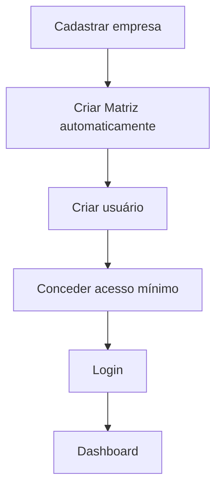
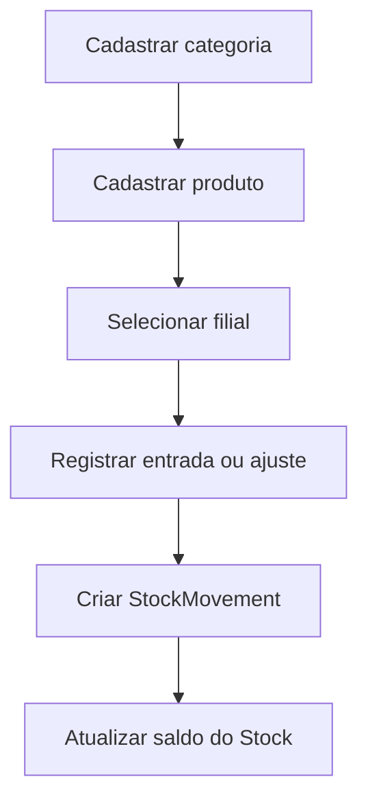
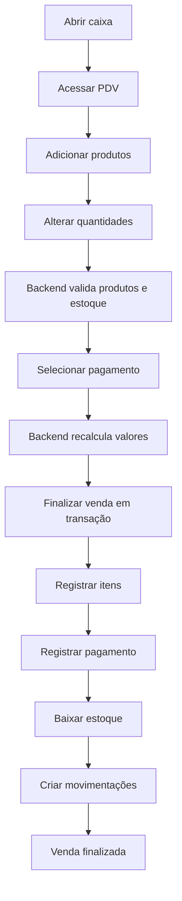
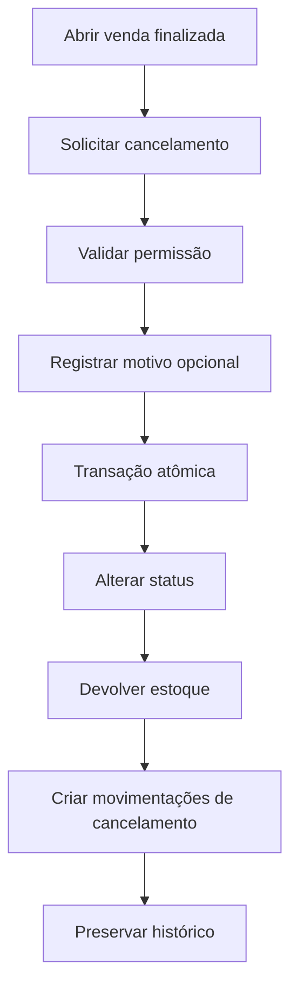
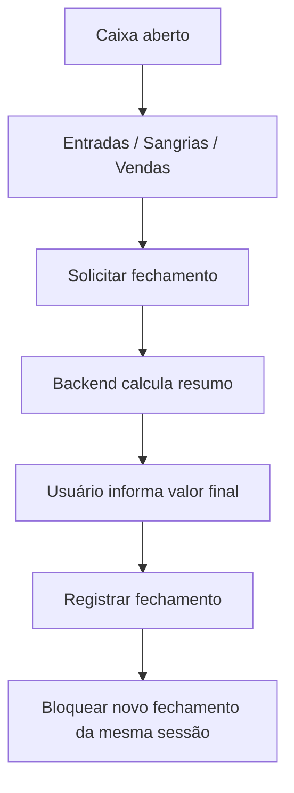
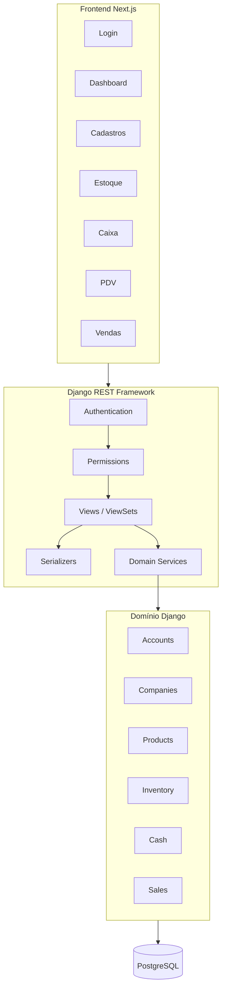
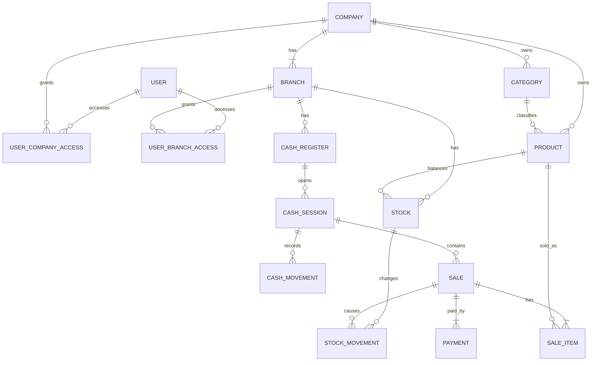
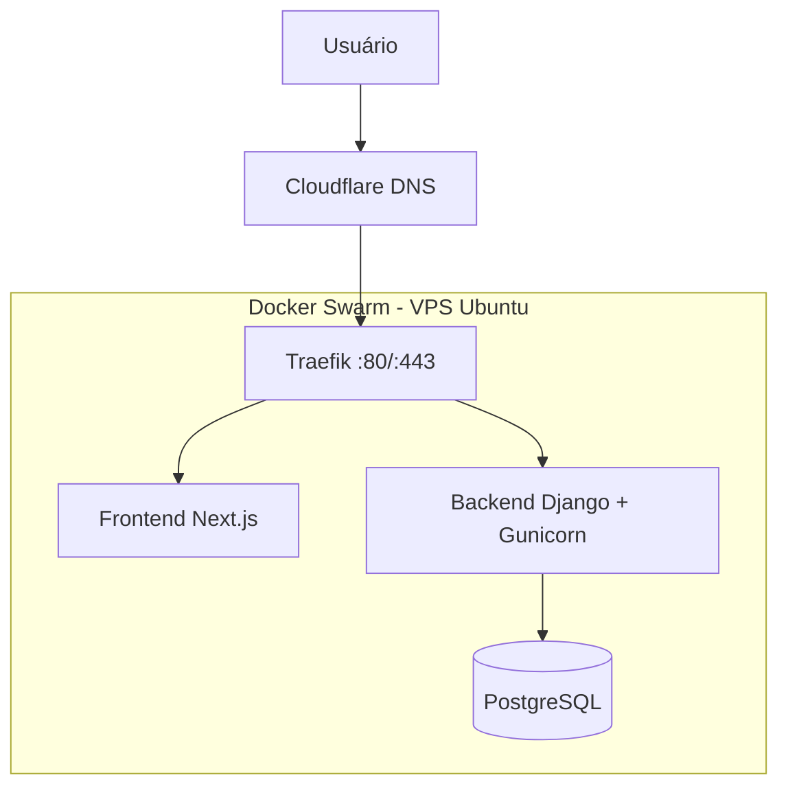

# PRD — CORE PDV: Sistema de Gestão Empresarial e Ponto de Venda

> **Versão:** 1.0  
> **Data:** 2026-08-15  
> **Status:** PRD técnico — pronto para revisão e execução do MVP  
> **Domínio de produção:** `corepdv.com`  
> **Idioma do código:** inglês  
> **Idioma da interface:** português brasileiro  
> **Timezone:** `America/Sao_Paulo`  
> **API:** `/api/v1/`  
> **Stack principal:** Python >3.13 · Django >6.0 · Django REST Framework · PostgreSQL 16+ · Next.js · React · Tailwind CSS · Docker · Docker Compose  
> **Infraestrutura de produção prevista:** Docker Swarm · Traefik · Cloudflare DNS · Let's Encrypt DNS-01 · GHCR ou registry compatível

---

## Sobre este documento

Este PRD é a **fonte única de verdade do MVP do CORE PDV**. Ele deve orientar arquitetura, modelagem, API, frontend, regras de negócio, segurança, banco de dados, infraestrutura, sprints e critérios de aceite.

O documento foi construído a partir dos requisitos mandatórios do CORE PDV e utiliza o projeto público **SCSI — Sistema de Gestão para Corretora de Seguros Inteligente** como referência de organização, disciplina arquitetural, documentação, deploy e planejamento, sem copiar funcionalidades específicas do domínio de seguros e sem importar módulos que estejam fora do escopo do CORE PDV.

### Regras de interpretação

1. Requisitos explícitos do CORE PDV prevalecem sobre padrões do projeto de referência.
2. O MVP deve ser pequeno, funcional e utilizável de ponta a ponta.
3. Preparação futura não autoriza implementação prematura.
4. O backend é a fonte de verdade para regras operacionais e de segurança.
5. Nenhuma funcionalidade poderá ser declarada concluída sem as verificações tecnicamente possíveis no ambiente.
6. Código em inglês; interface em português brasileiro.
7. Diagramas arquiteturais podem utilizar Mermaid.
8. Critérios de aceite e tarefas de sprint usam `- [ ]`.
9. Mudanças futuras devem ser adicionadas ao PRD de forma explícita, sem apagar requisitos históricos relevantes.

---

# Índice

1. Visão Geral do Produto
2. Problema e Proposta de Valor
3. Objetivos do MVP
4. Escopo do Projeto
5. Público-Alvo
6. Personas e Perfis Operacionais
7. Jornadas Principais
8. Regras Gerais do Sistema
9. Arquitetura Geral
10. Estratégia de Multi-Tenancy Futuro
11. Stack Técnica
12. Estrutura do Repositório
13. Padrão Interno dos Apps Django
14. Modelagem de Domínio
15. Entidades Principais
16. Autenticação e Usuários
17. Empresas e Filiais
18. Permissões e Segurança
19. Categorias e Produtos
20. Estoque
21. Caixa
22. Venda / PDV
23. Pagamentos
24. Finalização de Venda
25. Cancelamento de Venda
26. Dashboard
27. API REST
28. Frontend e UX
29. Design System
30. Integridade de Dados e Concorrência
31. Regras Financeiras
32. Logs, Auditoria e Histórico
33. Healthcheck
34. Requisitos Não Funcionais
35. Qualidade de Código
36. Variáveis de Ambiente
37. Docker Compose para Desenvolvimento
38. Estratégia de Produção
39. Docker Swarm + Traefik
40. Guia de Deploy em VPS Ubuntu
41. Estratégia de Build e Registry
42. Estratégia de Banco e Persistência
43. Backup e Recuperação
44. Segurança Operacional
45. Observabilidade Básica
46. Riscos Técnicos
47. Decisões Arquiteturais
48. Definition of Done
49. Roadmap
50. Sprints de Implementação
51. Checklist Final de Validação
52. Evoluções Futuras
53. Considerações Finais

---

# 1. Visão Geral do Produto

## 1.1 Descrição

O **CORE PDV** é um sistema de gestão empresarial e ponto de venda voltado principalmente para:

- bares;
- restaurantes;
- casas de eventos;
- boates;
- lounges;
- estabelecimentos de alimentação, entretenimento e operação presencial semelhante.

O MVP deve cobrir o núcleo operacional necessário para que uma empresa consiga configurar sua estrutura básica, cadastrar produtos, controlar estoque por filial, abrir caixa, realizar uma venda, registrar o pagamento, baixar estoque, consultar ou cancelar a venda, movimentar o caixa, fechar o caixa e acompanhar indicadores básicos no dashboard.

## 1.2 Fluxo central do MVP

```mermaid
flowchart LR
    A[Empresa] --> B[Filial]
    B --> C[Usuário]
    C --> D[Categoria]
    D --> E[Produto]
    E --> F[Estoque]
    F --> G[Abertura de Caixa]
    G --> H[Venda]
    H --> I[Pagamento]
    I --> J[Baixa de Estoque]
    J --> K[Histórico / Cancelamento]
    K --> L[Fechamento de Caixa]
    L --> M[Dashboard]
```



## 1.3 Princípio do MVP

> **FAZER POUCO, MAS FAZER CORRETAMENTE.**

O projeto não deve antecipar módulos futuros. Uma funcionalidade somente integra o MVP quando for necessária para completar o fluxo operacional principal ou para garantir segurança, integridade de dados e capacidade razoável de evolução.

---

# 2. Problema e Proposta de Valor

## 2.1 Problema

Estabelecimentos de alimentação e entretenimento frequentemente operam com sistemas desconectados, controles manuais, planilhas, registros de caixa pouco auditáveis e baixa integração entre venda, estoque e operação financeira.

Os principais problemas que o CORE PDV pretende resolver no MVP são:

- produto cadastrado sem visão clara de estoque;
- estoque sem histórico confiável de movimentação;
- venda sem vínculo forte com caixa e filial;
- divergência entre preço exibido e preço efetivamente registrado;
- ausência de rastreabilidade em cancelamentos;
- estoque negativo por falta de validação transacional;
- caixa sem histórico de abertura, entradas, sangrias e fechamento;
- dificuldade de visualizar rapidamente o resultado operacional do dia;
- arquitetura inicial que prende o sistema a uma única empresa e dificulta evolução futura.

## 2.2 Proposta de valor do MVP

| Perfil | Valor entregue |
|---|---|
| Proprietário / Administrador | Controle básico de empresa, filial, usuários, produtos, estoque, vendas e caixa em um único sistema. |
| Gerente | Visibilidade rápida da operação da unidade, últimas vendas, situação do caixa e estoque zerado. |
| Operador de Caixa | Fluxo rápido para abertura, venda, pagamento, entrada, sangria e fechamento. |
| Operador de Estoque | Controle de saldo por filial com histórico obrigatório de movimentações. |
| Evolução técnica | Base separada em API + frontend e modelagem preparada para múltiplas empresas e filiais futuramente. |

---

# 3. Objetivos do MVP

## 3.1 Objetivos de produto

- Permitir operação completa do ciclo básico do PDV.
- Manter estoque coerente com as vendas.
- Preservar histórico financeiro e operacional.
- Reduzir risco de inconsistência por concorrência ou manipulação do frontend.
- Disponibilizar interface responsiva para uso operacional.
- Criar base arquitetural evolutiva sem implementar antecipadamente módulos futuros.

## 3.2 Objetivos técnicos

- Utilizar Django 6.0+ com Django REST Framework como backend.
- Utilizar Next.js + React + Tailwind CSS no frontend.
- Centralizar todas as regras críticas no backend.
- Expor API REST versionada em `/api/v1/`.
- Utilizar PostgreSQL em desenvolvimento containerizado e produção.
- Trabalhar valores monetários exclusivamente com tipos decimais apropriados.
- Garantir consistência transacional em venda, pagamento, estoque e cancelamento.
- Preparar Company/Branch e escopo de acesso para futura evolução multi-tenant compartilhada.
- Não utilizar Django Templates como interface principal.

## 3.3 Metas mensuráveis

- 100% das rotas privadas exigem autenticação.
- Nenhuma listagem retorna objetos fora do contexto autorizado do usuário.
- 100% das alterações de estoque possuem `StockMovement` correspondente.
- Nenhuma venda pode finalizar com caixa fechado.
- Nenhuma venda pode finalizar com estoque insuficiente.
- Nenhuma venda finalizada pode existir sem pagamento válido.
- Cancelamento de venda restaura o estoque de forma transacional.
- Toda empresa criada possui pelo menos uma filial `Matriz`.
- Frontend compila sem erro e consome somente a API.
- `/health/` responde HTTP 200 em estado saudável.

---

# 4. Escopo do Projeto

## 4.1 Dentro do MVP

- autenticação por e-mail;
- Custom User Model;
- empresa;
- filial;
- criação automática da filial `Matriz`;
- estrutura mínima de acesso de usuário a empresa/filial;
- permissões básicas usando Django/DRF;
- categorias;
- produtos;
- busca e filtros de produtos;
- estoque por filial;
- movimentações de estoque;
- caixa físico/POS;
- sessão de caixa;
- abertura de caixa;
- entrada manual;
- sangria;
- fechamento de caixa;
- tela funcional de PDV;
- venda;
- itens da venda;
- pagamentos;
- baixa de estoque;
- consulta de vendas;
- detalhe da venda;
- cancelamento de venda;
- devolução de estoque no cancelamento;
- dashboard operacional simples;
- API REST versionada;
- frontend Next.js separado;
- Docker Compose local;
- healthcheck;
- infraestrutura de produção documentada em Docker Swarm + Traefik.

## 4.2 Fora do MVP funcional

Não implementar agora:

- multi-tenancy completo;
- resolução dinâmica de tenant;
- tenant middleware global;
- subdomínios por tenant;
- onboarding SaaS;
- billing;
- planos e assinaturas;
- banco ou schema PostgreSQL por tenant;
- painel SaaS de tenants;
- editor avançado de permissões por empresa;
- funcionários sem usuário;
- escalas;
- metas;
- comissões;
- clientes;
- fornecedores;
- compras;
- transferências entre filiais;
- mesas;
- comandas;
- camarotes;
- reservas;
- eventos;
- promoters;
- ingressos avançados;
- combos;
- produtos compostos;
- variações;
- ficha técnica;
- receitas;
- adicionais e complementos;
- múltiplos preços;
- tabelas de preço;
- financeiro completo;
- contas a pagar;
- contas a receber;
- DRE;
- relatórios avançados;
- geração de PDFs;
- WhatsApp;
- integração Stone;
- adquirentes e gateways externos;
- IA;
- LangChain;
- LangGraph;
- Celery;
- RabbitMQ;
- Redis;
- notificações assíncronas;
- backup automatizado;
- MKDocs;
- testes automatizados.

## 4.3 Importante sobre infraestrutura de produção

O MVP funcional não depende de Docker Swarm, Traefik, Cloudflare ou GHCR para ser desenvolvido e validado localmente. Entretanto, por requisito de planejamento deste PRD, a arquitetura de produção e o passo a passo de deploy são documentados desde já.

Isso **não significa implementar módulos de produto adicionais**. A infraestrutura de produção é tratada como trilha de lançamento/deploy, separada do escopo funcional do MVP.

---

# 5. Público-Alvo

- bares de pequeno e médio porte;
- restaurantes;
- pizzarias;
- lounges;
- casas de eventos;
- boates;
- operações com um ou mais caixas físicos;
- empresas que futuramente poderão possuir múltiplas filiais.

O usuário típico possui habilidade técnica baixa ou intermediária e precisa de uma interface objetiva, rápida e operacional.

---

# 6. Personas e Perfis Operacionais

## 6.1 Administrador

Responsável por empresa, filial, usuários e cadastros principais.

## 6.2 Gerente

Acompanha operação, estoque, vendas e situação dos caixas, conforme permissões concedidas.

## 6.3 Operador de Caixa

Realiza abertura, venda, pagamento, entrada, sangria e fechamento conforme permissões.

## 6.4 Operador de Estoque

Realiza entradas, saídas e ajustes autorizados e consulta histórico de movimentação.

> O MVP não precisa criar um sistema complexo de cargos. Os perfis podem ser representados por grupos/permissões do Django conforme necessidade operacional.

---

# 7. Jornadas Principais

## 7.1 Configuração inicial



## 7.2 Cadastro e estoque



## 7.3 Venda



## 7.4 Cancelamento



## 7.5 Fechamento de caixa



---

# 8. Regras Gerais do Sistema

1. Toda model de domínio deve possuir `created_at` e `updated_at`.
2. Código em inglês; UI em português brasileiro.
3. Timezone: `America/Sao_Paulo`.
4. Nenhum ID operacional deve ser hardcoded.
5. O backend é a fonte de verdade.
6. Dados sensíveis enviados pelo frontend sempre devem ser validados novamente no backend.
7. Valores monetários nunca usam `float`.
8. Entidades históricas importantes não são apagadas fisicamente quando status/inativação for mais apropriado.
9. Toda operação crítica deve ser auditável.
10. O MVP não implementará abstrações vazias para funcionalidades futuras.
11. Endpoints de detalhe devem validar acesso ao objeto.
12. Endpoints de listagem devem limitar o queryset ao contexto autorizado.
13. Unicidades de negócio devem considerar empresa quando necessário.
14. Estoque é sempre por filial.
15. Venda exige caixa aberto.
16. Estoque negativo é proibido.
17. Toda alteração de estoque gera movimentação correspondente.
18. Preço histórico da venda é imutável em relação a alterações posteriores do produto.
19. Cancelamento restaura estoque e preserva histórico.
20. Toda venda finalizada possui ao menos um pagamento válido.

---

# 9. Arquitetura Geral

## 9.1 Estilo arquitetural

Adotar **monólito modular no backend**, com frontend desacoplado.

- Backend: Django + DRF.
- Frontend: Next.js + React + Tailwind.
- Banco: PostgreSQL.
- Comunicação: HTTP/JSON pela API `/api/v1/`.
- Regra de negócio: services no backend quando a lógica ultrapassar validação simples.
- Sem microservices no MVP.
- Sem event sourcing, CQRS, Kafka ou infraestrutura distribuída.

## 9.2 Visão de camadas



## 9.3 Princípios arquiteturais

- **Thin views, explicit services:** views/viewsets coordenam entrada/saída; regras transacionais relevantes ficam em services.
- **Backend authoritative:** preço, subtotal, total, permissões, estoque e contexto de empresa/filial são confirmados no servidor.
- **Separation by domain:** apps pequenas e coesas.
- **No premature abstraction:** somente criar camada adicional quando houver motivo concreto.
- **API first:** frontend nunca acessa PostgreSQL diretamente.
- **Transactional core:** venda, cancelamento e operações dependentes usam transações de banco.

---

# 10. Estratégia de Multi-Tenancy Futuro

## 10.1 Objetivo

O MVP não implementará multi-tenancy completo, mas a modelagem deve evitar dependência permanente de uma única empresa.

## 10.2 Entidades obrigatórias

- `Company`
- `Branch`

Toda `Branch` pertence a exatamente uma `Company`.

Toda empresa deve possuir pelo menos uma filial.

Ao cadastrar uma empresa, criar automaticamente uma filial inicial chamada `Matriz`.

## 10.3 Preparação mínima

Dados de negócio devem carregar `company` quando o contexto da empresa for necessário.

Dados operacionais físicos devem carregar `branch` quando a operação acontece em uma unidade.

A relação de usuário deve permitir evoluir futuramente para:

```text
User
├── Company A
│   ├── Branch A1
│   └── Branch A2
└── Company B
    └── Branch B1
```

Uma implementação mínima recomendada no MVP é utilizar entidades explícitas de acesso, por exemplo `UserCompanyAccess` e `UserBranchAccess`, ou uma modelagem equivalente simples, desde que:

- não assuma um único `company_id` fixo no sistema;
- não assuma que o usuário sempre acessa todas as filiais;
- permita filtrar autorização no backend;
- não implemente onboarding SaaS, subdomínio, billing ou tenant resolver.

## 10.4 O que não criar agora

- `TenantMiddleware` global;
- resolução por host/subdomínio;
- schema-per-tenant;
- database-per-tenant;
- planos;
- assinatura;
- cobrança;
- painel de plataforma;
- seleção dinâmica avançada de tenant.

---

# 11. Stack Técnica

## 11.1 Backend

| Tecnologia | Regra |
|---|---|
| Python | `> 3.13`, conforme requisito do projeto |
| Django | `> 6.0`, conforme requisito do projeto |
| Django REST Framework | obrigatório |
| PostgreSQL | `>= 16` recomendado |
| psycopg | driver PostgreSQL |
| django-environ ou equivalente | leitura segura de `.env` |
| django-cors-headers | necessário enquanto frontend e API forem servidos em origens diferentes (`corepdv.com` e `api.corepdv.com`) |
| Gunicorn | servidor WSGI de produção |

## 11.2 Frontend

| Tecnologia | Regra |
|---|---|
| Next.js | versão estável compatível com o projeto |
| React | versão compatível com Next.js |
| Tailwind CSS | obrigatório |
| TypeScript | recomendado como padrão do frontend |
| Fetch/Axios | cliente HTTP centralizado; escolher um e padronizar |

## 11.3 Infraestrutura

- Docker;
- Docker Compose para desenvolvimento;
- Docker Swarm para produção planejada;
- Traefik para reverse proxy/TLS;
- Cloudflare DNS;
- Let's Encrypt via DNS-01;
- GHCR ou registry OCI equivalente.

## 11.4 Não adicionar no MVP

- Celery;
- RabbitMQ;
- Redis;
- LangChain;
- LangGraph;
- OpenAI SDK;
- stack de observabilidade complexa.

---

# 12. Estrutura do Repositório

A estrutura mandatória é:

```text
core-pdv/
├── .env.example
├── .gitignore
├── docker-compose.yml
├── docker-stack.yml                 # produção planejada
├── README.md
├── PRD.md
├── docs/
│   ├── architecture.md              # opcional durante o MVP
│   └── deploy.md                    # opcional; PRD continua fonte principal
├── scripts/
│   └── deploy.sh
├── design_system/
│   └── design_system.html
│
├── backend/
│   ├── .venv/                       # não versionado
│   ├── .env                         # não versionado
│   ├── .env.example
│   ├── requirements.txt
│   ├── manage.py
│   ├── Dockerfile
│   ├── entrypoint.sh
│   ├── core/
│   │   ├── __init__.py
│   │   ├── settings.py              # único settings principal
│   │   ├── urls.py
│   │   ├── wsgi.py
│   │   └── asgi.py
│   └── apps/
│       ├── base/
│       ├── accounts/
│       ├── companies/
│       ├── products/
│       ├── inventory/
│       ├── cash/
│       └── sales/
│
└── frontend/
    ├── .env.local                   # não versionado
    ├── .env.example
    ├── package.json
    ├── next.config.*
    ├── Dockerfile
    └── src/
        ├── app/
        ├── components/
        ├── features/
        ├── lib/
        ├── services/
        └── types/
```

### Observações

- Apps Django ficam dentro de `backend/apps/`.
- `core` é o pacote de configuração Django.
- `base` contém recursos compartilhados realmente utilizados.
- Não criar apps vazias para funcionalidades futuras.
- `.venv` e `requirements.txt` pertencem ao backend, conforme definição do projeto.

---

# 13. Padrão Interno dos Apps Django

Estrutura recomendada, adaptável à complexidade real:

```text
backend/apps/<app>/
├── __init__.py
├── apps.py
├── admin.py
├── models.py                # ou package models/ quando justificado
├── serializers.py
├── permissions.py           # somente se houver regras específicas
├── selectors.py             # opcional, apenas se consultas reutilizáveis justificarem
├── services.py              # regras de negócio relevantes
├── signals.py               # somente quando necessário
├── urls.py
├── views.py                 # ou viewsets.py, padronizar por projeto
└── migrations/
```

### Regras

- Não duplicar regra entre serializer, view, model e frontend.
- Signals não devem esconder regras críticas de venda, estoque ou caixa.
- Services devem ser preferidos para operações transacionais de negócio.
- Arquivos gigantes devem ser divididos por responsabilidade quando a complexidade justificar.

---

# 14. Modelagem de Domínio

## 14.1 Diagrama conceitual



## 14.2 Convenções gerais

- PK: padrão Django ou UUID, desde que a decisão seja consistente no projeto. Não misturar sem necessidade.
- `created_at` e `updated_at` obrigatórios em models do domínio.
- Status representados por `TextChoices` quando aplicável.
- Foreign keys com `related_name` claros.
- Constraints no banco para regras estruturais importantes.
- Índices para campos de consulta frequente e chaves de escopo (`company`, `branch`, status, códigos).

---

# 15. Entidades Principais

## 15.1 BaseModel

Campos:

- `created_at`;
- `updated_at`.

## 15.2 Company

Campos mínimos:

- `trade_name` — nome fantasia;
- `legal_name` — razão social;
- `cnpj`;
- `email`;
- `phone`;
- `status`.

Regras:

- CNPJ validado quando informado;
- status ativo/inativo;
- inativação não apaga histórico;
- criação da empresa deve criar `Matriz` de forma consistente.

## 15.3 Branch

Campos mínimos:

- `company`;
- `name`;
- `cnpj`;
- `phone`;
- `email`;
- endereço;
- `status`.

Regra: `company` obrigatório.

## 15.4 User

Custom User baseada no Django.

Campos iniciais:

- `first_name`;
- `last_name`;
- `email`;
- `password`;
- `status`.

`email` é identificador de autenticação.

## 15.5 Category

- `company`;
- `name`;
- `description`;
- `status`.

## 15.6 Product

- `company`;
- `name`;
- `description`;
- `internal_code`;
- `barcode`;
- `category`;
- `unit`;
- `cost`;
- `sale_price`;
- `status`;
- `image` opcional.

## 15.7 Stock

- `product`;
- `branch`;
- `current_quantity`.

Constraint recomendada:

- uma única linha de estoque para a combinação `product + branch`.

## 15.8 StockMovement

- `product`;
- `branch`;
- `previous_quantity`;
- `movement_quantity`;
- `final_quantity`;
- `type`;
- `user`;
- `reason` opcional;
- timestamp;
- referência opcional à venda quando aplicável.

Tipos:

- `entry`;
- `exit`;
- `adjustment`;
- `sale`;
- `sale_cancellation`.

## 15.9 CashRegister

Representa o caixa físico/POS.

Campos sugeridos:

- `branch`;
- `name`;
- `status`.

## 15.10 CashSession

Representa uma abertura do caixa.

Campos mínimos:

- `cash_register`;
- `branch`;
- `opened_by`;
- `opened_at`;
- `opening_amount`;
- `status`;
- `closed_by` opcional;
- `closed_at` opcional;
- `closing_amount_informed` opcional.

## 15.11 CashMovement

- `cash_session`;
- `type` (`manual_entry`, `withdrawal` e referências operacionais quando necessário);
- `amount`;
- `user`;
- `reason`;
- timestamp.

## 15.12 Sale

- `company`;
- `branch`;
- `cash_session`;
- `user`;
- `sale_number`;
- `status`;
- `subtotal`;
- `discount`;
- `total`;
- timestamps;
- dados de cancelamento quando aplicável.

## 15.13 SaleItem

- `sale`;
- `product`;
- `quantity`;
- `unit_price` histórico;
- `subtotal` histórico.

## 15.14 Payment

- `sale`;
- `method`;
- `amount`;
- timestamp.

Métodos do MVP:

- cash;
- pix;
- credit_card;
- debit_card.

---

# 16. Autenticação e Usuários

## 16.1 Custom User Model

Obrigatória desde o início.

Regras:

- `USERNAME_FIELD = 'email'` ou solução equivalente correta;
- e-mail único conforme a estratégia escolhida;
- senhas com hashing do Django;
- senha nunca retornada pela API;
- usuário inativo não autentica.

## 16.2 Fluxos mínimos

- login;
- logout;
- obter usuário autenticado;
- alterar dados básicos próprios.

### Regras de acesso no login

- Usuário inativo não autentica e recebe mensagem específica de conta inativa.
- E-mail não cadastrado recebe mensagem de conta não encontrada.
- Usuário comum precisa possuir ao menos um acesso ativo a Company ativa e a uma Branch ativa dessa Company.
- Company ou Branch inativa somente bloqueia o login quando não existe outro contexto operacional ativo autorizado.
- Superusuário ativo pode autenticar sem vínculos explícitos de Company/Branch para executar administração global.

## 16.3 Sessão/token

Escolher uma estratégia simples, consistente e compatível com Next.js. Preferência:

- autenticação baseada em cookie HTTP-only e CSRF corretamente configurado; ou
- token seguro conforme arquitetura definida no início da implementação.

A escolha deve ser única e documentada. Não misturar estratégias sem necessidade.

---

# 17. Empresas e Filiais

## 17.1 Criação de empresa

A criação da Company e da primeira Branch deve ocorrer como uma unidade consistente.

A primeira filial deve receber o nome inicial:

`Matriz`

Se a criação da Matriz falhar, a criação da empresa não deve ser considerada concluída.

## 17.2 Filiais

O MVP permite estrutura mínima de gestão e deixa a modelagem pronta para mais de uma filial.

Não implementar fluxos avançados de consolidação multi-filial.

## 17.3 Regras cadastrais e de status

- CNPJ de Company é único quando informado.
- Nome fantasia e razão social de Company são únicos sem diferença entre maiúsculas e minúsculas.
- Filiais criadas manualmente exigem CEP, logradouro, número, bairro, cidade e UF; complemento e telefone são opcionais.
- A Matriz automática pode nascer com endereço pendente para não quebrar a atomicidade do cadastro inicial da empresa, mas sua edição deve permitir completar os dados obrigatórios.
- A consulta de CEP no frontend é apenas assistiva; os dados continuam editáveis e são validados novamente pelo backend.
- Inativar uma Company inativa atomicamente todas as suas Branches.
- Reativar uma Company não reativa suas Branches automaticamente; cada unidade deve ser reativada explicitamente.

---

# 18. Permissões e Segurança

## 18.1 Base

Utilizar:

- Django permissions;
- Django groups quando útil;
- DRF permissions;
- validação explícita de contexto de Company/Branch.

## 18.2 Permissões mínimas

- visualizar produtos;
- cadastrar produtos;
- editar produtos;
- visualizar estoque;
- movimentar estoque;
- abrir caixa;
- fechar caixa;
- realizar venda;
- cancelar venda.

## 18.3 Regras obrigatórias por endpoint

Para recursos associados a empresa ou filial:

1. validar autenticação;
2. validar permissão funcional;
3. validar acesso à empresa;
4. validar acesso à filial quando aplicável;
5. validar pertencimento do objeto;
6. impedir acesso cruzado por manipulação de ID;
7. filtrar listagens no backend.

## 18.4 Dados nunca confiáveis do frontend

Nunca confiar cegamente em:

- `company_id`;
- `branch_id`;
- `cash_session_id`;
- `user_id` operacional;
- preço;
- custo;
- subtotal;
- desconto;
- total;
- saldo de estoque;
- permissões.

## 18.5 Erros

A API não deve expor:

- stack trace;
- credenciais;
- SQL;
- variáveis de ambiente;
- detalhes internos desnecessários.

---

# 19. Categorias e Produtos

## 19.1 Categorias

Operações:

- cadastrar;
- listar;
- visualizar;
- editar;
- ativar;
- inativar.

Evitar exclusão física quando houver histórico associado.

## 19.2 Produtos

Operações:

- cadastrar;
- listar;
- visualizar;
- editar;
- ativar;
- inativar;
- buscar;
- filtrar.

## 19.3 Regras de código

`internal_code` deve identificar o produto no contexto da empresa.

Constraint recomendada:

```text
UniqueConstraint(company, internal_code)
```

`barcode` deve ser pesquisável no PDV.

## 19.4 Não implementar

- variação;
- combo;
- ficha técnica;
- receita;
- adicional;
- complemento;
- produto composto;
- múltiplos preços;
- tabela de preço.

---

# 20. Estoque

## 20.1 Conceito

`Product` e `Stock` são entidades separadas.

O saldo é por filial.

## 20.2 Regra fundamental

O campo de saldo não deve ser alterado por fluxos de negócio sem gerar `StockMovement` correspondente.

## 20.3 Movimentações manuais

### Entrada

- quantidade positiva;
- registra saldo anterior e final;
- usuário obrigatório.

### Saída

- exige saldo suficiente;
- não permite saldo negativo.

### Ajuste

- exige motivo quando aplicável;
- registrar diferença e valores anterior/final.

## 20.4 Concorrência

Operações que reduzem estoque devem executar em transação e bloquear/serializar adequadamente o registro de saldo quando houver risco de duas vendas simultâneas consumirem o mesmo estoque.

Uso recomendado: `transaction.atomic()` + estratégia de lock como `select_for_update()` nos registros de estoque relevantes durante a finalização/cancelamento.

## 20.5 Não implementar

- transferência;
- lote;
- validade;
- inventário avançado;
- consumo interno;
- fornecedor;
- compra;
- previsão de estoque.

---

# 21. Caixa

## 21.1 Caixa físico

`CashRegister` representa o POS físico, por exemplo `Caixa 01`.

## 21.2 Sessão

Cada abertura gera `CashSession`.

Fluxo:

```text
CashRegister -> CashSession(open) -> operations -> CashSession(closed)
```

## 21.3 Abertura

Registrar:

- caixa;
- filial;
- usuário;
- horário;
- valor inicial.

## 21.4 Sessões simultâneas

Por padrão, impedir mais de uma sessão aberta para o mesmo `CashRegister`.

A regra deve existir no backend e, quando possível, possuir suporte de constraint de banco coerente com o PostgreSQL.

## 21.5 Entrada manual

Registrar valor, usuário, motivo e timestamp.

## 21.6 Sangria

Registrar valor, usuário, motivo e timestamp.

Sangria não deve ser apagada.

## 21.7 Fechamento

Registrar:

- usuário responsável;
- data/hora;
- valor final informado;
- resumo básico da sessão.

Uma sessão já fechada não pode ser fechada novamente.

---

# 22. Venda / PDV

## 22.1 Interface

Tela operacional com prioridade máxima para:

- rapidez;
- poucos cliques;
- leitura fácil;
- busca por nome, código interno ou código de barras;
- alteração rápida de quantidade;
- feedback visual imediato.

## 22.2 Regras

- venda pertence a Company e Branch;
- venda pertence a uma CashSession aberta;
- usuário responsável deve estar autenticado e autorizado;
- item preserva preço histórico;
- backend recalcula todos os valores;
- estoque suficiente é obrigatório.

## 22.3 Número da venda

Deve ser gerado pelo backend.

Pode ser sequencial dentro do contexto apropriado, desde que a solução seja segura contra concorrência e não dependa de ID hardcoded.

---

# 23. Pagamentos

Métodos:

- dinheiro;
- PIX;
- cartão de crédito;
- cartão de débito.

Regras:

- toda venda finalizada possui pelo menos um pagamento válido;
- soma dos pagamentos deve satisfazer a regra financeira definida para finalização;
- integrações externas não existem no MVP;
- cartão é apenas registro de forma de pagamento, não transação com adquirente.

Caso o MVP permita múltiplos pagamentos por venda, a soma deve ser validada pelo backend. Caso a primeira versão operacional limite a um método por venda, essa simplificação deve ser documentada na sprint sem quebrar a modelagem `Sale -> Payment[]`.

---

# 24. Finalização de Venda

## 24.1 Operação crítica

A finalização deve acontecer dentro de `transaction.atomic()`.

## 24.2 Validações

Antes de confirmar:

1. usuário autenticado;
2. permissão de venda;
3. Company autorizada;
4. Branch autorizada;
5. CashSession existente;
6. CashSession aberta;
7. produtos existentes;
8. produtos ativos;
9. produtos pertencentes à Company correta;
10. quantidades válidas;
11. preços lidos do backend;
12. estoque suficiente;
13. pagamentos válidos;
14. total recalculado;
15. ausência de inconsistência concorrente.

## 24.3 Ordem lógica

Dentro da transação:

1. carregar e bloquear estoques relevantes;
2. validar novamente saldos;
3. criar ou atualizar registro da venda conforme desenho escolhido;
4. criar itens com preço histórico;
5. registrar pagamentos;
6. reduzir estoque;
7. criar StockMovement de venda;
8. marcar venda como finalizada;
9. commit.

Se qualquer etapa falhar, nenhuma parte deve permanecer parcialmente concluída.

---

# 25. Cancelamento de Venda

## 25.1 Requisitos

Somente usuário autorizado.

Registrar:

- status cancelado;
- usuário que cancelou;
- timestamp;
- motivo opcional/recomendado;
- devolução de estoque;
- movimentações correspondentes.

## 25.2 Transação

Cancelamento inteiro dentro de `transaction.atomic()`.

Usar lock dos estoques envolvidos quando necessário.

## 25.3 Histórico

- venda não é apagada;
- itens não são apagados;
- pagamentos históricos não desaparecem;
- preço histórico não muda;
- auditoria de cancelamento permanece.

---

# 26. Dashboard

Dashboard simples com:

- vendas do dia;
- valor vendido no dia;
- quantidade de vendas;
- situação atual do caixa;
- produtos com estoque zerado;
- últimas vendas.

Não implementar:

- BI;
- previsão;
- IA;
- análise avançada;
- gráficos complexos sem necessidade.

Todas as métricas devem respeitar o contexto de empresa/filial autorizado.

---

# 27. API REST

## 27.1 Prefixo

`/api/v1/`

## 27.2 Organização sugerida

```text
/api/v1/auth/
/api/v1/companies/
/api/v1/branches/
/api/v1/users/
/api/v1/categories/
/api/v1/products/
/api/v1/stocks/
/api/v1/stock-movements/
/api/v1/cash-registers/
/api/v1/cash-sessions/
/api/v1/cash-movements/
/api/v1/sales/
/api/v1/dashboard/
```

A lista é guia de organização; rotas concretas devem seguir uma convenção REST consistente e não precisam criar endpoints desnecessários.

## 27.3 Ações de domínio

Ações explícitas podem utilizar endpoints como:

```text
POST /api/v1/cash-sessions/open/
POST /api/v1/cash-sessions/{id}/close/
POST /api/v1/cash-sessions/{id}/entry/
POST /api/v1/cash-sessions/{id}/withdrawal/
POST /api/v1/sales/finalize/
POST /api/v1/sales/{id}/cancel/
```

## 27.4 Resposta de erro

Padronizar estrutura, por exemplo:

```json
{
  "error": {
    "code": "insufficient_stock",
    "message": "Estoque insuficiente para um ou mais produtos.",
    "details": {}
  }
}
```

Não é obrigatório usar exatamente esse envelope se o projeto já possuir padrão consistente melhor, mas toda API deve manter previsibilidade.

## 27.5 Paginação, busca e filtros

- paginação para listagens potencialmente grandes;
- busca de produto por nome, código interno e código de barras;
- filtros por status, categoria e contexto permitido;
- evitar N+1 com `select_related`/`prefetch_related` quando aplicável.

---

# 28. Frontend e UX

## 28.1 Telas mínimas

- login;
- dashboard;
- empresa;
- filial;
- usuários;
- categorias;
- produtos;
- estoque;
- movimentação de estoque;
- caixas;
- abertura de caixa;
- operação de caixa;
- PDV;
- lista de vendas;
- detalhe da venda;
- cancelamento;
- fechamento de caixa.

## 28.2 Regras

- responsive first;
- desktop, notebook, tablet e smartphone;
- feedback de loading;
- feedback de sucesso;
- feedback de erro;
- empty states;
- disabled states;
- confirmação para ação destrutiva;
- nenhuma lógica financeira crítica apenas no frontend.

## 28.3 Cliente de API

Centralizar comunicação com backend em `frontend/src/services/` ou `frontend/src/lib/api/`.

Não espalhar `fetch` arbitrário por dezenas de componentes sem padrão.

## 28.4 Estado de autenticação

Deve existir solução consistente para:

- usuário autenticado;
- loading inicial;
- expiração de sessão;
- redirecionamento de rota privada;
- tratamento de 401/403.

## 28.5 Experiência do gerente

- Gerente não acessa as telas administrativas de empresas, filiais e usuários.
- A navegação do gerente prioriza dashboard e `Sobre mim`.
- `Sobre mim` exibe dados pessoais, empresas, papéis e filiais vinculadas em modo de leitura.
- Nome e sobrenome podem ser atualizados pelo próprio usuário; e-mail permanece somente leitura nesse fluxo.
- Ocultar links não substitui autorização: URLs administrativas também devem redirecionar o gerente e o backend continua validando permissões e contexto.

---

# 29. Design System

Antes de construir componentes visuais, ler:

`design_system/design_system.html`

Esse arquivo é a fonte de verdade para:

- cores;
- tipografia;
- espaçamentos;
- bordas;
- raios;
- componentes;
- estados;
- hierarquia visual;
- comportamento;
- identidade do CORE PDV.

Não criar design system paralelo.

Quando faltar componente, derivar dos padrões existentes.

---

# 30. Integridade de Dados e Concorrência

## 30.1 Constraints recomendadas

- `Stock(product, branch)` único;
- `Product(company, internal_code)` único;
- nenhuma sessão simultânea aberta para o mesmo caixa;
- relações Company/Branch coerentes;
- `SaleItem.quantity > 0`;
- valores financeiros não negativos quando a regra exigir.

## 30.2 Regras de concorrência

Cenários críticos:

- duas vendas do mesmo item em paralelo;
- duas tentativas de fechar a mesma sessão;
- duas aberturas do mesmo caixa;
- cancelamento simultâneo da mesma venda;
- ajuste de estoque concorrente com venda.

Tratar com:

- `transaction.atomic()`;
- `select_for_update()` quando necessário;
- constraints de banco;
- validação de status dentro da transação.

---

# 31. Regras Financeiras

Usar `DecimalField` no Django e representação decimal consistente no frontend.

Nunca usar `float` como fonte de verdade para:

- custo;
- preço;
- subtotal;
- desconto;
- total;
- pagamento;
- abertura de caixa;
- entrada;
- sangria;
- fechamento.

Definir precisão monetária consistente, por exemplo duas casas decimais para BRL, salvo necessidade futura explicitamente documentada.

Arredondamento deve ser centralizado e previsível.

---

# 32. Logs, Auditoria e Histórico

## 32.1 Logs mínimos

Registrar em log de aplicação:

- erros 5xx;
- falhas inesperadas de integração interna;
- tentativas relevantes de operação inválida, sem vazar dados sensíveis;
- inicialização e falhas do serviço.

## 32.2 Auditoria de domínio

O próprio modelo deve preservar informações como:

- usuário que abriu/fechou caixa;
- usuário que movimentou estoque;
- usuário que realizou venda;
- usuário que cancelou venda;
- motivo de cancelamento;
- timestamps.

Não criar framework de auditoria complexo no MVP se os próprios registros históricos forem suficientes.

---

# 33. Healthcheck

Backend deve expor:

`GET /health/`

Requisitos:

- público;
- leve;
- HTTP 200 quando aplicação está saudável;
- não depende de módulos de domínio;
- não executa consulta pesada;
- adequado para Docker/Traefik healthcheck.

Resposta sugerida:

```json
{"status": "ok"}
```

---

# 34. Requisitos Não Funcionais

## 34.1 Segurança

- HTTPS em produção;
- `DEBUG=False`;
- `SECRET_KEY` fora do código;
- CORS/CSRF corretamente configurados conforme origem do frontend;
- cookies seguros quando utilizados;
- nenhuma credencial versionada;
- usuário de banco com privilégio mínimo necessário.

## 34.2 Performance

- evitar N+1;
- usar índices apropriados;
- paginação;
- queries agregadas eficientes no dashboard;
- não carregar histórico inteiro sem necessidade.

## 34.3 Disponibilidade

No MVP local, Docker Compose deve iniciar ambiente previsível.

Na arquitetura de produção, Swarm deve definir healthchecks e restart policies.

## 34.4 Responsividade

Interface deve operar corretamente em múltiplos tamanhos de tela.

## 34.5 Localização

- idioma: `pt-br`;
- timezone: `America/Sao_Paulo`;
- moeda exibida: BRL.

---

# 35. Qualidade de Código

Prioridade:

1. corretude;
2. segurança;
3. integridade;
4. simplicidade;
5. legibilidade;
6. manutenção;
7. performance adequada.

Evitar:

- overengineering;
- serializers gigantes;
- viewsets gigantes;
- componentes frontend gigantes;
- regra financeira duplicada;
- regra crítica em signal;
- IDs hardcoded;
- magic numbers;
- imports mortos;
- arquivos órfãos;
- abstrações futuras vazias.

Backend Python:

- PEP8;
- nomes em inglês;
- aspas simples quando razoável e consistente;
- type hints quando agregarem clareza;
- preferir recursos nativos do Django/DRF.

Frontend:

- TypeScript recomendado;
- componentes coesos;
- tipos compartilhados de domínio;
- camada de API centralizada;
- evitar lógica de negócio crítica na UI.

---

# 36. Variáveis de Ambiente

## 36.1 Backend — desenvolvimento

Exemplo `backend/.env.example`:

```env
DEBUG=True
SECRET_KEY=change-me
ALLOWED_HOSTS=localhost,127.0.0.1
CSRF_TRUSTED_ORIGINS=http://localhost:3000
CORS_ALLOWED_ORIGINS=http://localhost:3000
TIME_ZONE=America/Sao_Paulo
LANGUAGE_CODE=pt-br
DATABASE_URL=postgresql://corepdv:corepdv@db:5432/corepdv
```

## 36.2 Frontend

Exemplo `frontend/.env.example`:

```env
NEXT_PUBLIC_API_URL=http://localhost:8000/api/v1
```

## 36.3 Produção

Exemplo conceitual:

```env
DEBUG=False
SECRET_KEY=__SECRET__
DOMAIN=corepdv.com
API_DOMAIN=api.corepdv.com
FRONTEND_DOMAIN=corepdv.com
ALLOWED_HOSTS=api.corepdv.com,corepdv.com,.corepdv.com
CSRF_TRUSTED_ORIGINS=https://corepdv.com,https://*.corepdv.com
CORS_ALLOWED_ORIGINS=https://corepdv.com
TIME_ZONE=America/Sao_Paulo
LANGUAGE_CODE=pt-br
DATABASE_URL=postgresql://corepdv:__DB_PASSWORD__@db:5432/corepdv
POSTGRES_DB=corepdv
POSTGRES_USER=corepdv
POSTGRES_PASSWORD=__SECRET__
ACME_EMAIL=admin@corepdv.com
BACKEND_IMAGE=ghcr.io/SEU_USUARIO/core-pdv-backend:latest
FRONTEND_IMAGE=ghcr.io/SEU_USUARIO/core-pdv-frontend:latest
```

Segredos reais não devem permanecer no `.env` versionado. Em produção, preferir Docker Secrets para os valores mais sensíveis.

---

# 37. Docker Compose para Desenvolvimento

## 37.1 Serviços mínimos

- `db` — PostgreSQL;
- `backend` — Django/DRF;
- `frontend` — Next.js.

## 37.2 Volumes

- PostgreSQL persistente;
- volume de mídia apenas se a imagem de produto for utilizada localmente de forma persistente.

## 37.3 Dependências

Backend deve aguardar banco saudável antes de migrations/start, por entrypoint ou mecanismo equivalente simples.

## 37.4 Comandos esperados

```bash
# subir
Docker compose up -d --build
```

Usar o comando real em minúsculas:

```bash
docker compose up -d --build
```

```bash
# logs
docker compose logs -f backend
docker compose logs -f frontend

# migrations
docker compose exec backend python manage.py migrate

# check
docker compose exec backend python manage.py check

# criar superusuário, quando necessário
docker compose exec backend python manage.py createsuperuser
```

---

# 38. Estratégia de Produção

## 38.1 Topologia



## 38.2 Separação recomendada de hosts

- `corepdv.com` → frontend;
- `api.corepdv.com` → backend;
- `traefik.corepdv.com` → dashboard Traefik opcional e protegido.

O certificado wildcard deve cobrir:

- `corepdv.com`;
- `*.corepdv.com`.

## 38.3 Rede

- `traefik_public`: overlay externa;
- `corepdv_internal`: overlay interna para backend/db;
- frontend conecta em `traefik_public`;
- backend conecta em `traefik_public` e `corepdv_internal`;
- PostgreSQL conecta somente em `corepdv_internal`.

---

# 39. Docker Swarm + Traefik

## 39.1 Regras

Traefik é o único serviço exposto diretamente em 80/443.

PostgreSQL não publica porta para a internet.

Backend usa Gunicorn, nunca `runserver`.

Frontend roda build de produção do Next.js.

## 39.2 DNS-01 Cloudflare

Traefik deve utilizar ACME DNS challenge via Cloudflare para emitir wildcard.

Configuração conceitual:

```yaml
command:
  - '--providers.swarm=true'
  - '--providers.swarm.exposedbydefault=false'
  - '--entrypoints.web.address=:80'
  - '--entrypoints.web.http.redirections.entrypoint.to=websecure'
  - '--entrypoints.web.http.redirections.entrypoint.scheme=https'
  - '--entrypoints.websecure.address=:443'
  - '--certificatesresolvers.letsencrypt.acme.email=${ACME_EMAIL}'
  - '--certificatesresolvers.letsencrypt.acme.storage=/letsencrypt/acme.json'
  - '--certificatesresolvers.letsencrypt.acme.dnschallenge=true'
  - '--certificatesresolvers.letsencrypt.acme.dnschallenge.provider=cloudflare'
  - '--entrypoints.websecure.http.tls.certresolver=letsencrypt'
  - '--entrypoints.websecure.http.tls.domains[0].main=${DOMAIN}'
  - '--entrypoints.websecure.http.tls.domains[0].sans=*.${DOMAIN}'
```

> A sintaxe exata do provider Traefik deve ser validada contra a versão adotada na implementação antes do deploy. Não congelar configuração obsoleta apenas por copiar referência antiga.

## 39.3 Secret Cloudflare

Secret obrigatório:

`CLOUDFLARE_DNS_API_TOKEN`

Traefik deve receber o token via arquivo de secret, por exemplo:

```yaml
environment:
  CF_DNS_API_TOKEN_FILE: /run/secrets/CLOUDFLARE_DNS_API_TOKEN
secrets:
  - CLOUDFLARE_DNS_API_TOKEN
```

## 39.4 Healthchecks

Backend:

```yaml
healthcheck:
  test: ['CMD', 'python', '-c', "import urllib.request; urllib.request.urlopen('http://localhost:8000/health/')"]
  interval: 30s
  timeout: 10s
  retries: 3
  start_period: 60s
```

PostgreSQL:

```yaml
healthcheck:
  test: ['CMD-SHELL', 'pg_isready -U $${POSTGRES_USER} -d $${POSTGRES_DB}']
  interval: 10s
  timeout: 5s
  retries: 5
  start_period: 30s
```

Frontend deve possuir healthcheck simples compatível com a imagem final, por exemplo HTTP na porta interna do Next.js.

## 39.5 Restart policy

Para serviços principais:

```yaml
deploy:
  restart_policy:
    condition: on-failure
    delay: 5s
    max_attempts: 5
    window: 120s
```

Backend/frontend podem usar rolling update com rollback:

```yaml
update_config:
  parallelism: 1
  delay: 10s
  order: start-first
  failure_action: rollback
  monitor: 30s
rollback_config:
  parallelism: 1
  delay: 5s
  order: stop-first
```

---

# 40. Guia de Deploy em VPS Ubuntu

> Referência: Ubuntu 24.04 LTS ou versão LTS suportada. Ajuste IP, usuário, registry e senhas.

## 40.1 DNS inicial

No Cloudflare:

1. Adicionar `corepdv.com` à conta Cloudflare, caso ainda não esteja.
2. Garantir nameservers corretos.
3. Criar registro A:
   - nome: `@`;
   - conteúdo: `IP_DA_VPS`.
4. Criar registro A:
   - nome: `api`;
   - conteúdo: `IP_DA_VPS`.
5. Criar registro A opcional:
   - nome: `traefik`;
   - conteúdo: `IP_DA_VPS`.
6. Manter SSL/TLS em **Full (strict)** quando o certificado de origem estiver válido.

## 40.2 Acessar servidor

```bash
ssh root@SEU_IP
```

## 40.3 Atualizar sistema

```bash
apt update && apt upgrade -y
apt install -y curl git ca-certificates gnupg ufw apache2-utils
```

## 40.4 Criar usuário de deploy

```bash
adduser deploy
usermod -aG sudo deploy
```

Configurar chave SSH para o usuário `deploy` e, após validar o acesso, endurecer SSH conforme política operacional.

## 40.5 Firewall

```bash
ufw allow OpenSSH
ufw allow 80/tcp
ufw allow 443/tcp
ufw enable
ufw status
```

Em cluster multi-node futuro, liberar também apenas entre nós as portas necessárias ao Docker Swarm. Para VPS single-node, não expor portas de Swarm desnecessariamente à internet pública.

## 40.6 Instalar Docker pelo repositório oficial

Forma simplificada:

```bash
curl -fsSL https://get.docker.com -o get-docker.sh
sh get-docker.sh
usermod -aG docker deploy
docker --version
docker compose version
```

Reabrir a sessão SSH do usuário `deploy` para aplicar o grupo `docker`.

## 40.7 Inicializar Swarm

```bash
docker swarm init --advertise-addr SEU_IP
docker node ls
```

Para uma VPS única, o nó será manager e worker.

## 40.8 Criar redes overlay

```bash
docker network create --driver overlay --attachable traefik_public
docker network create --driver overlay --attachable --internal corepdv_internal
```

Se `corepdv_internal` for declarada diretamente pelo stack, a criação manual pode ser omitida. `traefik_public` deve permanecer externa para reutilização pelo Traefik.

## 40.9 Criar token de API do Cloudflare

No painel Cloudflare:

1. Perfil → **My Profile** → **API Tokens**.
2. **Create Token**.
3. Usar template de edição de DNS ou criar token customizado.
4. Permissões mínimas:
   - `Zone` → `DNS` → `Edit`;
   - `Zone` → `Zone` → `Read` quando exigido pelo provider.
5. Em **Zone Resources**, restringir para:
   - `Include` → `Specific zone` → `corepdv.com`.
6. Criar token.
7. Copiar o token uma única vez e armazená-lo com segurança.

Não utilizar Global API Key.

## 40.10 Criar Docker Secret do Cloudflare

Como usuário com acesso ao Docker:

```bash
printf '%s' 'SEU_TOKEN_CLOUDFLARE' | docker secret create CLOUDFLARE_DNS_API_TOKEN -
```

Validar:

```bash
docker secret ls
```

## 40.11 Clonar projeto

```bash
su - deploy
cd /home/deploy
git clone SEU_REPOSITORIO core-pdv
cd core-pdv
```

## 40.12 Criar `.env` de produção

Copiar template:

```bash
cp backend/.env.example backend/.env
nano backend/.env
```

Valores mínimos:

```env
DEBUG=False
SECRET_KEY=uma-chave-forte
DOMAIN=corepdv.com
API_DOMAIN=api.corepdv.com
ALLOWED_HOSTS=api.corepdv.com,corepdv.com,.corepdv.com
CSRF_TRUSTED_ORIGINS=https://corepdv.com,https://*.corepdv.com
CORS_ALLOWED_ORIGINS=https://corepdv.com
TIME_ZONE=America/Sao_Paulo
LANGUAGE_CODE=pt-br
POSTGRES_DB=corepdv
POSTGRES_USER=corepdv
POSTGRES_PASSWORD=senha-forte
DATABASE_URL=postgresql://corepdv:senha-forte@db:5432/corepdv
ACME_EMAIL=admin@corepdv.com
```

Frontend production env deve apontar para:

```env
NEXT_PUBLIC_API_URL=https://api.corepdv.com/api/v1
```

## 40.13 Criar demais Docker Secrets

Recomendados:

- `COREPDV_DJANGO_SECRET_KEY`;
- `COREPDV_POSTGRES_PASSWORD`;
- `CLOUDFLARE_DNS_API_TOKEN`.

Exemplo:

```bash
printf '%s' 'CHAVE_DJANGO' | docker secret create COREPDV_DJANGO_SECRET_KEY -
printf '%s' 'SENHA_POSTGRES' | docker secret create COREPDV_POSTGRES_PASSWORD -
```

A aplicação deve ler secrets por `_FILE` ou entrypoint apropriado, sem registrar seu conteúdo em logs.

## 40.14 Login no registry

Exemplo GHCR:

```bash
echo "$GHCR_TOKEN" | docker login ghcr.io -u SEU_USUARIO --password-stdin
```

O token deve possuir somente os escopos necessários.

## 40.15 Build manual de referência

Backend:

```bash
docker build -t ghcr.io/SEU_USUARIO/core-pdv-backend:latest ./backend
docker push ghcr.io/SEU_USUARIO/core-pdv-backend:latest
```

Frontend:

```bash
docker build -t ghcr.io/SEU_USUARIO/core-pdv-frontend:latest ./frontend
docker push ghcr.io/SEU_USUARIO/core-pdv-frontend:latest
```

## 40.16 Deploy do stack

```bash
# Demonstração manual: exporte apenas as variáveis necessárias à interpolação do stack.
# Não use `source` cegamente em produção quando o arquivo puder conter caracteres
# especiais ou conteúdo não confiável. O scripts/deploy.sh deve fazer parsing seguro.
export DOMAIN=corepdv.com
export API_DOMAIN=api.corepdv.com
export ACME_EMAIL=admin@corepdv.com
export BACKEND_IMAGE=ghcr.io/SEU_USUARIO/core-pdv-backend:<tag>
export FRONTEND_IMAGE=ghcr.io/SEU_USUARIO/core-pdv-frontend:<tag>

docker stack deploy --with-registry-auth -c docker-stack.yml corepdv
```

Validar:

```bash
docker stack services corepdv
docker service ls
docker stack ps corepdv
```

## 40.17 Logs

```bash
docker service logs -f corepdv_backend
docker service logs -f corepdv_frontend
docker service logs -f corepdv_traefik
```

A nomenclatura final depende dos nomes concretos definidos em `docker-stack.yml`.

## 40.18 Verificar certificado wildcard

Verificar logs do Traefik:

```bash
docker service logs corepdv_traefik --since 10m
```

Confirmar que não existem erros de ACME/DNS challenge.

Testar:

```bash
curl -I https://corepdv.com
curl -I https://api.corepdv.com/health/
```

Inspecionar certificado:

```bash
openssl s_client -connect corepdv.com:443 -servername corepdv.com </dev/null 2>/dev/null | openssl x509 -noout -subject -issuer -dates
```

O certificado deve ser válido e o wildcard deve estar armazenado no ACME do Traefik conforme configuração.

## 40.19 Migrations em produção

Migrations devem ser executadas de maneira controlada antes ou durante o deploy, nunca simultaneamente por múltiplas réplicas sem coordenação.

Estratégias aceitáveis:

- job/serviço one-shot de migration;
- `docker exec`/`docker run` controlado antes de atualizar réplicas;
- etapa exclusiva no `scripts/deploy.sh`.

Não deixar cada réplica do Gunicorn competir para aplicar migration.

## 40.20 Criar superusuário

Executar apenas quando necessário:

```bash
# localizar container/task ativa e executar de forma controlada
# ou usar um serviço one-shot específico
python manage.py createsuperuser
```

A forma exata deve ser adequada à imagem/stack implementada.

---

# 41. Estratégia de Build e Registry

## 41.1 Tag de imagem

Evitar depender apenas de `latest`.

Recomendado:

```text
ghcr.io/SEU_USUARIO/core-pdv-backend:<git-sha>
ghcr.io/SEU_USUARIO/core-pdv-frontend:<git-sha>
```

Também pode publicar `latest` como conveniência, mas deploy deve preferir tag imutável para rollback previsível.

## 41.2 `scripts/deploy.sh`

O projeto deve possuir script responsável por:

1. validar arquivos necessários;
2. carregar variáveis não sensíveis com parsing seguro, sem executar o `.env` como shell script;
3. validar que `DEBUG=False`, que a rede `traefik_public` existe e que os Docker Secrets obrigatórios foram criados;
4. identificar tag (`git rev-parse --short HEAD` ou argumento);
5. build do backend;
6. build do frontend;
7. push das duas imagens;
8. exportar tags utilizadas;
9. executar `docker stack deploy --with-registry-auth`;
10. acompanhar serviços e rollout;
11. executar healthchecks pós-deploy;
12. retornar código diferente de zero em falha.

Fluxo esperado:

```bash
chmod +x scripts/deploy.sh
./scripts/deploy.sh
```

O script não deve conter token, senha ou SECRET_KEY hardcoded.

---

# 42. Estratégia de Banco e Persistência

## 42.1 PostgreSQL

- versão 16+ recomendada;
- volume persistente;
- sem porta pública em produção;
- acesso somente pela rede interna;
- usuário exclusivo do CORE PDV;
- migrations como mecanismo oficial de evolução do schema.

## 42.2 Migrations

- não editar migration aplicada arbitrariamente;
- não apagar migration sem entender estado;
- Custom User deve existir antes do primeiro fluxo normal de migrations;
- revisar `makemigrations --check`/equivalente quando disponível;
- executar migrations antes de considerar fase estrutural concluída.

---

# 43. Backup e Recuperação

Backup automatizado está fora do MVP funcional, porém produção deve documentar procedimento manual mínimo.

Exemplo conceitual:

```bash
pg_dump -Fc -h HOST -U corepdv corepdv > corepdv_$(date +%F_%H%M).dump
```

Em Docker/Swarm, executar através do container/serviço do PostgreSQL ou ferramenta externa autorizada.

Antes de produção real com dados comerciais, definir:

- frequência;
- retenção;
- destino externo à VPS;
- criptografia;
- teste de restauração.

---

# 44. Segurança Operacional

- não versionar `.env`;
- usar Docker Secrets para segredos fortes em produção;
- token Cloudflare restrito à zona `corepdv.com`;
- desabilitar senha/root SSH quando operação estiver validada;
- atualizar pacotes do host periodicamente;
- PostgreSQL não exposto;
- dashboard Traefik, se habilitado, deve exigir autenticação forte;
- Traefik Docker socket somente read-only;
- HTTPS obrigatório;
- `SECURE_PROXY_SSL_HEADER`, cookies seguros e configurações Django de produção devem ser ajustadas para operação atrás do Traefik.

---

# 45. Observabilidade Básica

No MVP:

- logs stdout/stderr dos containers;
- healthchecks;
- `docker service ls`;
- `docker stack ps`;
- logs do Traefik;
- logs do backend;
- logs do frontend;
- logs do PostgreSQL quando necessário.

Não implementar stack Prometheus/Grafana/Loki sem requisito posterior.

---

# 46. Riscos Técnicos

| Risco | Impacto | Mitigação |
|---|---|---|
| Estoque concorrente | venda acima do saldo | transação + lock + revalidação |
| IDs manipulados no frontend | acesso cruzado | autorização e filtro no backend |
| Duplicidade de sessão de caixa | inconsistência financeira | constraint/status + transação |
| Valores em float | erro financeiro | Decimal end-to-end no backend |
| Regra duplicada frontend/backend | divergência | backend como fonte de verdade |
| Multi-tenant prematuro | complexidade | apenas Company/Branch + acesso mínimo |
| Apps grandes demais | manutenção ruim | divisão por domínio e services |
| Deploy com secrets no `.env` público | vazamento | Docker Secrets + `.gitignore` |
| Migration executada por múltiplas réplicas | race/lock | etapa de migration controlada |
| Wildcard TLS falhar | indisponibilidade HTTPS | DNS-01 Cloudflare + logs ACME + token mínimo correto |

---

# 47. Decisões Arquiteturais

## ADR-001 — Frontend separado

**Decisão:** Next.js separado do Django.  
**Motivo:** requisito explícito, evolução futura de POS/apps e API centralizada.

## ADR-002 — DRF obrigatório

**Decisão:** toda funcionalidade operacional consumida pelo frontend passa por REST API em `/api/v1/`.

## ADR-003 — Monólito modular

**Decisão:** backend Django único, apps por domínio.  
**Não usar:** microsserviços no MVP.

## ADR-004 — Shared database preparado para tenant futuro

**Decisão:** Company/Branch e chaves de escopo no modelo atual.  
**Não implementar:** tenant resolver/subdomínio/billing.

## ADR-005 — Serviços para transações críticas

Venda, cancelamento e movimentações dependentes devem ser orquestradas em `services.py` ou estrutura equivalente clara.

## ADR-006 — Docker Compose dev / Swarm prod

Compose é obrigatório no fluxo local. Swarm + Traefik é padrão documentado para produção.

## ADR-007 — PostgreSQL como banco oficial

Não utilizar SQLite como banco funcional do ambiente Docker do MVP.

---

# 48. Definition of Done

O MVP somente pode ser considerado concluído se TODOS os cenários abaixo funcionarem ponta a ponta.

- [ ] AC-01 — Cadastrar uma empresa.
- [ ] AC-02 — Criar automaticamente uma filial `Matriz`.
- [ ] AC-03 — Criar usuário com acesso ao sistema.
- [ ] AC-04 — Realizar login.
- [ ] AC-05 — Cadastrar categoria.
- [ ] AC-06 — Cadastrar produto.
- [ ] AC-07 — Adicionar estoque ao produto.
- [ ] AC-08 — Abrir caixa.
- [ ] AC-09 — Acessar PDV.
- [ ] AC-10 — Adicionar produtos à venda.
- [ ] AC-11 — Selecionar forma de pagamento.
- [ ] AC-12 — Finalizar venda.
- [ ] AC-13 — Registrar automaticamente baixa de estoque.
- [ ] AC-14 — Visualizar venda realizada.
- [ ] AC-15 — Cancelar venda e devolver produtos corretamente ao estoque.
- [ ] AC-16 — Realizar entrada manual ou sangria.
- [ ] AC-17 — Fechar caixa.
- [ ] AC-18 — Visualizar informações básicas no dashboard.

---

# 49. Roadmap

| Fase | Sprints | Resultado |
|---|---|---|
| Fundação | 0–2 | repositório, backend, frontend, Docker, autenticação, design system |
| Estrutura empresarial | 3–4 | Company, Branch, usuários e acesso mínimo |
| Catálogo e estoque | 5–6 | categorias, produtos, saldo e movimentações |
| Caixa | 7 | caixa, abertura, entrada, sangria, fechamento |
| PDV | 8–9 | venda, itens, pagamentos, baixa de estoque |
| Pós-venda | 10 | consulta e cancelamento transacional |
| Integração | 11 | dashboard e jornada completa |
| Validação | 12 | revisão técnica completa sem suíte automatizada |
| Produção | 13 | Swarm, Traefik, Cloudflare, deploy.sh |

---

# 50. Sprints de Implementação

> Sprints sequenciais e incrementais. Todos os itens começam com espaço vazio (`- [ ]`) e só devem receber um **X** após execução e verificação real. Não avançar silenciosamente com etapa quebrada.

## Sprint 0 — Inspeção e Planejamento

**Objetivo:** entender o projeto existente antes de alterar arquivos.

- [X] Ler estrutura atual do repositório.
- [X] Ler `backend/core/settings.py` se existir.
- [X] Ler `backend/core/urls.py` se existir.
- [X] Levantar apps Django existentes.
- [X] Levantar migrations existentes.
- [X] Ler `backend/requirements.txt`.
- [X] Ler `frontend/package.json`.
- [X] Mapear rotas do frontend existentes.
- [X] Localizar e ler `design_system/design_system.html`.
- [X] Identificar Dockerfiles/Compose já existentes.
- [X] Comparar estado atual com este PRD.
- [X] Preservar implementações corretas.
- [X] Listar conflitos concretos antes de refatorar.

**Entrega:** mapa do estado atual e plano de mudanças focado.

### Resultado da inspeção — 2026-08-15

#### Mapa do estado atual

```text
PDV-25LOUNGE/
├── .gitignore
├── backend/
│   ├── .env                     # existe, mas ainda não é carregado pelo Django
│   ├── .venv/                   # Python 3.13.15 e Django 6.1
│   ├── core/
│   │   ├── __init__.py
│   │   ├── asgi.py
│   │   ├── settings.py
│   │   ├── urls.py
│   │   └── wsgi.py
│   ├── manage.py
│   └── requirements.txt
└── PRD.md
```

| Área inspecionada | Estado encontrado |
|---|---|
| Backend | Scaffold padrão do Django 6.1 reorganizado dentro de `backend/`. |
| Configuração | Um único `core/settings.py`; SQLite, `LANGUAGE_CODE='en-us'`, `TIME_ZONE='UTC'`, `DEBUG=True` e `SECRET_KEY` hardcoded. |
| Apps Django | Somente os seis apps padrão de `django.contrib`; nenhum app próprio. |
| Migrations | Nenhuma migration própria e nenhum `db.sqlite3`; o Custom User ainda pode ser criado antes do primeiro ciclo normal de migrations. |
| Dependências | `Django==6.1`, `asgiref`, `sqlparse` e `tzdata`; DRF, psycopg, biblioteca de `.env`, CORS e Gunicorn ausentes. |
| Rotas backend | Apenas `/admin/`; não existem `/health/` nem `/api/v1/`. |
| Frontend | Diretório, `package.json`, código e rotas inexistentes. |
| Design system | `design_system/design_system.html` inexistente no projeto e no diretório pai pesquisado. |
| Docker | Nenhum Dockerfile, arquivo Compose, stack ou entrypoint. |
| Domínio do MVP | Nenhuma model, API, service, permission ou tela de domínio implementada. |

#### Implementações corretas a preservar

- pacote de configuração `core` usado de forma consistente por `manage.py`, ASGI e WSGI;
- um único `settings.py` principal;
- Django 6.1 e ambiente Python 3.13.15, compatíveis com a base técnica prevista;
- middlewares de segurança, sessão, CSRF e autenticação do scaffold Django;
- validadores padrão de senha, `USE_I18N=True` e `USE_TZ=True`;
- `.gitignore` cobrindo `.env`, `.venv`, caches, SQLite, mídia e estáticos coletados;
- ausência de migrations, que deve ser mantida até a definição do Custom User;
- ausência de abstrações prematuras, microsserviços, Celery, Redis, IA e multi-tenancy completo.

#### Conflitos concretos antes de refatorar

1. **Resolvido em 2026-08-15:** o scaffold de backend deixou a raiz e foi reorganizado em `backend/`.
2. **Resolvido em 2026-08-15:** `.venv`, `.env`, `requirements.txt`, `manage.py` e `core/` estão dentro de `backend/`.
3. O banco atual é SQLite, mas PostgreSQL é o banco oficial do MVP.
4. DRF, psycopg, leitura de `.env`, CORS e Gunicorn ainda não estão instalados/configurados.
5. A configuração efetiva ignora o `.env`; mantém segredo no código, inglês, UTC e hosts vazios.
6. Não existe Custom User e o projeto ainda usa implicitamente o User padrão do Django.
7. Não existem apps `base`, `accounts` ou apps de domínio.
8. Não existem healthcheck, prefixo `/api/v1/` ou endpoints do MVP.
9. Não existe frontend Next.js, portanto não há rotas, componentes, autenticação ou cliente HTTP a preservar.
10. O design system obrigatório está ausente; qualquer implementação visual fica bloqueada até o arquivo ser disponibilizado.
11. Não existe infraestrutura Docker local ou de produção.
12. O `.env` contém placeholders de módulos fora do MVP, embora esses módulos não estejam instalados; esse ruído não deve orientar a implementação.

#### Plano de mudanças focado

1. Restaurar ou fornecer `design_system/design_system.html` antes de iniciar qualquer componente visual.
2. **Concluído em 2026-08-15:** reorganizar o scaffold existente dentro de `backend/`, preservando o pacote `core`, os entrypoints e o único settings principal.
3. Manter o banco sem migrations até criar `apps/base`, `apps/accounts`, `BaseModel` e o Custom User autenticado por e-mail.
4. Alinhar as dependências e a configuração do backend a DRF, PostgreSQL, `.env`, CORS, `pt-br` e `America/Sao_Paulo`.
5. Criar e validar `/health/` e o prefixo `/api/v1/` antes de avançar para os domínios.
6. Criar o frontend separado somente após a fonte visual estar disponível; centralizar API e autenticação desde a fundação.
7. Containerizar `db`, `backend` e `frontend` depois das fundações executáveis, sem antecipar módulos fora do MVP.
8. Avançar sequencialmente pelas sprints de domínio, preservando regras críticas no backend e transações explícitas em estoque, caixa e vendas.

#### Reexecução dos itens pendentes — 2026-08-15

- `backend/requirements.txt` foi localizado, lido e validado após a reorganização; a tarefa correspondente recebeu X.
- `frontend/package.json` foi procurado novamente e continua inexistente; a tarefa permanece sem X.
- `design_system/design_system.html` e `design_system/design_system.html` foram procurados novamente no projeto e em `D:\2026`; ambos continuam inexistentes e a tarefa permanece sem X.
- o backend reorganizado foi validado com Python 3.13.15, Django 6.1 e `python manage.py check`, sem erros.

---

## Sprint 1 — Fundação Backend

**Objetivo:** backend executável com PostgreSQL, DRF e Custom User.

- [X] Garantir Python 3.13+.
- [X] Criar/validar `backend/.venv`.
- [X] Criar/validar `backend/requirements.txt`.
- [X] Configurar Django 6.0+.
- [X] Adicionar Django REST Framework.
- [X] Adicionar driver PostgreSQL.
- [X] Adicionar biblioteca de `.env`.
- [X] Manter um único `settings.py` principal.
- [X] Configurar `TIME_ZONE='America/Sao_Paulo'`.
- [X] Configurar `LANGUAGE_CODE='pt-br'`.
- [X] Criar app `apps/base`.
- [X] Criar `BaseModel` abstrata.
- [X] Criar app `apps/accounts`.
- [X] Criar Custom User antes do ciclo normal de migrate.
- [X] Configurar login por e-mail.
- [X] Criar `/health/`.
- [X] Criar prefixo `/api/v1/`.
- [X] Executar `python manage.py check`.
- [X] Criar/aplicar migrations coerentes.

**Entrega:** backend inicializa e healthcheck funciona.

### Evidências da Sprint 1 — 2026-08-15

- Python 3.13.15, Django 6.1 e DRF 3.18.0 executados em `backend/.venv`.
- Dependências fixadas em `backend/requirements.txt`; `pip check` sem conflitos.
- Configuração carregada por `django-environ`, sem fallback para SQLite e com PostgreSQL como backend efetivo.
- PostgreSQL 16.15 validado em container de desenvolvimento isolado; migrations padrão e `accounts.0001_initial` aplicadas.
- `accounts_user` existe e `auth_user` não existe, confirmando o Custom User anterior ao ciclo normal de migrations.
- `User` autentica por e-mail, normaliza o endereço, usa hashing Django e rejeita usuário inativo.
- Login de sessão protegido por CSRF, limitado a 10 tentativas por minuto e sem retorno de senha; `logout` e `me` também foram validados.
- `GET /health/` retornou HTTP 200 com `{"status": "ok"}` consultando o PostgreSQL de forma leve.
- `GET /api/v1/` retornou HTTP 200 e as rotas `/api/v1/auth/csrf/`, `login/`, `logout/` e `me/` foram verificadas.
- CORS com credenciais foi validado para a origem local configurada do frontend.
- `python manage.py check`, `makemigrations --check --dry-run` e `migrate --check` concluíram sem erros ou pendências.

---

## Sprint 2 — Fundação Frontend e Docker Local

**Objetivo:** frontend separado, design system aplicado e ambiente local containerizado.

- [X] Criar/validar Next.js.
- [X] Configurar Tailwind CSS.
- [X] Configurar TypeScript, se ainda não estiver.
- [X] Criar layout base conforme design system.
- [X] Criar cliente HTTP centralizado.
- [X] Criar tratamento central de erros 401/403/5xx.
- [X] Criar tela de login.
- [X] Conectar login à API.
- [X] Criar rota privada base.
- [X] Criar `backend/Dockerfile`.
- [X] Criar `frontend/Dockerfile` de desenvolvimento quando necessário.
- [X] Criar `docker-compose.yml` com `db`, `backend`, `frontend`.
- [X] Criar volume persistente do PostgreSQL.
- [X] Adicionar healthcheck do banco.
- [X] Validar `docker compose up -d --build`.
- [X] Validar frontend compila.
- [X] Validar frontend acessa backend pela API.

**Entrega:** login funcional em ambiente Docker local.

### Evidências da Sprint 2 — 2026-08-15

- Next.js 16.3.1, React 19.2.8, TypeScript e Tailwind CSS 4.3.3 configurados; `npm run build` concluído sem erros.
- Shell responsivo derivado de `design_system/design_system.html`, com sidebar, header, cards, tabelas, formulários, estados e tokens visuais do CORE PDV.
- Cliente HTTP único com sessão, CSRF, renovação controlada, paginação e tratamento de 401, 403, 429 e 5xx.
- Login, logout, estado autenticado e rotas privadas `/dashboard`, `/empresas`, `/filiais` e `/usuarios` validados.
- Dockerfiles, entrypoint e Compose criados com `db`, `backend` e `frontend`; volume `corepdv-25lounge-dev_postgres_data` confirmado.
- PostgreSQL 16, backend e frontend ficaram saudáveis após `docker compose up -d --build`.
- O backend foi publicado em `localhost:18000` porque a porta 8000 já estava ocupada por outro projeto; o frontend em `localhost:3000` consumiu a API com CORS e credenciais validados.

---

## Sprint 3 — Company e Branch

**Objetivo:** estrutura empresarial mínima.

- [X] Criar app `apps/companies`.
- [X] Criar model `Company`.
- [X] Criar model `Branch`.
- [X] Implementar validação de CNPJ quando informado.
- [X] Criar migration.
- [X] Implementar service de criação de Company + Matriz.
- [X] Garantir atomicidade Company/Matriz.
- [X] Criar serializers.
- [X] Criar permissions/querysets por contexto.
- [X] Criar endpoints de Company.
- [X] Criar endpoints de Branch.
- [X] Criar telas de empresa e filial.
- [X] Validar que nenhuma regra usa ID fixo.
- [X] Validar empresa sempre com pelo menos uma filial no fluxo inicial.

**Entrega:** empresa criada com Matriz automática e UI integrada.

### Evidências da Sprint 3 — 2026-08-15

- `Company` e `Branch` possuem timestamps, status, CNPJ normalizado/validado e constraints coerentes.
- `companies.0001_initial` criou Company/Branch e `companies.0003` identificou estruturalmente a Matriz e adicionou constraints de CNPJ/Matriz.
- Service atômico criou Company, exatamente uma Branch `Matriz` e os acessos iniciais; falha forçada na Matriz confirmou rollback integral.
- Endpoints REST de empresas e filiais foram validados para criação, listagem, detalhe, edição, ativação e inativação, sem DELETE físico.
- Querysets e permissões bloquearam detalhe e mutação fora do contexto, inclusive IDs válidos de outra empresa/filial.
- As telas carregam IDs exclusivamente da API, confirmam a Matriz retornada e compilam sem valores operacionais hardcoded.

---

## Sprint 4 — Usuários e Acesso Mínimo

**Objetivo:** permitir gerenciamento básico de usuários e escopo futuro de empresa/filial.

- [X] Definir modelagem mínima de acesso User ↔ Company.
- [X] Definir modelagem mínima de acesso User ↔ Branch.
- [X] Criar migrations.
- [X] Implementar endpoints de usuários necessários ao MVP.
- [X] Impedir retorno de senha.
- [X] Integrar permissões Django/DRF.
- [X] Criar grupos/permissões iniciais quando útil.
- [X] Implementar checagem de contexto em listagens.
- [X] Implementar checagem de contexto em detalhe.
- [X] Criar tela de usuários.
- [X] Permitir ativar/inativar usuário quando aplicável.
- [X] Validar login com usuário autorizado.

**Entrega:** usuário criado e limitado ao contexto concedido.

### Evidências da Sprint 4 — 2026-08-15

- `UserCompanyAccess` e `UserBranchAccess` foram criados em `companies.0002`, com unicidades e validação da relação filial/empresa.
- Grupos idempotentes `Administrators` e `Managers` integram permissões Django com permissões DRF e escopo explícito.
- API de usuários permite listar, criar, editar e ativar/inativar conforme permissão; senha é write-only, validada e nunca apareceu nas respostas verificadas.
- Listagem e detalhe filtram Company e Branch; tentativas de escalada, acesso cruzado e alteração de usuário fora do contexto foram bloqueadas.
- Edição preserva acessos de filiais invisíveis ao administrador e desativa todos apenas quando a empresa correspondente é removida.
- Tela de usuários gerencia dados, perfil e acessos carregados da API, respeita permissões e exige confirmação para status.
- Usuário autorizado autenticou por e-mail no Compose e visualizou somente sua empresa; usuário inativo foi rejeitado.

---

## Sprint 5 — Categorias e Produtos

**Objetivo:** catálogo operacional.

- [ ] Criar app `apps/products`.
- [ ] Criar `Category`.
- [ ] Criar `Product`.
- [ ] Definir status com `TextChoices`.
- [ ] Usar Decimal para custo/preço.
- [ ] Criar constraint de código interno por empresa.
- [ ] Criar migrations.
- [ ] Criar CRUD API de categorias.
- [ ] Criar CRUD API de produtos.
- [ ] Implementar ativação/inativação.
- [ ] Implementar busca por nome.
- [ ] Implementar busca por código interno.
- [ ] Implementar busca por código de barras.
- [ ] Implementar filtros por categoria/status.
- [ ] Otimizar querysets básicos.
- [ ] Criar telas de categoria.
- [ ] Criar telas de produto.
- [ ] Aplicar design system.

**Entrega:** catálogo pesquisável e integrado.

---

## Sprint 6 — Estoque

**Objetivo:** saldo por filial com histórico obrigatório.

- [ ] Criar app `apps/inventory`.
- [ ] Criar `Stock`.
- [ ] Criar `StockMovement`.
- [ ] Constraint única product + branch.
- [ ] Criar migrations.
- [ ] Criar service central de movimentação.
- [ ] Implementar entrada.
- [ ] Implementar saída.
- [ ] Implementar ajuste.
- [ ] Proibir saldo negativo.
- [ ] Registrar saldo anterior.
- [ ] Registrar quantidade movimentada.
- [ ] Registrar saldo final.
- [ ] Registrar usuário.
- [ ] Criar endpoints de estoque.
- [ ] Criar endpoints de movimentação.
- [ ] Criar tela de saldo.
- [ ] Criar tela/histórico de movimentações.
- [ ] Validar concorrência de alteração de saldo.

**Entrega:** estoque por filial com trilha completa.

---

## Sprint 7 — Caixa

**Objetivo:** operação básica de caixa.

- [ ] Criar app `apps/cash`.
- [ ] Criar `CashRegister`.
- [ ] Criar `CashSession`.
- [ ] Criar `CashMovement`.
- [ ] Criar migrations.
- [ ] Impedir duas sessões abertas no mesmo caixa.
- [ ] Implementar abertura.
- [ ] Implementar entrada manual.
- [ ] Implementar sangria.
- [ ] Implementar fechamento.
- [ ] Impedir fechar sessão já fechada.
- [ ] Preservar histórico de movimentos.
- [ ] Criar endpoints.
- [ ] Criar telas de caixas.
- [ ] Criar tela de abertura.
- [ ] Criar tela de operação.
- [ ] Criar tela de fechamento.
- [ ] Validar valores com Decimal.

**Entrega:** ciclo completo do caixa sem vendas.

---

## Sprint 8 — Venda, Itens e Pagamentos

**Objetivo:** estruturar domínio de venda e PDV.

- [ ] Criar app `apps/sales`.
- [ ] Criar `Sale`.
- [ ] Criar `SaleItem`.
- [ ] Criar `Payment`.
- [ ] Criar migrations.
- [ ] Definir status de venda.
- [ ] Gerar número da venda no backend.
- [ ] Preservar preço histórico do item.
- [ ] Criar tipos de pagamento.
- [ ] Criar service de cálculo.
- [ ] Criar tela de PDV.
- [ ] Buscar produtos por nome/código/barcode.
- [ ] Adicionar/remover item no frontend.
- [ ] Alterar quantidade.
- [ ] Exibir subtotal provisório na UI.
- [ ] Selecionar forma de pagamento.
- [ ] Não tratar valor da UI como fonte definitiva.

**Entrega:** PDV pronto para acionar finalização segura.

---

## Sprint 9 — Finalização Transacional da Venda

**Objetivo:** completar venda de ponta a ponta.

- [ ] Implementar service de finalização em `transaction.atomic()`.
- [ ] Validar usuário/permissão.
- [ ] Validar Company/Branch.
- [ ] Validar CashSession aberta.
- [ ] Carregar produtos no backend.
- [ ] Recalcular preços.
- [ ] Recalcular subtotais.
- [ ] Recalcular total.
- [ ] Validar pagamentos.
- [ ] Bloquear registros de estoque necessários.
- [ ] Revalidar saldo dentro da transação.
- [ ] Criar itens históricos.
- [ ] Registrar pagamentos.
- [ ] Baixar estoque.
- [ ] Criar StockMovement tipo `sale`.
- [ ] Finalizar status da venda.
- [ ] Garantir rollback total em erro.
- [ ] Criar endpoint de finalização.
- [ ] Integrar botão de finalizar no PDV.
- [ ] Exibir feedback de sucesso/erro.
- [ ] Validar que venda com estoque insuficiente é rejeitada.
- [ ] Validar que venda com caixa fechado é rejeitada.

**Entrega:** venda completa com pagamento e baixa de estoque.

---

## Sprint 10 — Consulta e Cancelamento

**Objetivo:** histórico de venda e cancelamento seguro.

- [ ] Criar listagem de vendas.
- [ ] Criar detalhe de venda.
- [ ] Exibir itens/pagamentos/status.
- [ ] Implementar permissão de cancelamento.
- [ ] Implementar service de cancelamento atômico.
- [ ] Impedir cancelamento duplicado.
- [ ] Registrar usuário cancelador.
- [ ] Registrar timestamp.
- [ ] Registrar motivo quando informado.
- [ ] Bloquear estoques durante devolução quando necessário.
- [ ] Devolver quantidades.
- [ ] Criar StockMovement tipo `sale_cancellation`.
- [ ] Preservar venda e itens históricos.
- [ ] Integrar tela/modal de cancelamento conforme design system.
- [ ] Validar rollback em falha de devolução.

**Entrega:** cancelamento transacional e auditável.

---

## Sprint 11 — Dashboard e Integração Final

**Objetivo:** consolidar jornada operacional.

- [ ] Criar endpoint de dashboard.
- [ ] Vendas do dia.
- [ ] Valor vendido no dia.
- [ ] Quantidade de vendas.
- [ ] Situação do caixa.
- [ ] Estoques zerados.
- [ ] Últimas vendas.
- [ ] Respeitar Company/Branch autorizadas.
- [ ] Criar dashboard frontend.
- [ ] Revisar navegação principal.
- [ ] Revisar feedbacks de loading/error/empty.
- [ ] Revisar responsividade.
- [ ] Percorrer fluxo Empresa → Dashboard completo.

**Entrega:** MVP operacional integrado.

---

## Sprint 12 — Validação Técnica Geral

**Objetivo:** verificar o MVP sem criar suíte automatizada.

- [ ] Executar `python manage.py check`.
- [ ] Verificar migrations pendentes.
- [ ] Aplicar migrations em ambiente limpo de validação quando possível.
- [ ] Validar imports.
- [ ] Subir Docker Compose do zero.
- [ ] Validar `/health/`.
- [ ] Validar login.
- [ ] Validar Company + Matriz.
- [ ] Validar usuário.
- [ ] Validar categoria.
- [ ] Validar produto.
- [ ] Validar entrada de estoque.
- [ ] Validar bloqueio de estoque negativo.
- [ ] Validar abertura de caixa.
- [ ] Validar venda.
- [ ] Validar pagamento.
- [ ] Validar baixa.
- [ ] Validar detalhe.
- [ ] Validar cancelamento.
- [ ] Validar devolução de estoque.
- [ ] Validar entrada manual.
- [ ] Validar sangria.
- [ ] Validar fechamento.
- [ ] Validar dashboard.
- [ ] Executar build do frontend.
- [ ] Corrigir erros de TypeScript/JavaScript.
- [ ] Revisar rotas mortas.
- [ ] Revisar IDs hardcoded.
- [ ] Revisar uso indevido de float.
- [ ] Revisar autorização de Company/Branch.
- [ ] Confirmar que nenhum módulo fora do MVP foi implementado.

**Entrega:** evidência técnica de que os 18 critérios funcionam.

---

## Sprint 13 — Infraestrutura de Produção e Deploy

**Objetivo:** preparar lançamento em VPS sem alterar o escopo funcional.

- [ ] Criar/validar Dockerfiles de produção.
- [ ] Criar `docker-stack.yml`.
- [ ] Criar serviço Traefik.
- [ ] Configurar `traefik_public` external.
- [ ] Configurar `corepdv_internal`.
- [ ] Configurar PostgreSQL sem porta pública.
- [ ] Configurar healthcheck backend.
- [ ] Configurar healthcheck frontend.
- [ ] Configurar healthcheck PostgreSQL.
- [ ] Configurar restart policies.
- [ ] Configurar rolling update/rollback.
- [ ] Configurar hosts `corepdv.com` e `api.corepdv.com`.
- [ ] Configurar ACME DNS-01 Cloudflare.
- [ ] Criar secret `CLOUDFLARE_DNS_API_TOKEN`.
- [ ] Criar demais secrets necessários.
- [ ] Criar `scripts/deploy.sh`.
- [ ] Implementar build de backend.
- [ ] Implementar build de frontend.
- [ ] Implementar push para registry.
- [ ] Implementar deploy do stack.
- [ ] Implementar checagem pós-deploy.
- [ ] Validar certificado wildcard.
- [ ] Validar `https://corepdv.com`.
- [ ] Validar `https://api.corepdv.com/health/`.
- [ ] Documentar rollback.

**Entrega:** deploy reproduzível em VPS Ubuntu.

---

# 51. Checklist Final de Validação

Antes de declarar o MVP concluído:

- [ ] Custom User autentica por e-mail.
- [ ] Company existe.
- [ ] Branch existe.
- [ ] Company recebe Matriz automaticamente.
- [ ] Nenhum ID operacional está hardcoded.
- [ ] API usa `/api/v1/`.
- [ ] Frontend usa exclusivamente a API.
- [ ] Django Templates não são usados como frontend principal.
- [ ] Rotas privadas exigem autenticação.
- [ ] Backend valida permissões.
- [ ] Backend valida acesso Company/Branch.
- [ ] Categorias funcionam.
- [ ] Produtos funcionam.
- [ ] Código interno respeita contexto de Company.
- [ ] Estoque é por Branch.
- [ ] Alteração de estoque gera histórico.
- [ ] Estoque negativo está bloqueado.
- [ ] Caixa abre.
- [ ] Entrada manual funciona.
- [ ] Sangria funciona.
- [ ] Venda exige caixa aberto.
- [ ] Venda valida estoque.
- [ ] Venda recalcula valores no backend.
- [ ] Venda registra itens históricos.
- [ ] Pagamentos são registrados.
- [ ] Venda reduz estoque.
- [ ] Finalização é transacional.
- [ ] Cancelamento preserva histórico.
- [ ] Cancelamento devolve estoque.
- [ ] Cancelamento é transacional.
- [ ] Caixa fecha.
- [ ] Dashboard funciona.
- [ ] Valores financeiros não usam `float`.
- [ ] Design system foi respeitado.
- [ ] Frontend é responsivo.
- [ ] `/health/` responde corretamente.
- [ ] Docker Compose sobe o ambiente local.
- [ ] Migrations estão consistentes.
- [ ] Backend inicializa.
- [ ] Frontend compila.
- [ ] Nenhuma funcionalidade foi declarada pronta sem validação.
- [ ] Nenhum módulo futuro foi implementado prematuramente.

---

# 52. Evoluções Futuras

Somente após o MVP estar funcional e validado poderão entrar novas fases.

Possíveis evoluções:

- multi-tenancy compartilhado completo;
- memberships avançadas;
- múltiplas empresas por usuário;
- seleção dinâmica de empresa/filial;
- RBAC customizável por empresa;
- comandas;
- mesas;
- reservas;
- eventos;
- camarotes;
- promoters;
- clientes;
- fornecedores;
- compras;
- transferências de estoque;
- ficha técnica;
- receitas;
- combos;
- variações;
- financeiro;
- contas a pagar/receber;
- DRE;
- relatórios;
- integração Stone;
- aplicativo para terminal POS;
- integrações externas;
- WhatsApp;
- Celery/Redis/RabbitMQ;
- IA com LangChain/LangGraph;
- previsão de estoque;
- previsão de vendas;
- análise de lucratividade;
- metas e rankings;
- backup automatizado;
- observabilidade avançada.

Cada módulo futuro deve possuir requisitos próprios antes de implementação.

---

# 53. Considerações Finais

O CORE PDV deve nascer com um núcleo simples e tecnicamente confiável.

A prioridade da implementação é:

1. operação completa de ponta a ponta;
2. segurança no backend;
3. integridade transacional;
4. estoque consistente;
5. histórico preservado;
6. frontend rápido e claro;
7. arquitetura capaz de evoluir sem reescrever o núcleo.

A implementação não deve aumentar o escopo para parecer mais completa.

O marco de sucesso é conseguir executar integralmente:

**Empresa → Filial → Usuário → Categoria → Produto → Estoque → Caixa → Venda → Pagamento → Baixa de Estoque → Consulta/Cancelamento → Fechamento de Caixa → Dashboard.**

Somente depois desse fluxo estar funcional, verificado e consistente o CORE PDV poderá avançar para módulos adicionais.

---

## Referências arquiteturais utilizadas

- Requisitos mandatórios fornecidos para o CORE PDV.
- Projeto público `pycodebr/scsi`, branch `main`, utilizado como referência de organização de PRD, disciplina modular, deploy Docker Swarm/Traefik, healthchecks, restart policies, redes overlay, Cloudflare DNS-01 e formato de sprints/checklists.
- Onde o SCSI diverge dos requisitos do CORE PDV — por exemplo, Django Templates, apps na raiz, Celery/IA e multi-tenancy completo — prevalece este PRD do CORE PDV.
