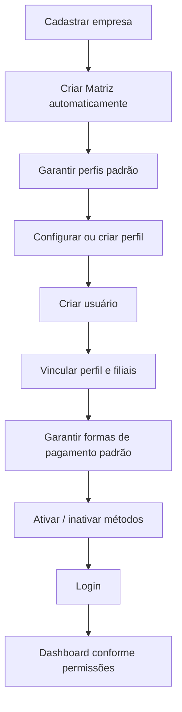
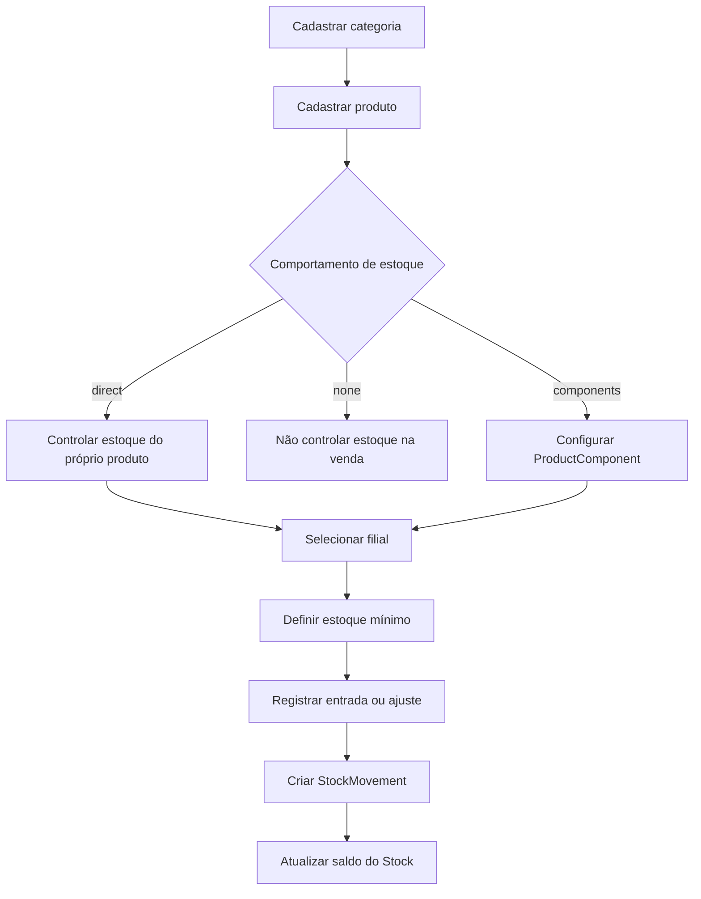
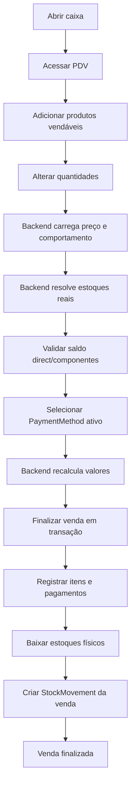
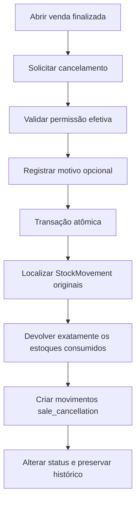
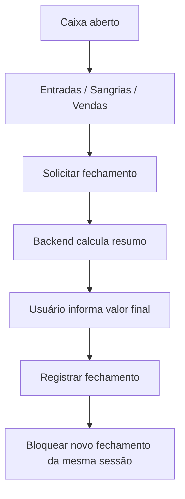
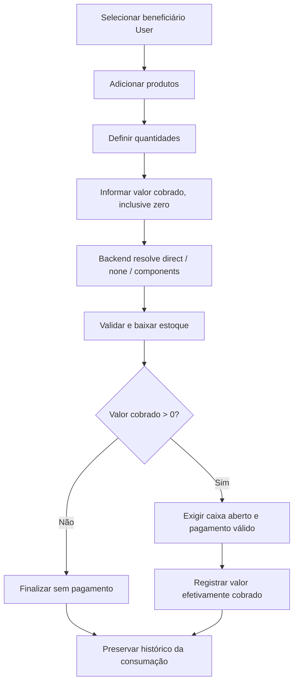
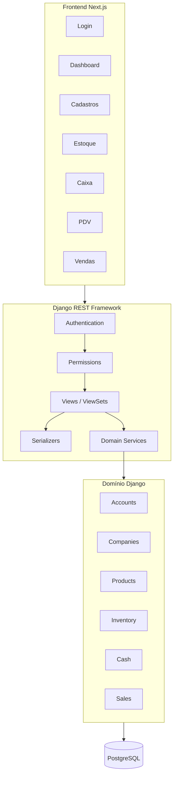
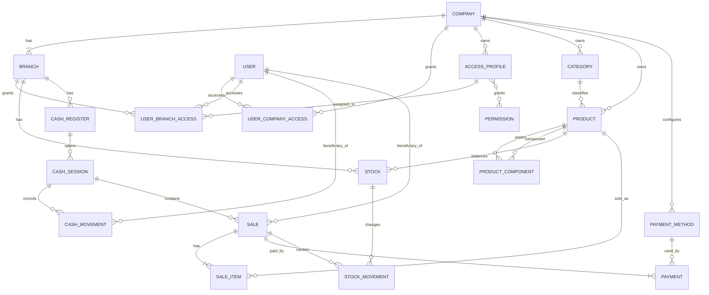
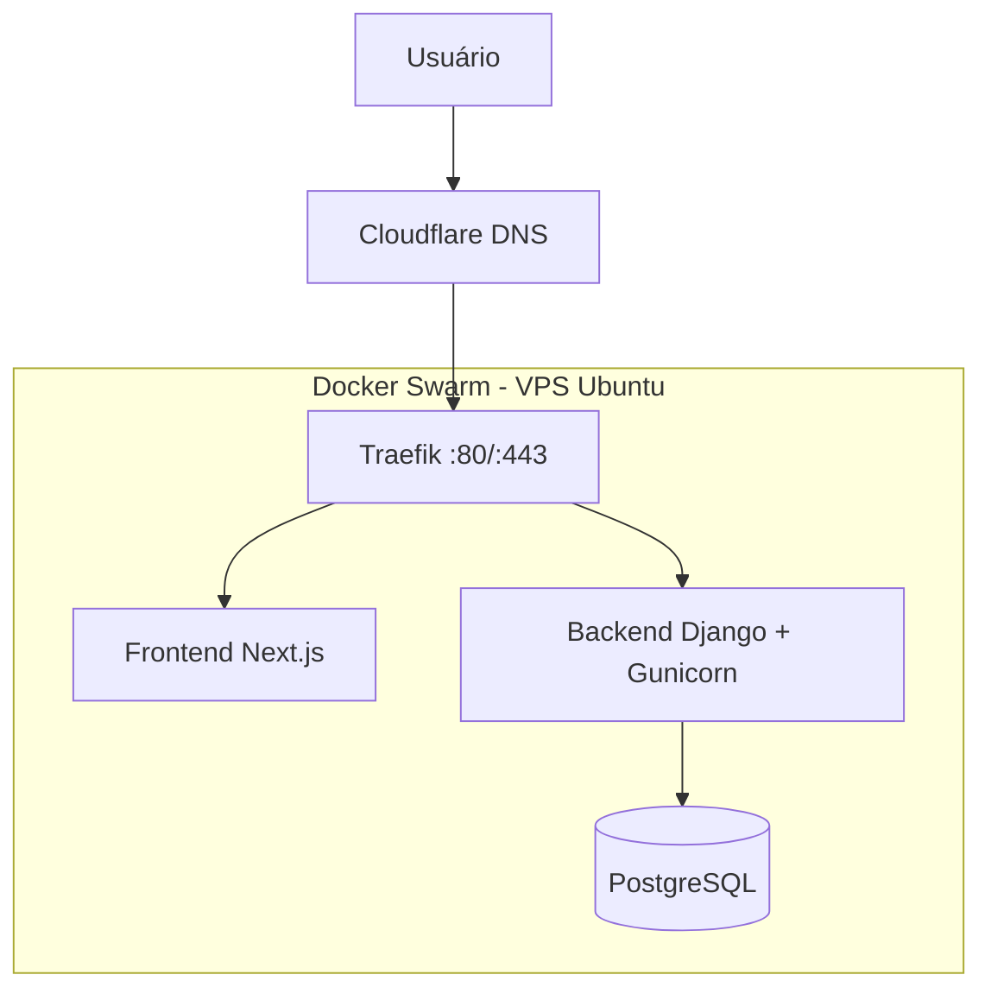

# PRD — CORE PDV: Sistema de Gestão Empresarial e Ponto de Venda

> **Versão:** 1.5
> **Data:** 2026-08-16  
> **Status:** PRD técnico — MVP em validação operacional avançada, com PDV/consumação unificados, RBAC por filial, promoções, relatórios, dashboard gerencial e novas sprints previstas para correções, configurações por filial, preços, atendentes, taxa de serviço, comissões e resultado operacional  
> **Domínio de produção:** `corepdv.com`  
> **Idioma do código:** inglês  
> **Idioma da interface:** português brasileiro  
> **Timezone:** `America/Sao_Paulo`  
> **API:** `/api/v1/`  
> **Stack principal:** Python >3.13 · Django >6.0 · Django REST Framework · PostgreSQL 16+ · Next.js · React · Tailwind CSS · Docker · Docker Compose  
> **Infraestrutura de produção prevista:** Docker Swarm · Traefik · Cloudflare DNS · Let's Encrypt DNS-01 · GHCR ou registry compatível

---

## Sobre este documento

Este PRD é a **fonte única de verdade do MVP do CORE PDV**. Ele deve orientar arquitetura, modelagem, API, frontend, regras de negócio, segurança, banco de dados, infraestrutura, sprints e critérios de aceite.

O documento foi construído a partir dos requisitos mandatórios do CORE PDV e utiliza o projeto público **SCSI — Sistema de Gestão para Corretora de Seguros Inteligente** como referência de organização, disciplina arquitetural, documentação, deploy e planejamento, sem copiar funcionalidades específicas do domínio de seguros e sem importar módulos que estejam fora do escopo do CORE PDV.

### Regras de interpretação

1. Requisitos explícitos do CORE PDV prevalecem sobre padrões do projeto de referência.
2. O MVP deve ser pequeno, funcional e utilizável de ponta a ponta.
3. Preparação futura não autoriza implementação prematura.
4. O backend é a fonte de verdade para regras operacionais e de segurança.
5. Nenhuma funcionalidade poderá ser declarada concluída sem as verificações tecnicamente possíveis no ambiente.
6. Código em inglês; interface em português brasileiro.
7. Diagramas arquiteturais podem utilizar Mermaid.
8. Critérios de aceite e tarefas de sprint usam `- [ ]`.
9. Mudanças futuras devem ser adicionadas ao PRD de forma explícita, sem apagar requisitos históricos relevantes.

---

# Índice

1. Visão Geral do Produto
2. Problema e Proposta de Valor
3. Objetivos do MVP
4. Escopo do Projeto
5. Público-Alvo
6. Personas e Perfis Operacionais
7. Jornadas Principais
8. Regras Gerais do Sistema
9. Arquitetura Geral
10. Estratégia de Multi-Tenancy Futuro
11. Stack Técnica
12. Estrutura do Repositório
13. Padrão Interno dos Apps Django
14. Modelagem de Domínio
15. Entidades Principais
16. Autenticação e Usuários
17. Empresas e Filiais
18. Permissões e Segurança
19. Categorias e Produtos
20. Estoque
21. Caixa
22. Venda / PDV
23. Pagamentos
24. Finalização de Venda
25. Cancelamento de Venda
26. Dashboard
27. API REST
28. Frontend e UX
29. Design System
30. Integridade de Dados e Concorrência
31. Regras Financeiras
32. Logs, Auditoria e Histórico
33. Healthcheck
34. Requisitos Não Funcionais
35. Qualidade de Código
36. Variáveis de Ambiente
37. Docker Compose para Desenvolvimento
38. Estratégia de Produção
39. Docker Swarm + Traefik
40. Guia de Deploy em VPS Ubuntu
41. Estratégia de Build e Registry
42. Estratégia de Banco e Persistência
43. Backup e Recuperação
44. Segurança Operacional
45. Observabilidade Básica
46. Riscos Técnicos
47. Decisões Arquiteturais
48. Definition of Done
49. Roadmap
50. Sprints de Implementação
51. Checklist Final de Validação
52. Evoluções Futuras
53. Considerações Finais

---

# 1. Visão Geral do Produto

## 1.1 Descrição

O **CORE PDV** é um sistema de gestão empresarial e ponto de venda voltado principalmente para:

- bares;
- restaurantes;
- casas de eventos;
- boates;
- lounges;
- estabelecimentos de alimentação, entretenimento e operação presencial semelhante.

O MVP deve cobrir o núcleo operacional necessário para que uma empresa consiga configurar sua estrutura básica, cadastrar usuários com ou sem acesso ao sistema, classificar usuários operacionais como funcionário, promoter, DJ, artista/pagode ou outro, criar perfis de acesso e permissões com aplicação por filial, organizar categorias na ordem operacional desejada, cadastrar produtos simples, não estocáveis ou compostos, destacar produtos favoritos para o PDV, controlar estoque por filial com estoque mínimo e visão financeira aproximada a custo atual conforme permissão, configurar formas de pagamento, abrir caixa, registrar sangrias classificadas e vinculadas a beneficiários quando aplicável, realizar venda ou consumação interna, registrar pagamento e troco quando aplicável, aplicar desconto simples autorizado, baixar o estoque correto conforme o comportamento do produto, consultar ou cancelar operações, movimentar o caixa, fechar o caixa comparando saldo esperado e valor informado e acompanhar indicadores básicos conforme as permissões do perfil.

O MVP deve permanecer simples: essas regras existem para tornar o fluxo principal utilizável e historicamente correto, não para antecipar módulos avançados de compras, fiscal, financeiro, ficha técnica, promoções ou conciliação.

## 1.2 Fluxo central do MVP

```mermaid
flowchart LR
    A[Empresa] --> B[Filial]
    B --> C[Perfil e Permissões]
    C --> D[Usuário]
    D --> E[Categoria]
    E --> F[Produto / Composição]
    F --> G[Estoque / Mínimo]
    G --> H[Formas de Pagamento]
    H --> I[Abertura de Caixa]
    I --> J[Venda / Consumação]
    J --> K[Pagamento quando aplicável]
    K --> L[Baixa Direta / Componentes]
    L --> M[Histórico / Cancelamento]
    M --> N[Fechamento de Caixa]
    N --> O[Dashboard]
```



## 1.3 Princípio do MVP

> **FAZER POUCO, MAS FAZER CORRETAMENTE.**

O projeto não deve antecipar módulos futuros. Uma funcionalidade somente integra o MVP quando for necessária para completar o fluxo operacional principal ou para garantir segurança, integridade de dados e capacidade razoável de evolução.

---

# 2. Problema e Proposta de Valor

## 2.1 Problema

Estabelecimentos de alimentação e entretenimento frequentemente operam com sistemas desconectados, controles manuais, planilhas, registros de caixa pouco auditáveis e baixa integração entre venda, estoque e operação financeira.

Os principais problemas que o CORE PDV pretende resolver no MVP são:

- produto cadastrado sem visão clara de estoque;
- estoque sem histórico confiável de movimentação;
- venda sem vínculo forte com caixa e filial;
- divergência entre preço exibido e preço efetivamente registrado;
- ausência de rastreabilidade em cancelamentos;
- estoque negativo por falta de validação transacional;
- caixa sem histórico de abertura, entradas, sangrias e fechamento;
- dificuldade de visualizar rapidamente o resultado operacional do dia;
- arquitetura inicial que prende o sistema a uma única empresa e dificulta evolução futura.

## 2.2 Proposta de valor do MVP

| Perfil | Valor entregue |
|---|---|
| Proprietário / Administrador | Controle básico de empresa, filial, usuários, produtos, estoque, vendas e caixa em um único sistema. |
| Gerente | Visibilidade da operação conforme permissões concedidas, últimas vendas, situação do caixa e alertas de estoque. |
| Operador de Caixa | Fluxo rápido para abertura, venda, pagamento, entrada, sangria e fechamento. |
| Operador de Estoque | Controle de saldo por filial com histórico completo de movimentações e visibilidade conforme permissões. |
| Evolução técnica | Base separada em API + frontend e modelagem preparada para múltiplas empresas e filiais futuramente. |

---

# 3. Objetivos do MVP

## 3.1 Objetivos de produto

- Permitir operação completa do ciclo básico do PDV.
- Manter estoque coerente com as vendas.
- Preservar histórico financeiro e operacional.
- Reduzir risco de inconsistência por concorrência ou manipulação do frontend.
- Disponibilizar interface responsiva para uso operacional.
- Criar base arquitetural evolutiva sem implementar antecipadamente módulos futuros.

## 3.2 Objetivos técnicos

- Utilizar Django 6.0+ com Django REST Framework como backend.
- Utilizar Next.js + React + Tailwind CSS no frontend.
- Centralizar todas as regras críticas no backend.
- Expor API REST versionada em `/api/v1/`.
- Utilizar PostgreSQL em desenvolvimento containerizado e produção.
- Trabalhar valores monetários exclusivamente com tipos decimais apropriados.
- Garantir consistência transacional em venda, pagamento, estoque e cancelamento.
- Preparar Company/Branch e escopo de acesso para futura evolução multi-tenant compartilhada.
- Implementar autorização por perfil configurável por Company com perfil operacional aplicável por Branch, sem regras hardcoded pelo nome do perfil.
- Manter contexto explícito de Company e Branch atual no frontend para telas operacionais.
- Modelar estoque para produtos `direct`, `none` e `components` antes das sprints de venda.
- Exigir Category nos Products e permitir ordenação operacional de Category sem expor número de ordem ao usuário.
- Gerar `internal_code` no backend quando o usuário não informar um código.
- Modelar formas de pagamento como entidade configurável por Company.
- Preservar snapshots mínimos dos itens vendidos para que alterações futuras no catálogo não mudem a representação histórica da venda.
- Calcular fechamento de caixa com saldo esperado, valor informado e diferença.
- Permitir usuários operacionais sem login, mantendo o mesmo cadastro de User como referência futura para consumação, sangria e relatórios.
- Separar permissão de visualização dos KPIs operacionais de estoque da permissão de visualização dos valores de custo/valorização.
- Registrar classificação e beneficiário de sangrias sem criar módulo financeiro completo.
- Modelar consumação interna como operação distinta de venda comercial, reutilizando o mesmo resolvedor transacional de estoque e permitindo valor cobrado de `R$ 0,00` ou superior.
- Organizar permissões em matriz por módulo/ação no frontend, sem alterar a autorização real do backend.
- Compactar telas com muitos filtros usando busca principal visível + painel/dropdown de filtros avançados.
- Não utilizar Django Templates como interface principal.

## 3.3 Metas mensuráveis

- 100% das rotas privadas exigem autenticação.
- Nenhuma listagem retorna objetos fora do contexto autorizado do usuário.
- Perfis de acesso pertencem à empresa, podem ser aplicados por filial e determinam permissões funcionais sem depender do nome fixo do perfil.
- O mesmo usuário pode possuir perfis operacionais diferentes em filiais diferentes da mesma empresa.
- Toda empresa possui perfis padrão mínimos e pode criar perfis personalizados adicionais.
- Todo Product possui Category obrigatória.
- Categories possuem ordenação persistida e configurável por drag-and-drop na interface.
- A listagem de Categories informa a quantidade de Products vinculados e o detalhe/edição permite visualizar Produtos relacionados.
- Produtos podem ser marcados como favoritos para priorização no PDV.
- `internal_code` é único por Company e é gerado pelo backend quando omitido.
- Produtos podem operar com comportamento de estoque `direct`, `none` ou `components`.
- Produtos de composição não podem provocar baixa do próprio saldo quando configurados como `components`.
- Quantidades de componentes são exibidas com a unidade correspondente e sem zeros finais desnecessários, por exemplo `5 UN`.
- Sugestões de custo e preço de combos podem preencher os campos normais enquanto ainda não houver valor manual, sem sobrescrever valores já informados pelo usuário.
- 100% das alterações reais de estoque possuem `StockMovement` correspondente.
- Movimentações manuais de estoque preservam trilha de auditoria mesmo quando o motivo não é informado; `reason` é opcional no MVP.
- Estoque mínimo é configurável por produto e filial.
- A tela de estoque exibe indicadores de zerados, abaixo do mínimo e valor estimado em estoque e recalcula esses indicadores conforme filtros aplicados.
- A permissão de visualizar custos de estoque controla em conjunto o widget financeiro `Valor em estoque`, `Custo unitário` e `Custo total`; sem essa permissão, esses valores não são retornados/expostos ao usuário.
- A permissão de visualizar KPIs operacionais de estoque pode controlar separadamente os indicadores `Produtos zerados` e `Produtos abaixo do mínimo`.
- Usuários operacionais podem existir sem acesso ao sistema e ainda assim serem selecionados como beneficiários de sangria e consumação.
- Sangrias podem ser classificadas, no mínimo, como `DJ`, `Pagode/Artista`, `Vale`, `Promoter`, `Fornecedor` ou `Outros`, preservando também o beneficiário quando aplicável.
- Consumação interna preserva beneficiário, itens, quantidades, custo/preço histórico, valor cobrado e impacto real no estoque.
- Nenhuma venda pode finalizar com caixa fechado.
- Nenhuma venda pode finalizar com estoque insuficiente dos itens efetivamente consumidos.
- Formas de pagamento padrão são configuráveis por empresa e somente métodos ativos podem ser utilizados em novas vendas.
- Pagamento em dinheiro pode registrar valor recebido e troco calculado pelo backend.
- Desconto do MVP é monetário, simples, autorizado por permissão e validado pelo backend.
- `SaleItem` preserva snapshot mínimo do produto vendido.
- Nenhuma venda finalizada pode existir sem pagamento válido.
- Cancelamento de venda restaura exatamente os estoques movimentados pela venda original, sem recalcular a composição atual do produto.
- Fechamento de caixa preserva saldo esperado, valor informado e diferença.
- Toda empresa criada possui pelo menos uma filial `Matriz`.
- Frontend compila sem erro e consome somente a API.
- `/health/` responde HTTP 200 em estado saudável.

# 4. Escopo do Projeto

## 4.1 Dentro do MVP

- autenticação por e-mail;
- Custom User Model;
- empresa;
- filial;
- criação automática da filial `Matriz`;
- contexto de empresa e filial atual na operação;
- estrutura de acesso de usuário a empresa/filial;
- usuários operacionais sem acesso ao site, reutilizando a entidade User;
- classificação operacional de User para funcionário, promoter, DJ, artista/pagode ou outro;
- perfis de acesso configuráveis por empresa;
- perfil operacional atribuível por filial;
- perfis padrão iniciais e criação de perfis personalizados;
- permissões funcionais dinâmicas associadas ao perfil;
- categorias obrigatórias para produtos;
- ordenação de categorias por drag-and-drop;
- quantidade de produtos na listagem de categorias;
- seção de produtos relacionados no detalhe/edição de categoria;
- produtos;
- produtos com busca principal e filtros avançados compactos, incluindo Favorito;
- produto favorito para priorização no PDV;
- código interno opcional na entrada e gerado automaticamente pelo backend quando omitido;
- unidade de produto por seleção controlada;
- produto vendável ou apenas operacional/insumo;
- comportamento de estoque do produto: `direct`, `none` ou `components`;
- composição básica de produtos/combos;
- exibição de quantidade de componente com unidade (`5 UN`, `2,5 KG`, etc.);
- sugestão automática de custo para combo baseada na composição, aplicada ao próprio campo `cost` somente quando ainda não houver valor manual;
- sugestão automática de preço de venda para combo baseada na composição, aplicada ao próprio campo `sale_price` somente quando ainda não houver valor manual;
- busca e filtros de produtos;
- estoque por filial;
- estoque mínimo por produto/filial;
- movimentações de estoque por entrada, saída e ajuste;
- motivo opcional em movimentações manuais;
- visão de estoque com custo unitário e custo total calculado;
- widgets de produtos abaixo do mínimo, produtos zerados e valor em estoque;
- filtros de estoque por filial, categoria, nome/código, situação e comportamento de estoque;
- permissões separadas para KPIs operacionais de estoque e para valores/custos de estoque;
- ocultação também no backend dos custos/valor de estoque quando o perfil não possuir permissão financeira de estoque;
- filtros avançados compactados em dropdown/popover/modal quando a quantidade de filtros prejudicar a leitura da tela;
- histórico de movimentação com apresentação visual destacada de tipo, quantidade e transição `saldo anterior → saldo final`;
- caixa físico/POS;
- sessão de caixa;
- abertura de caixa;
- entrada manual;
- sangria;
- classificação de sangria;
- beneficiário da sangria vinculado a User quando aplicável;
- fechamento de caixa;
- saldo esperado no fechamento;
- valor informado no fechamento;
- diferença de caixa;
- formas de pagamento padrão configuráveis por empresa;
- ativação/inativação das formas de pagamento padrão;
- tela funcional de PDV;
- consumação interna vinculada a User beneficiário;
- valor cobrado na consumação, permitindo `R$ 0,00`;
- baixa de estoque da consumação utilizando as mesmas regras `direct`, `none` e `components`;
- venda;
- desconto monetário simples com permissão;
- itens da venda com snapshot mínimo do produto;
- pagamentos;
- valor recebido e troco para pagamento em dinheiro;
- baixa de estoque conforme comportamento do produto;
- baixa dos componentes quando o produto utilizar composição;
- consulta de vendas;
- detalhe da venda;
- cancelamento de venda;
- devolução exata dos estoques efetivamente movimentados na venda cancelada;
- dashboard operacional simples;
- alertas de estoque zerado e abaixo do mínimo;
- autorização assistida de desconto por usuário autorizador com permissão;
- atendente/vendedor obrigatório em toda venda, distinto do operador quando necessário;
- taxa de serviço configurável por filial;
- comissão de atendente configurável por filial, com snapshot histórico por venda;
- configurações operacionais por filial;
- preço padrão da Company com possibilidade de override por Branch;
- promoções recorrentes com escopo por filial e sem conflito temporal/alvo;
- gráficos operacionais no dashboard;
- resultado operacional estimado por período/sessão, sem confundir sangria com despesa;
- API REST versionada;
- frontend Next.js separado;
- Docker Compose local;
- healthcheck;
- infraestrutura de produção documentada em Docker Swarm + Traefik.

## 4.2 Fora do MVP funcional

Não implementar agora:

- multi-tenancy completo;
- resolução dinâmica de tenant;
- tenant middleware global;
- subdomínios por tenant;
- onboarding SaaS;
- billing;
- planos e assinaturas;
- banco ou schema PostgreSQL por tenant;
- painel SaaS de tenants;
- regras condicionais avançadas de autorização além de perfil + permissão + contexto Company/Branch;
- permissões por horário, dispositivo, IP ou condição operacional;
- módulo separado de funcionários/RH fora da entidade User;
- escalas;
- metas;
- clientes;
- fornecedores;
- compras;
- transferências entre filiais;
- mesas;
- comandas;
- camarotes;
- reservas;
- eventos;
- módulo avançado de promoters, comissões e performance;
- ingressos avançados;
- composições aninhadas/recursivas de produtos;
- ficha técnica avançada;
- receitas com rendimento, perdas e conversões;
- conversão avançada de unidades;
- adicionais e complementos;
- variações;
- criação totalmente livre de novos tipos de pagamento pelo usuário;
- taxas, bandeiras, adquirentes, conciliação ou liquidação de cartão;
- financeiro completo;
- contas a pagar;
- contas a receber;
- DRE;
- BI e relatórios avançados;
- DRE/relatórios contábeis oficiais;
- insights de IA sobre relatórios;
- geração de PDFs;
- WhatsApp;
- integração Stone;
- adquirentes e gateways externos;
- IA;
- LangChain;
- LangGraph;
- Celery;
- RabbitMQ;
- Redis;
- notificações assíncronas;
- backup automatizado;
- MKDocs;
- testes automatizados.

## 4.3 Importante sobre infraestrutura de produção

O MVP funcional não depende de Docker Swarm, Traefik, Cloudflare ou GHCR para ser desenvolvido e validado localmente. Entretanto, por requisito de planejamento deste PRD, a arquitetura de produção e o passo a passo de deploy são documentados desde já.

Isso **não significa implementar módulos de produto adicionais**. A infraestrutura de produção é tratada como trilha de lançamento/deploy, separada do escopo funcional do MVP.

---

# 5. Público-Alvo

- bares de pequeno e médio porte;
- restaurantes;
- pizzarias;
- lounges;
- casas de eventos;
- boates;
- operações com um ou mais caixas físicos;
- empresas que futuramente poderão possuir múltiplas filiais.

O usuário típico possui habilidade técnica baixa ou intermediária e precisa de uma interface objetiva, rápida e operacional.

---

# 6. Personas e Perfis Operacionais

## 6.1 Perfis padrão iniciais

Toda nova Company deve possuir perfis padrão iniciais que sirvam como ponto de partida operacional. O conjunto inicial recomendado é:

- Administrador;
- Gerente;
- Operador de Caixa;
- Operador de Estoque.

Esses nomes **não podem ser usados como regra de autorização hardcoded**. O acesso efetivo é sempre determinado pelas permissões associadas ao perfil e pelo contexto autorizado de Company/Branch.

## 6.2 Administrador

Perfil padrão com permissões administrativas amplas dentro da Company, conforme configuração inicial.

## 6.3 Gerente

Perfil padrão voltado à supervisão operacional. Suas capacidades dependem das permissões concedidas e podem ser alteradas pela empresa.

## 6.4 Operador de Caixa

Perfil padrão voltado para abertura, venda, pagamento, entrada, sangria e fechamento, conforme permissões atribuídas.

## 6.5 Operador de Estoque

Perfil padrão voltado para consulta e movimentação de estoque, conforme permissões atribuídas.

## 6.6 Perfis personalizados

O MVP deve permitir que uma empresa crie perfis adicionais, por exemplo:

- Supervisor Noturno;
- Bartender;
- Estoquista;
- Fiscal de Caixa;
- perfil operacional específico da empresa.

Cada perfil deve possuir um conjunto explícito de permissões funcionais. O mesmo perfil pertence à Company e pode ser aplicado aos acessos de diferentes Branches.

### Regra mandatória

> **Não autorizar funcionalidades comparando nomes de perfil como `Administrator`, `Manager`, `Gerente` ou equivalentes.** Nomes são descritivos. A autorização deve consultar permissões efetivas + Company + Branch.

## 6.7 Perfil por filial

O mesmo User pode possuir funções diferentes dentro de filiais diferentes da mesma Company.

Exemplo:

```text
User: João
└── Company: 25 Lounge
    ├── Branch: Matriz
    │   └── AccessProfile: Gerente
    └── Branch: Barra
        └── AccessProfile: Operador de Caixa
```

Regras:

- `AccessProfile` continua pertencendo à Company;
- `UserBranchAccess` deve poder referenciar o perfil operacional efetivo naquela Branch;
- para operações vinculadas a Branch, as permissões devem ser resolvidas usando o perfil daquela Branch;
- um eventual perfil no `UserCompanyAccess` pode permanecer apenas para permissões administrativas de escopo da Company, desde que não substitua o perfil operacional da Branch;
- superusuário continua seguindo a exceção administrativa global;
- frontend deve possuir Company e Branch atuais explícitas, e recalcular menus/ações/permissões ao mudar de Branch.

## 6.8 Usuários operacionais sem acesso ao sistema

Nem toda pessoa relevante para a operação precisa autenticar no CORE PDV.

O mesmo `User` deve poder representar:

- funcionário;
- promoter;
- DJ;
- artista/pagode;
- outro colaborador/beneficiário operacional.

Regras:

- `User.can_login=False` indica cadastro operacional sem acesso ao site;
- usuário sem login pode possuir `UserCompanyAccess` apenas como vínculo operacional com a Company, sem perfil efetivo e sem `UserBranchAccess`; esse vínculo não concede acesso a telas;
- `UserCompanyAccess.access_profile` (ou campo equivalente) deve aceitar ausência de perfil quando o vínculo for apenas operacional, e o permission resolver deve ignorar vínculos sem perfil;
- usuário sem login pode ser beneficiário de sangria e consumação;
- e-mail é obrigatório somente quando `can_login=True`; quando informado, continua único conforme a política do projeto;
- usuário sem login deve possuir senha inutilizável (`set_unusable_password()` ou equivalente);
- para conceder acesso futuramente, exigir e-mail válido, senha e vínculos/perfis de Company/Branch antes de habilitar `can_login`;
- `user_type` deve permitir, no mínimo: `employee`, `promoter`, `dj`, `artist`, `other`;
- `user_type` é classificação operacional e **não concede permissão**;
- não criar módulos separados de Promoter, DJ ou RH no MVP.

# 7. Jornadas Principais

## 7.1 Configuração inicial



## 7.2 Cadastro de produto e estoque



## 7.3 Venda



## 7.4 Cancelamento



## 7.5 Fechamento de caixa



## 7.6 Consumação interna



Regras:

- consumação não deve ser confundida com venda comercial nos relatórios padrão;
- o beneficiário é um `User`, inclusive `User` sem acesso ao sistema;
- o valor cobrado pode ser `R$ 0,00`;
- o estoque segue exatamente as regras `direct`, `none` e `components`;
- quando houver cobrança maior que zero, o dinheiro/pagamento deve entrar corretamente no caixa e não pode ficar apenas como informação solta.

---

# 8. Regras Gerais do Sistema

1. Toda model de domínio deve possuir `created_at` e `updated_at`.
2. Código em inglês; UI em português brasileiro.
3. Timezone: `America/Sao_Paulo`.
4. Nenhum ID operacional deve ser hardcoded.
5. O backend é a fonte de verdade.
6. Dados sensíveis enviados pelo frontend sempre devem ser validados novamente no backend.
7. Valores monetários nunca usam `float`.
8. Entidades históricas importantes não são apagadas fisicamente quando status/inativação for mais apropriado.
9. Toda operação crítica deve ser auditável.
10. O MVP não implementará abstrações vazias para funcionalidades futuras.
11. Endpoints de detalhe devem validar acesso ao objeto.
12. Endpoints de listagem devem limitar o queryset ao contexto autorizado.
13. Unicidades de negócio devem considerar empresa quando necessário.
14. Estoque é sempre por filial.
15. Venda exige caixa aberto.
16. Estoque negativo é proibido.
17. Toda alteração de estoque gera movimentação correspondente.
18. O motivo de movimentação manual de estoque (`entry`, `exit`, `adjustment`) é opcional no MVP; produto, filial, usuário, tipo, saldo anterior, quantidade, saldo final e timestamp continuam obrigatoriamente auditáveis.
19. Preço histórico da venda é imutável em relação a alterações posteriores do produto.
20. `SaleItem` preserva snapshot mínimo de nome, código interno, unidade e preço do produto no momento da venda.
21. Cancelamento restaura estoque e preserva histórico.
22. Toda venda finalizada possui ao menos um pagamento válido.
23. Perfis de acesso são configuráveis por Company; nomes de perfil não são fonte de autorização.
24. O mesmo User pode possuir AccessProfiles diferentes em Branches diferentes da mesma Company.
25. Todo Product deve possuir Category.
26. Category possui ordenação persistida; a UI deve permitir reordenar por drag-and-drop sem exigir digitação de número.
27. Produto favorito deve ser priorizado no PDV.
28. `internal_code` é opcional para entrada do usuário; se ausente, o backend gera valor único no contexto da Company.
29. Produtos `direct` baixam seu próprio estoque.
30. Produtos `none` não consultam, baixam ou devolvem estoque por venda.
31. Produtos `components` baixam exclusivamente os componentes configurados, sem baixar o próprio produto pai.
32. Composição do MVP é de um nível: componentes não podem depender recursivamente de outra composição.
33. O cancelamento deve reverter os `StockMovement` realmente criados pela venda original.
34. Estoque mínimo pertence ao contexto `product + branch`, não ao Product global.
35. Quantidades devem manter precisão no banco, mas a interface não deve exibir zeros decimais desnecessários (`20.000` → `20`).
36. O valor estimado em estoque é calculado pelo custo atual: `current_quantity × Product.cost`; isso não representa custo médio, FIFO ou contabilidade de estoque.
37. Somente formas de pagamento ativas da Company podem ser selecionadas em novas vendas.
38. Em pagamento em dinheiro, troco é calculado pelo backend e não altera o valor efetivamente aplicado à Sale.
39. Desconto do MVP é somente monetário, não percentual, e depende de permissão específica.
40. Fechamento de caixa deve comparar saldo esperado e valor informado e preservar a diferença.
41. Quantidade de componente deve ser apresentada junto à unidade e sem zeros finais desnecessários; `UN` não admite fração no MVP.
42. Em Products `components`, composição gera sugestões para os próprios campos `cost` e `sale_price`; valores já informados manualmente nunca são sobrescritos automaticamente.
43. Category deve expor quantidade de Products vinculados na listagem e Produtos relacionados no detalhe/edição, sem duplicar o CRUD de Product.
44. Usuário operacional pode existir com `can_login=False`; classificação operacional (`user_type`) não concede permissão de acesso.
45. Sangria deve preservar classificação e beneficiário quando aplicável, sem ser automaticamente tratada como despesa contábil.
46. A permissão de visualizar custos de estoque controla o widget `Valor em estoque`, `Custo unitário` e `Custo total`; ocultar somente no frontend é insuficiente.
47. A permissão de visualizar KPIs operacionais de estoque pode ser separada da permissão financeira de custos.
48. Telas com muitos filtros devem manter busca principal visível e mover filtros auxiliares para painel/dropdown/popover/modal compacto.
49. Consumação interna deve ser distinguida de venda comercial, pode cobrar de `R$ 0,00` para cima e deve reutilizar a resolução transacional de estoque.
50. Quando uma consumação tiver valor cobrado maior que zero, deve existir pagamento coerente e, quando aplicável ao caixa, CashSession aberta.
51. Valores históricos de custo/preço necessários à futura análise de consumação devem ser preservados no item da operação, sem depender do Product atual.
52. Todo valor monetário retornado pela API deve possuir contrato de serialização consistente e previsível; no frontend, utilitários monetários devem aceitar somente o contrato definido e tratar defensivamente payload inválido, sem depender de `trim()` em valores de tipo desconhecido.
53. A criação de consumação não deve possuir um segundo PDV duplicado; deve ocorrer a partir do mesmo pedido montado no PDV, por ação explícita **Aplicar consumação** na etapa de fechamento/pagamento.
54. Toda listagem histórica e todo relatório deve permitir filtro por **data e hora inicial** e **data e hora final**, respeitando `America/Sao_Paulo`; filtros somente por data não atendem ao requisito operacional.
55. O perfil de sistema `Administrador` deve receber automaticamente novas permissões adicionadas ao catálogo e não pode perder capacidades por bootstrap/migration de permissões. Perfis administrativos restritos devem ser personalizados separadamente.
56. A configuração de formas de pagamento deve possuir rota/menu acessível a quem tem `payment_methods.view`; ausência causada por permissão deve gerar feedback claro, não desaparecer silenciosamente para um Administrador válido.
57. O dashboard principal da empresa é operacional e não deve usar quantidade de Companies, Branches ou Users como KPIs principais. Métricas de plataforma/SaaS pertencem a um futuro dashboard exclusivo do administrador da plataforma.
58. Testes automatizados permanecem fora do escopo por decisão explícita do projeto; suítes criadas incidentalmente devem ser removidas e não devem ser recriadas nas próximas sprints. Permanecem obrigatórias verificações estáticas, migrations, build, healthcheck e validação manual.
59. Promoções simples devem ser calculadas e validadas pelo backend, possuir vigência por data/hora e manter rastreabilidade do benefício aplicado na venda.
60. Relatórios operacionais devem respeitar Company, Branch, permissões e filtros temporais; dados financeiros protegidos nunca podem vazar por relatório, exportação ou endpoint agregado.
61. Inputs decimais do frontend devem aceitar vírgula e ponto como separador decimal e normalizar para o contrato da API sem alterar precisão.
62. Para unidade `UN`, campos de quantidade usam `min=1` e `step=1`; unidades fracionáveis usam passo decimal compatível.
63. Toda venda deve possuir `seller_user`/atendente obrigatório; não existe opção “Sem atendente”. O atendente pode ser garçom, bartender, gerente, caixa ou outro User autorizado a realizar venda na Branch.
64. `created_by` representa quem registrou a operação; `seller_user` representa quem realizou/assumiu a venda para fins operacionais e de comissão.
65. Desconto manual sem permissão própria pode ser autorizado por outro User autorizado, sem trocar a sessão do operador; o autorizador deve ser auditado.
66. Em pagamento em dinheiro, o operador informa o valor recebido; o valor aplicado à venda e o troco são derivados pelo backend conforme o saldo restante.
67. Venda/consumação cancelável somente enquanto a `CashSession` original estiver aberta; após fechamento, cancelamento operacional é bloqueado.
68. Promoções ativas não podem possuir conflito de alvo + filial + vigência + agenda. Conflitos devem ser impedidos no backend, não resolvidos silenciosamente no checkout.
69. Promoção pode ter fim opcional; sem fim, permanece vigente enquanto ativa e dentro de sua agenda recorrente.
70. Venda sem estoque somente pode gerar saldo negativo quando a Branch possuir configuração explícita para permitir estoque negativo; caso contrário, bloquear.
71. Estoque negativo deve permanecer rastreável e ser exibido como estado próprio `negative`; nunca ocultar a diferença mantendo saldo artificialmente em zero.
72. Taxa de serviço é calculada sobre o subtotal líquido após promoções e desconto manual. Comissão do atendente é uma obrigação distinta da taxa cobrada do cliente.
73. Descontos não podem ser subtraídos duas vezes em relatórios de resultado: devem explicar a diferença entre valor bruto a preço de tabela e faturamento efetivo.
74. Sangria não é automaticamente despesa. Somente movimentos classificados como afetando resultado entram em resultado operacional estimado.
75. Nenhuma chave técnica do backend (`manual_discount`, `payment_totals`, etc.) pode ser exibida diretamente ao usuário; toda UI deve usar rótulos pt-BR explícitos.

# 9. Arquitetura Geral

## 9.1 Estilo arquitetural

Adotar **monólito modular no backend**, com frontend desacoplado.

- Backend: Django + DRF.
- Frontend: Next.js + React + Tailwind.
- Banco: PostgreSQL.
- Comunicação: HTTP/JSON pela API `/api/v1/`.
- Regra de negócio: services no backend quando a lógica ultrapassar validação simples.
- Sem microservices no MVP.
- Sem event sourcing, CQRS, Kafka ou infraestrutura distribuída.

## 9.2 Visão de camadas



## 9.3 Princípios arquiteturais

- **Thin views, explicit services:** views/viewsets coordenam entrada/saída; regras transacionais relevantes ficam em services.
- **Backend authoritative:** preço, subtotal, total, permissões, estoque e contexto de empresa/filial são confirmados no servidor.
- **Separation by domain:** apps pequenas e coesas.
- **No premature abstraction:** somente criar camada adicional quando houver motivo concreto.
- **API first:** frontend nunca acessa PostgreSQL diretamente.
- **Transactional core:** venda, cancelamento e operações dependentes usam transações de banco.

---

# 10. Estratégia de Multi-Tenancy Futuro

## 10.1 Objetivo

O MVP não implementará multi-tenancy completo, mas a modelagem deve evitar dependência permanente de uma única empresa.

## 10.2 Entidades obrigatórias

- `Company`
- `Branch`

Toda `Branch` pertence a exatamente uma `Company`.

Toda empresa deve possuir pelo menos uma filial.

Ao cadastrar uma empresa, criar automaticamente uma filial inicial chamada `Matriz`.

## 10.3 Preparação mínima

Dados de negócio devem carregar `company` quando o contexto da empresa for necessário.

Dados operacionais físicos devem carregar `branch` quando a operação acontece em uma unidade.

A relação de usuário deve permitir:

```text
User
├── Company A
│   ├── Branch A1 — Perfil: Gerente
│   └── Branch A2 — Perfil: Operador de Caixa
└── Company B
    └── Branch B1 — Perfil: Administrador
```

Uma implementação mínima recomendada no MVP é utilizar entidades explícitas de acesso, por exemplo `UserCompanyAccess` e `UserBranchAccess`, desde que:

- não assuma um único `company_id` fixo no sistema;
- não assuma que o usuário sempre acessa todas as filiais;
- permita associar `AccessProfile` ao acesso operacional do User em cada Branch;
- permita `UserCompanyAccess` sem perfil efetivo apenas como vínculo operacional para User sem login, sem conceder autorização;
- permita que o mesmo User possua perfis diferentes em Branches diferentes da mesma Company;
- permita que o mesmo User também possua acessos distintos em Companies diferentes;
- permita filtrar autorização no backend por perfil, permissão, Company e Branch;
- mantenha Company/Branch atual explícitas no frontend;
- não implemente onboarding SaaS, subdomínio, billing ou tenant resolver.

## 10.4 O que não criar agora

- `TenantMiddleware` global;
- resolução por host/subdomínio;
- schema-per-tenant;
- database-per-tenant;
- planos;
- assinatura;
- cobrança;
- painel de plataforma;
- seleção dinâmica avançada de tenant.

---

# 11. Stack Técnica

## 11.1 Backend

| Tecnologia | Regra |
|---|---|
| Python | `> 3.13`, conforme requisito do projeto |
| Django | `> 6.0`, conforme requisito do projeto |
| Django REST Framework | obrigatório |
| PostgreSQL | `>= 16` recomendado |
| psycopg | driver PostgreSQL |
| django-environ ou equivalente | leitura segura de `.env` |
| django-cors-headers | necessário enquanto frontend e API forem servidos em origens diferentes (`corepdv.com` e `api.corepdv.com`) |
| Gunicorn | servidor WSGI de produção |

## 11.2 Frontend

| Tecnologia | Regra |
|---|---|
| Next.js | versão estável compatível com o projeto |
| React | versão compatível com Next.js |
| Tailwind CSS | obrigatório |
| TypeScript | recomendado como padrão do frontend |
| Fetch/Axios | cliente HTTP centralizado; escolher um e padronizar |

## 11.3 Infraestrutura

- Docker;
- Docker Compose para desenvolvimento;
- Docker Swarm para produção planejada;
- Traefik para reverse proxy/TLS;
- Cloudflare DNS;
- Let's Encrypt via DNS-01;
- GHCR ou registry OCI equivalente.

## 11.4 Não adicionar no MVP

- Celery;
- RabbitMQ;
- Redis;
- LangChain;
- LangGraph;
- OpenAI SDK;
- stack de observabilidade complexa.

---

# 12. Estrutura do Repositório

A estrutura mandatória é:

```text
core-pdv/
├── .env.example
├── .gitignore
├── docker-compose.yml
├── docker-stack.yml                 # produção planejada
├── README.md
├── PRD.md
├── docs/
│   ├── architecture.md              # opcional durante o MVP
│   └── deploy.md                    # opcional; PRD continua fonte principal
├── scripts/
│   └── deploy.sh
├── design_system/
│   └── design_system.html
│
├── backend/
│   ├── .venv/                       # não versionado
│   ├── .env                         # não versionado
│   ├── .env.example
│   ├── requirements.txt
│   ├── manage.py
│   ├── Dockerfile
│   ├── entrypoint.sh
│   ├── core/
│   │   ├── __init__.py
│   │   ├── settings.py              # único settings principal
│   │   ├── urls.py
│   │   ├── wsgi.py
│   │   └── asgi.py
│   └── apps/
│       ├── base/
│       ├── accounts/
│       ├── companies/
│       ├── products/
│       ├── inventory/
│       ├── cash/
│       └── sales/
│
└── frontend/
    ├── .env.local                   # não versionado
    ├── .env.example
    ├── package.json
    ├── next.config.*
    ├── Dockerfile
    └── src/
        ├── app/
        ├── components/
        ├── features/
        ├── lib/
        ├── services/
        └── types/
```

### Observações

- Apps Django ficam dentro de `backend/apps/`.
- `core` é o pacote de configuração Django.
- `base` contém recursos compartilhados realmente utilizados.
- Não criar apps vazias para funcionalidades futuras.
- `.venv` e `requirements.txt` pertencem ao backend, conforme definição do projeto.

---

# 13. Padrão Interno dos Apps Django

Estrutura recomendada, adaptável à complexidade real:

```text
backend/apps/<app>/
├── __init__.py
├── apps.py
├── admin.py
├── models.py                # ou package models/ quando justificado
├── serializers.py
├── permissions.py           # somente se houver regras específicas
├── selectors.py             # opcional, apenas se consultas reutilizáveis justificarem
├── services.py              # regras de negócio relevantes
├── signals.py               # somente quando necessário
├── urls.py
├── views.py                 # ou viewsets.py, padronizar por projeto
└── migrations/
```

### Regras

- Não duplicar regra entre serializer, view, model e frontend.
- Signals não devem esconder regras críticas de venda, estoque ou caixa.
- Services devem ser preferidos para operações transacionais de negócio.
- Arquivos gigantes devem ser divididos por responsabilidade quando a complexidade justificar.

---

# 14. Modelagem de Domínio

## 14.1 Diagrama conceitual



## 14.2 Convenções gerais

- PK: padrão Django ou UUID, desde que a decisão seja consistente no projeto. Não misturar sem necessidade.
- `created_at` e `updated_at` obrigatórios em models do domínio.
- Status representados por `TextChoices` quando aplicável.
- Foreign keys com `related_name` claros.
- Constraints no banco para regras estruturais importantes.
- Índices para campos de consulta frequente e chaves de escopo (`company`, `branch`, status, códigos).

---

# 15. Entidades Principais

## 15.1 BaseModel

Campos:

- `created_at`;
- `updated_at`.

## 15.2 Company

Campos mínimos:

- `trade_name` — nome fantasia;
- `legal_name` — razão social;
- `cnpj`;
- `email`;
- `phone`;
- `status`.

Regras:

- CNPJ validado quando informado;
- status ativo/inativo;
- inativação não apaga histórico;
- criação da empresa deve criar `Matriz` de forma consistente;
- criação inicial também deve garantir os perfis padrão e formas de pagamento padrão conforme services idempotentes definidos para o MVP.

## 15.3 Branch

Campos mínimos:

- `company`;
- `name`;
- `cnpj`;
- `phone`;
- `email`;
- endereço;
- `status`.

Regra: `company` obrigatório.

## 15.4 User

Custom User baseada no Django e também utilizada como cadastro operacional de pessoas relevantes para a empresa.

Campos mínimos:

- `first_name`;
- `last_name`;
- `email` opcional quando `can_login=False`;
- `password`;
- `status`;
- `can_login`;
- `user_type`.

`user_type` deve permitir, no mínimo:

- `employee` — Funcionário;
- `promoter` — Promoter;
- `dj` — DJ;
- `artist` — Artista/Pagode;
- `other` — Outro.

Regras:

- `email` permanece o identificador de autenticação para usuários com acesso ao sistema;
- `email` é obrigatório para `can_login=True`;
- usuário com `can_login=False` não autentica, mesmo que possua registro ativo;
- usuário sem login deve possuir senha inutilizável;
- `user_type` não define AccessProfile nem permissões;
- o mesmo User pode futuramente ganhar acesso ao sistema sem perder seus vínculos históricos de consumação/sangria;
- usuários operacionais sem login podem ser vinculados à Company por `UserCompanyAccess` sem perfil efetivo, apenas para seleção operacional; vínculo sem perfil não concede acesso a telas;
- evitar criar entidade paralela `Promoter`, `DJ` ou `Employee` apenas para atender o MVP.

## 15.5 AccessProfile

Representa um perfil de acesso configurável dentro de uma Company.

Campos mínimos:

- `company`;
- `name`;
- `description` opcional;
- `is_system` ou marcador equivalente para perfis padrão do sistema;
- `status`.

Relações/regras:

- possui conjunto de permissões funcionais;
- nome deve ser único no contexto da Company, sem depender de case quando tecnicamente viável;
- perfil pertence a exatamente uma Company;
- perfis padrão devem ser criados de forma idempotente;
- empresa pode criar perfis personalizados;
- perfil em uso não deve ser apagado de forma a quebrar histórico/acessos; preferir inativação;
- nome do perfil nunca substitui checagem de permissão;
- `UserBranchAccess` deve poder apontar para o perfil operacional efetivo naquela Branch;
- o mesmo User pode receber AccessProfiles distintos em Branches diferentes da mesma Company;
- se houver perfil administrativo em `UserCompanyAccess`, ele deve ser usado somente para ações de escopo da Company e não substituir o perfil operacional da Branch.

Perfis padrão iniciais:

- Administrador;
- Gerente;
- Operador de Caixa;
- Operador de Estoque.

## 15.6 Category

Campos mínimos:

- `company`;
- `name`;
- `description`;
- `sort_order`;
- `status`.

Valores derivados para API/UI:

- `product_count` — quantidade total de Products vinculados à Category, calculada pelo backend e não persistida manualmente.

Regras:

- Category é obrigatória para todo Product;
- `sort_order` é persistido no backend e usado para ordenar categorias no PDV e telas relacionadas;
- o usuário não precisa digitar `sort_order`; a interface deve permitir reordenar categorias por drag-and-drop;
- ao reordenar, o backend deve persistir ordem consistente dentro da Company;
- a listagem de Categories deve exibir, no mínimo, nome, descrição, quantidade de produtos, status e ações;
- `product_count` deve representar os Products vinculados à Category e ser obtido por query/agregação eficiente;
- a tela de detalhe/edição da Category deve possuir uma seção **Produtos relacionados**, exibindo os Products vinculados sem criar um segundo CRUD;
- a seção **Produtos relacionados** deve permitir navegar para o cadastro do Product e manter a edição principal do Product como fonte de verdade;
- filtros e agregações de estoque podem utilizar Category.

## 15.7 Product

Campos mínimos:

- `company`;
- `name`;
- `description`;
- `internal_code`;
- `barcode`;
- `category`;
- `unit`;
- `cost`;
- `sale_price`;
- `is_favorite`;
- `is_sellable`;
- `inventory_behavior`;
- `status`;
- `image` opcional.

Regras de campos:

- `category` é obrigatória;
- `internal_code` pode ser omitido pelo usuário, mas nunca deve permanecer vazio no registro persistido;
- quando `internal_code` não for informado, o backend deve gerar código único por Company de forma segura contra concorrência;
- `unit` deve ser escolhido em lista controlada, inicialmente: `UN`, `KG`, `G`, `L`, `ML`;
- `is_favorite=True` prioriza o produto no PDV; em produto não vendável, o campo não produz efeito visual no PDV;
- produto `status='inactive'` não pode ser utilizado em nova venda;
- inativação não remove histórico anterior.

`inventory_behavior` deve usar enum/TextChoices com valores estáveis no código:

- `direct` — baixa/devolve o estoque do próprio produto;
- `none` — venda não movimenta estoque;
- `components` — baixa/devolve os componentes configurados, e não o produto pai.

Regras:

- `is_sellable=False` permite utilizar o Product como insumo/componente sem exibi-lo como item normal no PDV;
- produto `components` exige composição válida para ser vendido;
- produto pai de composição não possui baixa própria na venda;
- o MVP não permite composição aninhada/recursiva.

### Sugestão de custo e preço para produtos compostos

Para `inventory_behavior='components'`, a composição deve ser usada para **sugerir valores nos próprios campos existentes `cost` e `sale_price`**, sem transformar esses campos em valores bloqueados ou permanentemente derivados.

Cálculos de sugestão:

```text
suggested_cost =
SUM(component_product.cost × ProductComponent.quantity)

suggested_sale_price =
SUM(component_product.sale_price × ProductComponent.quantity)
```

Regras:

- `cost` continua sendo o custo efetivamente cadastrado do produto pai e permanece editável;
- `sale_price` continua sendo o preço efetivo de venda do produto pai e permanece editável;
- ao adicionar ou alterar componentes, a UI pode preencher `Custo` e `Preço de venda` com as sugestões quando o respectivo campo ainda estiver vazio, no valor padrão não editado pelo usuário ou explicitamente marcado como não preenchido;
- se `cost` ou `sale_price` já tiver sido preenchido/alterado manualmente pelo usuário, recalcular a composição **não pode sobrescrever automaticamente** esse valor;
- quando houver valor manual, a interface pode mostrar a sugestão atual de forma auxiliar e oferecer uma ação explícita como **Usar sugestão**;
- não criar campos persistidos separados apenas para `custo calculado` ou `preço sugerido`;
- o backend/API pode fornecer os valores derivados de sugestão para apoiar a UI, mas a persistência final continua nos campos normais `cost` e `sale_price`.

## 15.8 ProductComponent

Representa a composição básica de um produto.

Campos mínimos:

- `parent_product`;
- `component_product`;
- `quantity`.

Regras:

- pai e componente devem pertencer à mesma Company;
- `quantity > 0`;
- a UI deve exibir a quantidade acompanhada da unidade do componente e sem zeros decimais desnecessários, por exemplo `5.000` de um componente `UN` deve aparecer como **`5 UN`**;
- para componente com unidade `UN`, a quantidade deve ser inteira positiva no MVP;
- para unidades fracionáveis (`KG`, `G`, `L`, `ML`), preservar precisão decimal e remover apenas zeros finais de apresentação;
- produto não pode ser componente de si mesmo;
- `parent_product` deve usar `inventory_behavior='components'`;
- `component_product` deve ser consumível diretamente no estoque e não pode usar composição recursiva no MVP;
- impedir duplicidade da mesma combinação pai + componente ou consolidá-la de forma determinística;
- alterações futuras da composição não podem alterar o histórico de estoque de vendas já realizadas.

## 15.9 Stock

Campos persistidos:

- `product`;
- `branch`;
- `current_quantity`;
- `minimum_quantity`.

Campos/valores derivados para API/UI:

- `category` — derivada de `Product.category`;
- `unit_cost` — derivado de `Product.cost`;
- `total_cost` — `current_quantity × Product.cost`;
- `stock_status` — `normal`, `below_minimum` ou `zero`.

Constraints/regras:

- uma única linha de estoque para a combinação `product + branch`;
- `minimum_quantity >= 0`;
- estoque mínimo é específico por filial;
- `unit_cost` e `total_cost` não devem duplicar dados persistidos desnecessariamente;
- produtos com `inventory_behavior='none'` não participam do valor/alerta de estoque físico da venda;
- componentes/insumos com estoque direto participam normalmente;
- valor em estoque usa custo atual do Product e é uma visão operacional aproximada, não custo médio/FIFO.

## 15.10 StockMovement

Campos:

- `product`;
- `branch`;
- `previous_quantity`;
- `movement_quantity`;
- `final_quantity`;
- `type`;
- `user`;
- `reason`;
- timestamp;
- referência opcional/obrigatória à venda quando o movimento decorrer de venda ou cancelamento, conforme desenho implementado.

Tipos:

- `entry`;
- `exit`;
- `adjustment`;
- `sale`;
- `sale_cancellation`;
- `consumption`;
- `consumption_cancellation`.

Regras:

- `reason` é opcional para movimentos manuais `entry`, `exit` e `adjustment` no MVP;
- mesmo sem `reason`, produto, Branch, usuário, tipo, saldo anterior, quantidade, saldo final e timestamp devem permanecer auditáveis;
- movimentos automáticos de venda/cancelamento devem possuir referência sistêmica rastreável e não exigem texto digitado pelo operador;
- saldo anterior, quantidade movimentada e saldo final devem permanecer auditáveis;
- os movimentos de uma venda são a fonte de verdade para saber quais produtos físicos foram efetivamente consumidos;
- no cancelamento, o sistema deve reverter esses movimentos, e não recalcular a composição atual do Product.
- consumação interna deve gerar `StockMovement(type='consumption')` para os Products físicos efetivamente consumidos;
- cancelamento/correção de consumação deve reverter os movimentos originais com `consumption_cancellation`, sem recalcular composição atual.

## 15.11 CashRegister

Representa o caixa físico/POS.

Campos sugeridos:

- `branch`;
- `name`;
- `status`.

## 15.12 CashSession

Representa uma abertura do caixa.

Campos mínimos:

- `cash_register`;
- `branch`;
- `opened_by`;
- `opened_at`;
- `opening_amount`;
- `status`;
- `closed_by` opcional;
- `closed_at` opcional;
- `closing_expected_amount` opcional até o fechamento;
- `closing_amount_informed` opcional;
- `closing_difference` opcional.

Regras:

- `closing_expected_amount` deve ser calculado pelo backend;
- no fechamento, salvar snapshot do saldo esperado, valor informado e diferença;
- `closing_difference = closing_amount_informed - closing_expected_amount`;
- valores históricos do fechamento não devem ser recalculados posteriormente usando dados alterados.

## 15.13 CashMovement

Campos mínimos:

- `cash_session`;
- `type` (`manual_entry`, `withdrawal` e referências operacionais quando necessário);
- `amount`;
- `user` — quem registrou;
- `reason` opcional/conforme fluxo;
- `withdrawal_category` opcional, aplicável a sangria;
- `beneficiary_user` opcional, aplicável a sangria;
- timestamp.

Categorias padrão de sangria no MVP:

- `dj` — DJ;
- `artist` — Pagode/Artista;
- `advance` — Vale/Adiantamento;
- `promoter` — Promoter;
- `supplier` — Fornecedor;
- `other` — Outros.

Regras:

- categoria de sangria serve para classificação operacional e relatórios futuros; não transforma a sangria automaticamente em despesa contábil;
- quando a categoria representar pagamento/vale a uma pessoa cadastrada, permitir/solicitar `beneficiary_user`;
- DJ, Promoter, Artista/Pagode e funcionário beneficiário devem ser selecionados a partir de `User`, inclusive quando `can_login=False`;
- `beneficiary_user` deve pertencer ao contexto autorizado da Company;
- histórico deve preservar categoria, beneficiário, valor, operador e timestamp.

## 15.14 Sale

Campos mínimos:

- `company`;
- `branch`;
- `cash_session` opcional apenas quando a operação for consumação gratuita;
- `user` — operador que registrou;
- `beneficiary_user` opcional em venda normal e obrigatório em consumação;
- `operation_type`;
- `sale_number`;
- `status`;
- `subtotal`;
- `discount`;
- `charged_amount` opcional para venda normal e obrigatório em consumação;
- `total`;
- timestamps;
- dados de cancelamento quando aplicável.

`operation_type`:

- `sale` — venda comercial normal;
- `consumption` — consumação interna vinculada a User.

Regras para consumação:

- `beneficiary_user` obrigatório;
- `charged_amount >= 0`;
- `subtotal` preserva o valor de referência dos itens pelos preços vigentes no momento;
- `total = charged_amount` para `operation_type='consumption'`;
- `discount` deve permanecer `0` em consumação; redução de preço é representada diretamente por `charged_amount` menor que `subtotal`;
- consumação gratuita usa `charged_amount=0` e não exige Payment;
- se `charged_amount > 0`, exigir Payment(s) válidos somando o valor cobrado e CashSession aberta; PIX/cartão não entram no dinheiro físico, mas a operação continua vinculada à sessão operacional;
- venda comercial continua usando a regra normal `total = subtotal - discount`;
- métricas padrão de vendas/faturamento não devem somar consumações como se fossem vendas comerciais; valores cobrados em consumação devem permanecer distinguíveis para relatórios futuros.

## 15.15 SaleItem

Campos mínimos:

- `sale`;
- `product`;
- `product_name` histórico;
- `internal_code` histórico;
- `unit` histórica;
- `quantity`;
- `unit_cost` histórico;
- `unit_price` histórico;
- `subtotal` histórico.

Regras:

- o FK de Product continua existindo quando possível;
- os campos históricos devem ser preenchidos no momento da finalização;
- `unit_cost` deve preservar o custo do Product no momento da operação para suportar auditoria e relatórios futuros de consumação/margem sem depender do custo atual;
- renomear produto, alterar código, unidade ou preço posteriormente não modifica a representação histórica da SaleItem;
- a composição operacional de estoque não precisa ser duplicada integralmente em `SaleItem` se os `StockMovement` vinculados à venda preservarem com clareza os itens realmente consumidos;
- o histórico nunca deve depender da composição atual do Product.

## 15.16 PaymentMethod

Representa uma forma de pagamento disponível para a Company.

Campos mínimos:

- `company`;
- `code` estável;
- `name` para exibição;
- `status`/`is_active`;
- `is_system` ou marcador equivalente para métodos padrão.

Métodos padrão do MVP, criados de forma idempotente para cada Company:

- `cash` — Dinheiro;
- `pix` — PIX;
- `credit_card` — Cartão de crédito;
- `debit_card` — Cartão de débito.

Regras:

- a empresa pode ativar ou inativar os métodos padrão;
- somente métodos ativos podem ser usados em novas vendas;
- inativar não apaga pagamentos históricos;
- criação livre de novos tipos pelo usuário fica fora do MVP;
- a modelagem deve permitir adicionar novos métodos e integrações futuras sem alterar o contrato histórico de `Payment`.

## 15.17 Payment

Campos mínimos:

- `sale`;
- `payment_method`;
- `amount`;
- `received_amount` opcional;
- `change_amount` opcional;
- timestamp.

Regras:

- `Payment` deve referenciar `PaymentMethod` em vez de armazenar apenas um enum fixo como fonte de verdade;
- `amount` representa o valor efetivamente aplicado ao pagamento da Sale;
- para métodos diferentes de dinheiro, `received_amount` e `change_amount` devem permanecer nulos/zero conforme convenção escolhida;
- para dinheiro, `received_amount` pode ser maior ou igual ao `amount`;
- `change_amount` deve ser calculado no backend;
- troco não aumenta receita nem o valor do Payment aplicado à Sale.

## 15.18 Consumação Interna

Consumação interna é uma operação registrada no domínio de Sales com `Sale.operation_type='consumption'`, e não um módulo financeiro separado.

Objetivos no MVP:

- identificar **quem consumiu**;
- identificar **o que consumiu e quanto**;
- baixar o estoque corretamente;
- registrar quanto foi cobrado, inclusive `R$ 0,00`;
- preservar custo/preço histórico para análises futuras;
- manter a operação separada das vendas comerciais normais.

Regras:

- `beneficiary_user` obrigatório e pode apontar para User sem acesso ao sistema;
- itens usam `SaleItem` com snapshot de custo e preço;
- `charged_amount` deve respeitar `0 <= charged_amount <= subtotal`; o MVP não cria tabela de benefício/limite por pessoa;
- `charged_amount=0` finaliza sem Payment;
- `charged_amount>0` exige PaymentMethod ativo, pagamento coerente e CashSession aberta;
- pagamento em dinheiro impacta saldo esperado do caixa pelo valor efetivamente cobrado;
- a baixa de estoque reutiliza o mesmo resolver de `direct`, `none` e `components`;
- gerar movimentos de estoque do tipo `consumption`;
- a operação deve ser transacional;
- cancelamento deve preservar histórico e devolver exatamente os movimentos de estoque originais;
- não criar limite mensal, cota de funcionário, comissão, benefício automático ou política complexa de consumação no MVP.

## 15.19 BranchSettings

Representa configurações operacionais específicas da filial. Relação one-to-one com `Branch`.

Campos/regras mínimas previstos para as próximas sprints:

- `branch`;
- `allow_negative_stock` — padrão `False`;
- `service_charge_enabled`;
- `service_charge_rate`;
- `commission_enabled`;
- `default_commission_rate`;
- `daily_fixed_operational_cost` opcional para resultado estimado;
- timestamps.

Regras:

- configurações são por Branch e nunca devem vazar para outra filial;
- `allow_negative_stock=False` preserva a regra atual de bloqueio por saldo insuficiente;
- `allow_negative_stock=True` permite saldo negativo real e auditável em `Stock`;
- `service_charge_rate` e `default_commission_rate` são independentes;
- a Company pode exibir uma visão consolidada de suas Branches e respectivas configurações.

## 15.20 BranchProductPrice

Override opcional de preço de venda por filial.

Campos mínimos:

- `branch`;
- `product`;
- `sale_price`;
- timestamps.

Regras:

- `Product.sale_price` continua sendo o preço padrão da Company;
- se existir `BranchProductPrice` ativo para a Branch atual, ele prevalece no PDV;
- unicidade `branch + product`;
- preço histórico continua sendo preservado em `SaleItem.unit_price`;
- alterações de preço futuras não alteram vendas antigas;
- relatório comparativo deve permitir `Produto | preço padrão | Filial A | Filial B | ...`.

## 15.21 Atendente, taxa de serviço e comissão na Sale

Toda venda comercial deve identificar obrigatoriamente o atendente/vendedor responsável.

Campos/snapshots previstos em `Sale` ou entidade histórica equivalente:

- `seller_user` obrigatório em `operation_type='sale'`;
- `service_charge_rate`;
- `service_charge_amount`;
- `commission_rate`;
- `commission_amount`;
- `commission_user`/referência ao atendente quando necessário;
- `discount_approved_by` opcional;
- timestamps/auditoria.

Regras:

- não existe opção “Sem atendente”;
- o atendente deve ser um User ativo, pertencente ao contexto da Company/Branch e autorizado a realizar venda;
- `created_by` pode ser diferente de `seller_user`;
- taxa de serviço cobrada do cliente e comissão paga ao atendente são valores distintos;
- taxa de serviço é calculada sobre o subtotal líquido após promoções e desconto manual;
- comissão usa percentual configurado da Branch na primeira versão, com snapshot na venda;
- cancelamento válido da venda zera/reverte a comissão gerada no relatório;
- alteração posterior da configuração da Branch não altera comissão/taxa histórica.

## 15.22 PromotionSchedule e escopo por Branch

Promoções recorrentes devem suportar escopo por filial e agenda semanal.

Modelagem sugerida:

- `Promotion` pertence à Company;
- relação N:N com `Branch` ou marcador `all_branches`;
- `starts_at` obrigatório;
- `ends_at` opcional;
- `PromotionSchedule` com `weekday`, `start_time`, `end_time`;
- uma promoção pode possuir múltiplos intervalos no mesmo dia.

Regras:

- sem agenda semanal configurada, a promoção vale durante todo o período de vigência;
- `ends_at=NULL` significa vigência sem fim enquanto ativa;
- intervalos podem atravessar meia-noite, com semântica explícita;
- conflitos devem ser detectados ao criar/editar/ativar;
- conflito considera Products, Categories, Branches, vigência, weekday e intervalos;
- produto atingido por Category conta como conflito com promoção direta do mesmo Product;
- “Todas as filiais” conflita com promoção específica de qualquer Branch coincidente;
- não permitir duas promoções efetivamente aplicáveis ao mesmo item no mesmo instante;
- desconto fixo deve ser definido de forma explícita como valor por unidade do item na V2.

# 16. Autenticação e Usuários

## 16.1 Custom User Model

Obrigatória desde o início.

Regras:

- `USERNAME_FIELD = 'email'` ou solução equivalente correta para usuários com login;
- e-mail pode ser nulo/vazio somente em `can_login=False`;
- quando informado, e-mail deve ser único conforme a estratégia escolhida;
- `can_login=True` exige e-mail válido;
- senhas com hashing do Django;
- senha nunca retornada pela API;
- usuário inativo não autentica.

## 16.2 Fluxos mínimos

- login;
- logout;
- obter usuário autenticado;
- alterar dados básicos próprios.

### Regras de acesso no login

- Usuário inativo não autentica e recebe mensagem específica de conta inativa.
- Usuário com `can_login=False` não autentica e não recebe sessão/token.
- E-mail não cadastrado recebe mensagem de conta não encontrada.
- Usuário com `can_login=True` precisa possuir e-mail válido e ao menos um acesso ativo a Company ativa e a uma Branch ativa dessa Company.
- Company ou Branch inativa somente bloqueia o login quando não existe outro contexto operacional ativo autorizado.
- Superusuário ativo pode autenticar sem vínculos explícitos de Company/Branch para executar administração global.

## 16.3 Sessão/token

Escolher uma estratégia simples, consistente e compatível com Next.js. Preferência:

- autenticação baseada em cookie HTTP-only e CSRF corretamente configurado; ou
- token seguro conforme arquitetura definida no início da implementação.

A escolha deve ser única e documentada. Não misturar estratégias sem necessidade.

---

# 17. Empresas e Filiais

## 17.1 Criação de empresa

A criação da Company e da primeira Branch deve ocorrer como uma unidade consistente.

A primeira filial deve receber o nome inicial:

`Matriz`

Se a criação da Matriz falhar, a criação da empresa não deve ser considerada concluída.

## 17.2 Filiais

O MVP permite estrutura mínima de gestão e deixa a modelagem pronta para mais de uma filial.

Não implementar fluxos avançados de consolidação multi-filial.

## 17.3 Regras cadastrais e de status

- CNPJ de Company é único quando informado.
- Nome fantasia e razão social de Company são únicos sem diferença entre maiúsculas e minúsculas.
- Filiais criadas manualmente exigem CEP, logradouro, número, bairro, cidade e UF; complemento e telefone são opcionais.
- A Matriz automática pode nascer com endereço pendente para não quebrar a atomicidade do cadastro inicial da empresa, mas sua edição deve permitir completar os dados obrigatórios.
- A consulta de CEP no frontend é apenas assistiva; os dados continuam editáveis e são validados novamente pelo backend.
- Inativar uma Company inativa atomicamente todas as suas Branches.
- Reativar uma Company não reativa suas Branches automaticamente; cada unidade deve ser reativada explicitamente.

---

# 18. Permissões e Segurança

## 18.1 Estratégia de autorização

Utilizar:

- permissões do Django como catálogo técnico de capacidades quando apropriado;
- DRF permissions;
- `AccessProfile` por Company;
- relação explícita entre perfil e permissões;
- validação explícita de contexto de Company/Branch.

Django Groups globais podem continuar existindo apenas como compatibilidade interna temporária ou mecanismo auxiliar, mas **não devem permanecer como a fonte principal de perfil da empresa**, pois um mesmo usuário pode possuir perfis diferentes em Companies diferentes.

## 18.2 Perfis configuráveis

Requisitos:

- criar perfis padrão iniciais por Company;
- permitir criar perfil personalizado;
- permitir editar nome/descrição/permissões quando autorizado;
- permitir ativar/inativar perfil;
- impedir que a edição de um perfil conceda permissões que o usuário editor não pode administrar, quando essa proteção for necessária para evitar escalada;
- permitir associar perfil administrativo ao acesso da Company quando necessário;
- associar perfil operacional ao `UserBranchAccess`;
- permitir que o mesmo User tenha perfis distintos em Branches distintas da mesma Company;
- permitir que o mesmo User também tenha acessos distintos em Companies distintas;
- não usar comparação de string/nome do perfil para autorizar endpoint ou tela.

## 18.3 Permissões mínimas do MVP

O catálogo deve contemplar, no mínimo, capacidades equivalentes a:

### Empresa e filiais
- visualizar empresa;
- editar empresa;
- visualizar filiais;
- cadastrar filiais;
- editar filiais;

### Usuários e perfis
- visualizar usuários;
- cadastrar usuários;
- editar usuários;
- ativar/inativar usuários;
- visualizar perfis;
- cadastrar perfis;
- editar perfis/permissões;
- ativar/inativar perfis;

### Produtos
- visualizar produtos;
- cadastrar produtos;
- editar produtos;
- ativar/inativar produtos;
- configurar composição de produto;

### Estoque
- visualizar estoque;
- visualizar KPIs operacionais de estoque;
- visualizar custos e valorização de estoque;
- movimentar estoque;
- ajustar estoque mínimo;
- visualizar histórico de estoque;

### Caixa
- visualizar caixas;
- abrir caixa;
- realizar entrada manual;
- realizar sangria;
- fechar caixa;

### Vendas e consumação
- realizar venda;
- visualizar vendas;
- cancelar venda;
- registrar consumação;
- visualizar consumação;
- cancelar consumação;

### Configurações operacionais
- visualizar formas de pagamento;
- configurar formas de pagamento.

A implementação pode mapear nomes técnicos para permissões Django específicas, desde que o comportamento acima seja preservado.

### Permissões financeiras de estoque

Definir capacidades equivalentes a:

- `inventory.view_stock_kpis` — permite visualizar contagens operacionais como zerados/abaixo do mínimo;
- `inventory.view_stock_costs` — permite visualizar **Valor em estoque**, **Custo unitário** e **Custo total**.

Regra mandatória:

> **Se o perfil não possuir permissão para custos/valorização do estoque, o backend não deve retornar os valores financeiros protegidos e o frontend não deve renderizar o widget/colunas correspondentes.**

Não basta ocultar via CSS/componente.

### Organização visual do catálogo de permissões

A tela de AccessProfile deve organizar permissões por **módulo** e **ação**, em formato de matriz semelhante a:

| Módulo/Recurso | Visualizar | Cadastrar | Editar | Inativar |
|---|---:|---:|---:|---:|
| Produtos | ✓ | ✓ | ✓ | ✓ |
| Categorias | ✓ | ✓ | ✓ | ✓ |
| Usuários | ✓ | ✓ | ✓ | ✓ |

Ações que não cabem no CRUD devem aparecer em bloco **Ações especiais**, por exemplo:

- movimentar estoque;
- ajustar estoque mínimo;
- visualizar KPIs;
- visualizar custos;
- abrir/fechar caixa;
- realizar sangria;
- aplicar desconto;
- registrar consumação;
- cancelar venda/consumação.

Regras de UX:

- permitir selecionar/desmarcar uma coluna ou módulo inteiro quando seguro;
- usar `Inativar` em vez de `Excluir` onde o domínio preserva histórico;
- a matriz é apenas representação visual; a fonte de verdade continua sendo o catálogo de permissões do backend;
- o frontend não deve inventar permissões inexistentes nem conceder acesso por checkbox local.

## 18.4 Regras obrigatórias por endpoint

Para recursos associados a empresa ou filial:

1. validar autenticação;
2. resolver Company autorizada;
3. quando a operação for de Branch, resolver a Branch atual/alvo autorizada;
4. obter o perfil efetivo correspondente ao escopo da operação;
5. validar a permissão funcional necessária;
6. validar pertencimento do objeto;
7. impedir acesso cruzado por manipulação de ID;
8. filtrar listagens no backend;
9. nunca aceitar perfil/permissão enviados pelo frontend como fonte de verdade.

Para operações de Branch, a permissão operacional deve refletir o perfil daquela Branch. Assim, um usuário pode ser Gerente na Branch A e Operador de Caixa na Branch B sem ganhar automaticamente em B as permissões de A.

## 18.5 Dados nunca confiáveis do frontend

Nunca confiar cegamente em:

- `company_id`;
- `branch_id`;
- `access_profile_id`;
- `cash_session_id`;
- `user_id` operacional;
- preço;
- custo;
- subtotal;
- desconto;
- total;
- saldo de estoque;
- `inventory_behavior` enviado durante uma finalização de venda;
- componentes/quantidades enviados pelo frontend para determinar baixa de estoque;
- forma de pagamento ativa/inativa;
- permissões.

## 18.6 Erros

A API não deve expor:

- stack trace;
- credenciais;
- SQL;
- variáveis de ambiente;
- detalhes internos desnecessários.

---

# 19. Categorias e Produtos

## 19.1 Categorias

Operações:

- cadastrar;
- listar;
- visualizar;
- editar;
- reordenar;
- ativar;
- inativar.

Regras:

- Category é obrigatória para Product;
- a ordem deve ser persistida por Company;
- a experiência principal de ordenação é drag-and-drop;
- não exigir do usuário digitação manual de número de ordem;
- o PDV deve respeitar a ordenação de Category após a prioridade de favoritos;
- a listagem deve possuir as colunas **Categoria/Nome**, **Descrição**, **Produtos**, **Status** e **Ações**;
- a coluna **Produtos** deve exibir `product_count`, calculado pelo backend, sem contador manual persistido;
- o detalhe/edição da Category deve possuir a seção **Produtos relacionados** com os Products atualmente vinculados, preferencialmente exibindo nome, código interno, preço de venda e status;
- a seção de relacionados é uma visão de apoio: criação/edição do produto continua ocorrendo no fluxo de Products;
- evitar exclusão física quando houver histórico associado.

## 19.2 Produtos

Operações:

- cadastrar;
- listar;
- visualizar;
- editar;
- ativar;
- inativar;
- buscar;
- filtrar;
- marcar/desmarcar favorito;
- definir se é vendável;
- definir comportamento de estoque;
- configurar composição básica quando aplicável.

Regras:

- Category obrigatória;
- produto inativo não pode ser vendido;
- produto não vendável não aparece normalmente no PDV;
- produto favorito aparece antes dos não favoritos no PDV;
- ordenação operacional sugerida do PDV: **Favoritos → ordem das categorias → produtos**.

## 19.3 Código interno

`internal_code` identifica o produto no contexto da Company.

Constraint:

```text
UniqueConstraint(company, internal_code)
```

Regras:

- campo é opcional no formulário/API de criação;
- quando informado, validar unicidade por Company;
- quando omitido, backend gera código automaticamente;
- geração deve ser segura contra concorrência;
- frontend nunca é a fonte de verdade para geração do código.

`barcode` deve ser pesquisável no PDV quando informado.

## 19.4 Unidade

A unidade deve ser selecionada em conjunto controlado no MVP:

- `UN`;
- `KG`;
- `G`;
- `L`;
- `ML`.

A UI deve utilizar select, não texto livre.

Conversão avançada de unidades permanece fora do MVP.

## 19.5 Favoritos

`is_favorite` serve somente para priorização operacional.

Regras:

- favoritos aparecem antes dos demais produtos vendáveis no PDV;
- favorito não altera preço, estoque ou permissão;
- produto inativo ou não vendável continua sem aparecer para venda mesmo que esteja marcado como favorito.

## 19.6 Produto vendável e insumo

`is_sellable` deve distinguir produtos que podem aparecer normalmente no PDV dos itens utilizados apenas operacionalmente.

Exemplos:

- cerveja: `is_sellable=True`;
- gelo usado apenas em composição: `is_sellable=False`;
- insumo interno: `is_sellable=False`.

Produto não vendável continua podendo existir no estoque e participar de composição.

## 19.7 Comportamento de estoque

Todo Product deve possuir exatamente um comportamento:

### `direct`

- controla o próprio estoque;
- venda reduz o saldo do Product;
- cancelamento devolve o saldo do Product.

### `none`

- não controla estoque na venda;
- venda não consulta saldo;
- venda não cria `StockMovement` para esse Product;
- cancelamento não altera estoque desse Product.

### `components`

- o produto pai é vendável;
- o próprio produto pai não sofre baixa de estoque;
- a venda expande a composição no backend;
- cada componente físico é validado e baixado conforme sua quantidade multiplicada pela quantidade vendida do pai;
- cancelamento reverte os movimentos originais da venda.

## 19.8 Composição básica / combo

A composição do MVP utiliza `ProductComponent` e é limitada a um nível.

Exemplo:

```text
Combo 5 Águas
└── Água x 5
```

Regras mandatórias:

- composição pertence à mesma Company;
- quantidade do componente deve ser positiva;
- não permitir auto-referência;
- não permitir composição recursiva/aninhada no MVP;
- produto `components` sem composição válida não pode ser vendido;
- componentes podem ser vendáveis ou apenas insumos, desde que sejam produtos de consumo direto de estoque;
- mudanças posteriores na composição não alteram vendas antigas.

### Quantidade, custo e preço na composição

Exemplo de quantidade:

```text
Água — Unidade: UN
Quantidade no combo: 5
Exibição na UI: 5 UN
```

A interface não deve exibir `5.000` quando o significado operacional for `5 UN`.

Exemplo de sugestão de valores:

```text
Água
Custo unitário: R$ 1,00
Preço de venda: R$ 3,00

Combo 5 Águas

Sugestão para o campo Custo: R$ 5,00
Sugestão para o campo Preço de venda: R$ 15,00
```

Regras:

- os cálculos da composição servem para sugerir valores nos **próprios campos `Custo` e `Preço de venda`** do produto;
- ambos os campos permanecem editáveis;
- se o campo ainda não tiver sido preenchido/alterado pelo usuário, a UI pode aplicar a sugestão automaticamente;
- se o usuário já tiver informado um valor, alterações posteriores nos componentes não devem sobrescrevê-lo;
- quando existir valor manual, a UI pode exibir a sugestão atual de forma auxiliar e oferecer **Usar sugestão**;
- não exibir três campos concorrentes `Custo calculado`, `Preço sugerido` e `Preço de venda` como se fossem três valores obrigatórios do cadastro;
- quantidades dos componentes devem ser exibidas com a unidade correspondente e sem zeros finais desnecessários.

## 19.9 Filtros de produtos

A listagem deve permitir, no mínimo:

- nome;
- código interno;
- Category;
- status;
- favorito;
- vendável;
- comportamento de estoque (`direct`, `none`, `components`).

Filtros que dependam de saldo/Branch devem ser oferecidos na visão de Estoque, não duplicados de forma confusa na listagem de Products.

O filtro **Favorito** deve possuir opções equivalentes a:

- Todos;
- Favoritos;
- Não favoritos.

Quando houver muitos filtros, manter apenas busca principal/nome/código visível e agrupar os filtros auxiliares em um botão **Filtros** que abre dropdown/popover no desktop e modal/drawer no mobile. O painel deve possuir ações claras **Filtrar/Aplicar**, **Limpar filtros** e **Cancelar/Fechar**.

## 19.10 Não implementar no MVP

- variações;
- ficha técnica avançada;
- receita com rendimento/perdas;
- composição aninhada;
- conversão avançada de unidades;
- adicional;
- complemento;
- tabela de preço;
- promoções condicionais avançadas, cashback, fidelidade, cupons e motores promocionais complexos.

# 20. Estoque

## 20.1 Conceito

`Product` e `Stock` são entidades separadas.

O saldo e o estoque mínimo são por filial.

A tela de Estoque deve servir não somente para movimentação, mas também para responder rapidamente:

- quais itens estão zerados;
- quais itens estão abaixo do mínimo;
- quanto existe em estoque a custo atual;
- quanto existe dentro de uma Category específica, por exemplo `Cervejas`.

## 20.2 Regra fundamental

O campo de saldo não deve ser alterado por fluxos de negócio sem gerar `StockMovement` correspondente.

Exceção conceitual: Product com `inventory_behavior='none'` não participa da movimentação de estoque causada por venda/cancelamento.

## 20.3 Estoque mínimo

Cada registro `Stock(product, branch)` deve possuir `minimum_quantity`.

Regras:

- valor não negativo;
- configurável por filial;
- não bloqueia venda por si só;
- serve para alerta e decisão operacional;
- situação:
  - `zero` quando `current_quantity = 0`;
  - `below_minimum` quando `current_quantity > 0` e `current_quantity < minimum_quantity`;
  - `normal` nos demais casos.

## 20.4 Widgets da tela de Estoque

Exibir no topo, no mínimo:

### Produtos abaixo do mínimo

Quantidade de registros físicos no escopo filtrado com:

```text
current_quantity > 0
AND current_quantity < minimum_quantity
```

### Produtos zerados

Quantidade de registros físicos no escopo filtrado com:

```text
current_quantity = 0
```

### Valor em estoque

Somatório no escopo filtrado:

```text
SUM(current_quantity × Product.cost)
```

Regras:

- usar `Decimal`;
- excluir produtos `inventory_behavior='none'` da valorização física;
- componentes/insumos `direct` entram normalmente;
- o valor é uma estimativa operacional usando custo atual;
- não implementar custo médio, FIFO, LIFO ou valorização contábil no MVP;
- **todos os widgets devem reagir aos mesmos filtros aplicados à listagem**;
- os widgets `Produtos zerados` e `Produtos abaixo do mínimo` exigem a permissão de KPIs operacionais definida para o perfil;
- o widget `Valor em estoque` exige a permissão de custos/valorização de estoque;
- sem permissão de custos, o backend deve omitir/não calcular para o usuário o valor protegido e a UI deve remover o widget, não apenas mascarar o número.

Exemplo: ao filtrar `Category = Cervejas`, os widgets passam a mostrar somente zerados, abaixo do mínimo e, quando autorizado, valor em estoque da categoria Cervejas.

## 20.5 Colunas da listagem de Estoque

Exibir, no mínimo:

- Produto;
- Category;
- Branch;
- Quantidade atual;
- Unidade;
- Estoque mínimo;
- Custo unitário;
- Custo total;
- Situação do estoque;
- Status do Product quando necessário para clareza operacional.

Regras:

- `Custo unitário = Product.cost`;
- `Custo total = current_quantity × Product.cost`;
- custo total deve ser calculado, não persistido como fonte de verdade;
- Category vem de `Product.category`;
- `Custo unitário` e `Custo total` exigem a mesma permissão `inventory.view_stock_costs` (ou capacidade equivalente) usada pelo widget `Valor em estoque`;
- sem essa permissão, os campos financeiros não devem ser retornados ao usuário pela API nem renderizados na listagem.

## 20.6 Filtros da tela de Estoque

Permitir, no mínimo:

- Branch;
- Category;
- nome ou código interno;
- situação: todos / normal / abaixo do mínimo / zerado;
- status do Product;
- vendável / insumo quando útil;
- comportamento de estoque: `direct`, `none`, `components`.

Ao aplicar filtros, atualizar listagem e widgets de forma coerente.

O filtro por Category deve permitir responder, por exemplo, quanto existe em quantidade e, quando autorizado, valor no grupo `Cervejas`.

### UX de filtros

Quando a quantidade de filtros deixar a tela visualmente poluída:

- manter uma busca principal visível;
- exibir botão **Filtros**;
- abrir filtros avançados em dropdown/popover ancorado no botão no desktop;
- usar modal/drawer responsivo em telas menores;
- incluir ações **Aplicar**, **Limpar** e **Cancelar/Fechar**;
- preservar visualmente os filtros ativos por chips/resumo quando útil;
- listagem e widgets devem sempre usar o mesmo estado de filtros.

## 20.7 Movimentações manuais

O botão **+ Movimentação** deve permitir escolher desde o início:

- Entrada;
- Saída;
- Ajuste.

### Entrada

- quantidade positiva;
- motivo opcional;
- registra saldo anterior e final;
- usuário obrigatório.

### Saída

- quantidade positiva;
- motivo opcional;
- exige saldo suficiente;
- não permite saldo negativo.

### Ajuste

- motivo opcional;
- backend deve registrar diferença e valores anterior/final;
- a interface deve deixar claro se o campo representa diferença ou nova contagem física; preferir nova contagem física para reduzir ambiguidade.

### Apresentação do histórico

A listagem/histórico de StockMovement deve destacar visualmente a operação sem alterar os dados persistidos.

Exemplo:

```text
SAÍDA   -5 UN
20 UN → 15 UN
```

ou:

```text
ENTRADA   +10 UN
20 UN → 30 UN
```

Regras de UX:

- tipo da movimentação com badge/identificação clara;
- quantidade movimentada com sinal `+`/`-` quando aplicável;
- `saldo anterior → saldo final` com hierarquia visual forte, preferencialmente em negrito ou destaque equivalente do design system;
- motivo, quando informado, aparece como informação secundária;
- não usar cor como única forma de transmitir entrada/saída.

## 20.8 Formatação de quantidade

Persistir quantidade com precisão decimal adequada, mas formatar de forma amigável em pt-BR:

- `20.000` → `20`;
- `20.500` → `20,5`;
- `20.250` → `20,25`;
- `20.125` → `20,125`.

Não reduzir a precisão do banco apenas para corrigir apresentação.

A mesma regra vale para `ProductComponent.quantity`: a UI deve combinar quantidade + unidade do componente. Exemplos:

- `5.000` + `UN` → `5 UN`;
- `2.500` + `KG` → `2,5 KG`;
- `1.250` + `L` → `1,25 L`.

Para `UN`, não permitir quantidade fracionária no MVP.

## 20.9 Baixa por venda

A lógica deve ser resolvida exclusivamente no backend:

- `direct` → baixar o próprio Product;
- `none` → não baixar estoque;
- `components` → expandir a composição e baixar os componentes.

Para quantidade vendida `Q` de um produto composto, cada componente deve consumir:

```text
quantidade_consumida = Q × ProductComponent.quantity
```

Quando mais de um item da venda consumir o mesmo componente, consolidar ou bloquear os registros de forma consistente antes de validar o saldo final necessário.

## 20.10 Concorrência

Operações que reduzem estoque devem executar em transação e bloquear/serializar adequadamente os registros físicos efetivamente consumidos quando houver risco de duas vendas simultâneas consumirem o mesmo saldo.

Uso recomendado: `transaction.atomic()` + estratégia de lock como `select_for_update()` nos registros `Stock` relevantes durante finalização/cancelamento.

## 20.11 Histórico e cancelamento

- toda baixa real de venda gera `StockMovement(type='sale')` para o Product efetivamente consumido;
- movimentos devem possuir vínculo rastreável com a Sale;
- cancelamento deve criar movimentos inversos `sale_cancellation` com base nos movimentos originais;
- nunca recalcular devolução usando a composição atual do produto pai;
- se a composição mudar depois da venda, a venda antiga continua devolvendo exatamente o que consumiu.

## 20.12 Estoque negativo condicionado à filial

A regra padrão continua sendo proibir saldo negativo. A exceção é explícita por `BranchSettings.allow_negative_stock`.

- `False`: venda/consumação com necessidade maior que o saldo deve ser rejeitada;
- `True`: a operação pode finalizar e o `Stock.current_quantity` pode ficar negativo;
- o movimento deve registrar saldo anterior e final reais, por exemplo `2 → -3`;
- criar estado derivado `negative` quando `current_quantity < 0`;
- widgets e filtros devem distinguir negativo de zerado;
- a regra também se aplica aos componentes reais de Products `components`.

## 20.13 Origem estruturada das movimentações

Na UI, substituir a dependência visual da coluna “Motivo” por uma coluna/ação **Origem / Detalhes** quando o movimento for automático.

Exemplos:

- `Venda V000008`;
- `Cancelamento da venda V000008`;
- `Consumação V000007`;
- `Cancelamento da consumação V000007`;
- `Ajuste manual`;
- `Entrada manual`;
- `Saída manual`.

Regras:

- não duplicar `sale_number` dentro de `reason`; usar vínculo estruturado com Sale;
- a API deve expor número/tipo da operação relacionada de forma amigável;
- a UI pode usar dropdown/popover para detalhes e ação **Abrir venda/consumação**;
- `reason` permanece para justificativa humana de movimentos manuais.

## 20.12 Não implementar

- transferência;
- lote;
- validade;
- inventário avançado;
- fornecedor;
- compra;
- previsão de estoque;
- reserva de estoque;
- composição recursiva;
- custo médio/FIFO/LIFO.

# 21. Caixa

## 21.1 Caixa físico

`CashRegister` representa o POS físico, por exemplo `Caixa 01`.

## 21.2 Sessão

Cada abertura gera `CashSession`.

Fluxo:

```text
CashRegister -> CashSession(open) -> operations -> CashSession(closed)
```

## 21.3 Abertura

Registrar:

- caixa;
- filial;
- usuário;
- horário;
- valor inicial.

## 21.4 Sessões simultâneas

Por padrão, impedir mais de uma sessão aberta para o mesmo `CashRegister`.

A regra deve existir no backend e, quando possível, possuir suporte de constraint de banco coerente com o PostgreSQL.

## 21.5 Entrada manual

Registrar valor, usuário, motivo e timestamp.

## 21.6 Sangria

Registrar:

- valor;
- usuário que registrou;
- motivo opcional/observação;
- categoria;
- beneficiário `User` quando aplicável;
- timestamp.

Categorias padrão do MVP:

- DJ;
- Pagode/Artista;
- Vale/Adiantamento;
- Promoter;
- Fornecedor;
- Outros.

Regras:

- DJ, Promoter, Artista/Pagode e funcionário/beneficiário são registros de `User`, mesmo que `can_login=False`;
- o select de beneficiário deve limitar resultados ao contexto da Company;
- a classificação existe para permitir futura análise de saídas por categoria/beneficiário;
- sangria classificada **não é automaticamente uma despesa contábil**;
- uma retirada para cofre, por exemplo, continua podendo ser sangria sem representar custo real do negócio;
- sangria não deve ser apagada.

## 21.7 Fechamento

Registrar:

- usuário responsável;
- data/hora;
- saldo esperado;
- valor final informado;
- diferença;
- resumo básico da sessão.

### Saldo esperado

O backend é a fonte de verdade.

Enquanto ainda não houver vendas implementadas, a Sprint de Caixa deve considerar:

```text
opening_amount
+ manual_entries
- withdrawals
```

Após a integração com Vendas, o cálculo completo deve considerar:

```text
opening_amount
+ vendas/pagamentos em dinheiro
+ consumações cobradas em dinheiro
+ entradas manuais
- sangrias
- reversões/devoluções em dinheiro
```

PIX, cartão de crédito e cartão de débito não compõem o dinheiro físico da gaveta.

Para vendas em dinheiro, utilizar `Payment.amount`, e não `received_amount`, pois troco não permanece no caixa como receita.

### Diferença

```text
closing_difference =
closing_amount_informed - closing_expected_amount
```

A sessão deve preservar os valores calculados no momento do fechamento.

Uma sessão já fechada não pode ser fechada novamente.

## 21.8 Histórico cronológico da sessão

A tela de operação do caixa deve possuir histórico funcional da `CashSession`, ordenado por data/hora, consolidando eventos relevantes da sessão:

- abertura;
- entradas manuais;
- sangrias;
- vendas em dinheiro;
- consumações cobradas em dinheiro;
- cancelamentos/reversões enquanto permitidos;
- fechamento.

Exemplo de apresentação:

```text
16:00  Abertura                + R$ 200,00
16:10  Venda V000021           + R$  50,00
16:30  Sangria DJ              - R$ 100,00
17:20  Cancelamento V000024    - R$  30,00
```

Venda/consumação relacionada deve ser clicável. O histórico não pode depender apenas de `CashMovement` se pagamentos e vendas forem armazenados em entidades separadas; o backend deve compor a timeline corretamente.

## 21.9 Regra de cancelamento vinculada à sessão

- venda/consumação só pode ser cancelada enquanto a `CashSession` original permanecer aberta;
- após `CashSession.status='closed'`, a API deve rejeitar cancelamento;
- o frontend deve ocultar/desabilitar a ação e explicar o motivo;
- não permitir cancelamento operacional de venda de sessão encerrada, mesmo que o usuário tenha permissão de cancelamento;
- eventuais estornos pós-fechamento futuros deverão possuir fluxo financeiro específico fora deste MVP.

# 22. Venda / PDV

## 22.1 Interface

Tela operacional com prioridade máxima para:

- rapidez;
- poucos cliques;
- leitura fácil;
- contexto visível de Company e Branch atual;
- favoritos primeiro;
- categorias na ordem configurada;
- busca por nome, código interno ou código de barras;
- alteração rápida de quantidade;
- feedback visual imediato;
- cálculo de troco para dinheiro;
- desconto simples somente quando o usuário possuir permissão.

Ordem operacional sugerida:

```text
Favoritos
→ Categories na ordem configurada
→ Products
```

## 22.2 Regras

- venda pertence a Company e Branch;
- venda pertence a uma CashSession aberta;
- usuário responsável deve estar autenticado e autorizado pelo perfil efetivo da Branch;
- item preserva preço e snapshot mínimo histórico;
- backend recalcula todos os valores;
- somente produtos `is_sellable=True` e ativos podem ser adicionados normalmente ao PDV;
- estoque suficiente é obrigatório apenas para os estoques físicos efetivamente consumidos pela venda;
- produto `direct` valida seu próprio saldo;
- produto `none` não depende de saldo;
- produto `components` valida os saldos dos componentes resultantes da composição;
- frontend nunca informa quais estoques devem ser baixados como fonte de verdade.

## 22.3 Número da venda

Deve ser gerado pelo backend.

Pode ser sequencial dentro do contexto apropriado, desde que a solução seja segura contra concorrência e não dependa de ID hardcoded.

## 22.4 Desconto simples

O MVP permite apenas desconto monetário em BRL.

Regras:

- campo `discount` representa valor monetário;
- `discount >= 0`;
- `discount <= subtotal`;
- aplicar desconto exige permissão funcional específica, por exemplo `sales.apply_discount`;
- backend valida e recalcula `total = subtotal - discount` para `operation_type='sale'`;
- consumação não usa esse campo para representar preço reduzido; usa `charged_amount`;
- sem percentual, cupom, campanha, desconto progressivo ou motor promocional no MVP.

## 22.5 Consumação integrada ao checkout do PDV

A consumação utiliza o mesmo carrinho/pedido da venda normal. **Não deve existir uma segunda tela de PDV para criar consumação.**

Fluxo obrigatório:

1. operador abre o PDV;
2. adiciona Products e quantidades normalmente;
3. backend calcula o pedido;
4. na etapa de fechamento/pagamento, se o usuário possuir permissão, a interface apresenta a ação **Aplicar consumação**;
5. ao selecionar essa ação, abrir modal/drawer para escolher beneficiário e valor cobrado;
6. após confirmar, o pedido passa a ser finalizado como `operation_type='consumption'`;
7. se `charged_amount=0`, finalizar sem Payment;
8. se `charged_amount>0`, seguir o mesmo fluxo de pagamento do checkout para o valor efetivamente cobrado.

A rota/tela `/consumacoes` pode continuar existindo para **consulta e histórico**, mas não deve existir um segundo construtor de pedido equivalente ao PDV, como `/consumacoes/nova`.

Campos operacionais mínimos da ação **Aplicar consumação**:

- beneficiário (`User`);
- valor de referência calculado pelo backend;
- valor cobrado;
- observação opcional quando aplicável.

### Valor cobrado

- pode ser `R$ 0,00`;
- pode ser inferior ao subtotal normal;
- deve respeitar `0 <= charged_amount <= subtotal` no MVP;
- não altera `Product.sale_price`;
- preserva valor de referência e valor efetivamente cobrado;
- `charged_amount=0` não gera Payment;
- `charged_amount>0` exige Payment(s) válidos e CashSession aberta.

### Estoque

A consumação reutiliza exatamente o mesmo resolvedor de estoque do pedido:

- `direct` → baixa o Product;
- `none` → não baixa estoque;
- `components` → baixa componentes.

O registro persiste como `operation_type='consumption'` para histórico, cancelamento e relatórios, embora a experiência de criação seja integrada ao PDV.

## 22.6 Atendente obrigatório

Toda venda comercial exige seleção/identificação de um atendente.

- não disponibilizar opção “Sem atendente”;
- o atendente pode ser garçom, bartender, gerente, operador de caixa ou outro funcionário desde que tenha permissão efetiva de venda na Branch;
- quando o próprio operador for o atendente, selecionar seu próprio User;
- o frontend pode pré-selecionar o próprio operador se ele for elegível, mas a informação continua explícita;
- o backend valida `seller_user` e não confia no select do frontend;
- relatórios devem distinguir vendas por operador (`created_by`) e por atendente (`seller_user`).

## 22.7 Autorização assistida de desconto

O campo/ação de desconto pode permanecer visível para operadores sem `sales.apply_discount`. Ao tentar aplicar desconto, o sistema deve abrir autorização assistida.

Fluxo recomendado:

1. buscar Users ativos da Company/Branch que possuam `sales.apply_discount`;
2. exibir esses Users em select amigável com nome/e-mail;
3. solicitar senha ou, futuramente, PIN de autorização;
4. validar credencial e permissão no backend;
5. aplicar o desconto sem trocar a sessão do operador;
6. registrar `discount_approved_by`.

Regras:

- nunca aceitar autorização somente no frontend;
- nunca conceder permissão permanente ao operador por ter recebido uma autorização pontual;
- o autorizador deve ser auditável no detalhe e relatórios quando aplicável.

## 22.8 Inputs monetários e decimais

Inputs numéricos do PDV e demais telas operacionais devem aceitar `,` ou `.` como separador decimal. O frontend normaliza antes de enviar, e o backend continua validando Decimal.

Aplicar o mesmo padrão a preço, custo, desconto, recebido, abertura, sangria, estoque, composição, consumação, comissão, taxa e promoções.

# 23. Pagamentos

## 23.1 Formas de pagamento configuráveis

O MVP deve possuir `PaymentMethod` configurável por Company.

Métodos padrão criados automaticamente e de forma idempotente:

- Dinheiro (`cash`);
- PIX (`pix`);
- Cartão de crédito (`credit_card`);
- Cartão de débito (`debit_card`).

A empresa pode ativar ou inativar cada método.

## 23.2 Regras

- toda venda finalizada possui pelo menos um pagamento válido;
- consumação gratuita (`charged_amount=0`) é exceção explícita e não exige Payment;
- consumação cobrada (`charged_amount>0`) exige CashSession aberta e Payment(s) válido(s) cuja soma corresponda ao valor cobrado;
- `Payment` referencia um `PaymentMethod` pertencente à mesma Company da Sale;
- somente métodos ativos podem ser usados em novas vendas;
- método inativado não invalida nem remove pagamentos históricos;
- backend valida a disponibilidade do método no momento da finalização;
- soma dos `Payment.amount` deve satisfazer a regra financeira definida para finalização;
- integrações externas não existem no MVP;
- cartão é apenas registro de forma de pagamento, não transação com adquirente;
- criação totalmente livre de novos métodos pelo usuário fica fora do MVP, mas a modelagem não deve impedir essa evolução.

### Dinheiro, valor recebido e troco

Para `PaymentMethod.code='cash'`:

```text
amount = valor efetivamente aplicado à venda
received_amount = valor entregue pelo cliente
change_amount = received_amount - amount
```

Regras:

- backend calcula `change_amount`;
- `received_amount` não pode ser menor que o valor em dinheiro necessário quando não houver outra composição de pagamento que cubra a diferença;
- troco não aumenta `Sale.total`, receita ou `Payment.amount`;
- a UI deve mostrar troco claramente antes da confirmação.

Caso o MVP permita múltiplos pagamentos por venda, a soma dos `Payment.amount` deve ser validada pelo backend. A modelagem `Sale -> Payment[]` deve permanecer válida.

## 23.3 UX de pagamento em dinheiro

Para pagamento em dinheiro, o operador não deve preencher manualmente dois campos redundantes “Valor” e “Recebido”.

Regra de UX:

- campo editável: **Valor recebido**;
- `Payment.amount`: calculado pelo backend como o valor necessário para quitar o saldo restante da venda naquele pagamento;
- `Payment.received_amount`: valor efetivamente entregue pelo cliente;
- `Payment.change_amount = received_amount - amount`;
- o frontend exibe **Valor aplicado** como informação derivada, não como segundo valor obrigatório.

Exemplo:

```text
Total restante: R$ 18,00
Valor recebido: R$ 20,00
Valor aplicado: R$ 18,00
Troco: R$ 2,00
```

Em pagamento dividido, após outros métodos cobrirem parte do total, o dinheiro aplica apenas o saldo restante e o troco é calculado sobre esse saldo.

## 23.4 Configuração no frontend

Deve existir tela ou área de configuração que permita ao usuário autorizado:

- listar formas de pagamento da Company;
- visualizar status;
- ativar;
- inativar.

O PDV deve exibir somente formas de pagamento ativas.

---

# 24. Finalização de Venda

## 24.1 Operação crítica

A finalização deve acontecer dentro de `transaction.atomic()`.

## 24.2 Validações

Antes de confirmar:

1. usuário autenticado;
2. permissão efetiva de realizar venda na Branch;
3. Company autorizada;
4. Branch autorizada e coerente com o contexto;
5. CashSession existente quando exigida pela operação;
6. CashSession aberta para venda normal e para consumação cobrada; consumação gratuita pode não possuir sessão;
7. produtos existentes;
8. produtos ativos;
9. produtos pertencentes à Company correta;
10. produtos vendáveis;
11. quantidades válidas;
12. preços lidos do backend;
13. snapshot de Product preparado pelo backend;
14. comportamento de estoque carregado do backend;
15. composição válida para produtos `components`;
16. estoques físicos necessários resolvidos pelo backend;
17. estoque suficiente dos produtos/componentes efetivamente consumidos;
18. desconto monetário válido e usuário autorizado quando `discount > 0`;
19. PaymentMethods existentes, ativos e pertencentes à Company;
20. pagamentos válidos;
21. `received_amount`/troco válidos quando houver dinheiro;
22. total recalculado;
23. ausência de inconsistência concorrente.
24. quando `operation_type='consumption'`, beneficiário válido e pertencente ao contexto;
25. `charged_amount >= 0` e regra de pagamento da consumação coerente.

## 24.3 Resolução de estoque

Antes de bloquear saldos, o service deve transformar os itens vendidos em necessidades reais de estoque:

- `direct` → necessidade do próprio produto;
- `none` → nenhuma necessidade;
- `components` → necessidades de cada `ProductComponent` multiplicadas pela quantidade vendida.

Necessidades repetidas do mesmo Product/Branch devem ser consolidadas antes da validação final de saldo.

Para `operation_type='consumption'`, usar a mesma resolução de necessidades físicas. A diferença está na regra financeira:

- `subtotal` preserva valor de referência;
- `total = charged_amount`;
- `charged_amount=0` não exige Payment;
- `charged_amount>0` exige Payment(s) e CashSession aberta; somente pagamentos em dinheiro alteram o saldo físico esperado.

## 24.4 Ordem lógica

Dentro da transação:

1. carregar venda/contexto e produtos do backend;
2. validar comportamento e composição dos produtos;
3. calcular e consolidar necessidades reais de estoque;
4. carregar e bloquear os registros `Stock` efetivamente consumidos;
5. validar novamente os saldos;
6. recalcular preços e subtotais;
7. validar/aplicar desconto simples autorizado;
8. recalcular total;
9. validar PaymentMethods e pagamentos;
10. calcular/validar valor recebido e troco quando houver dinheiro;
11. criar ou atualizar registro da venda conforme desenho escolhido;
12. criar SaleItems com snapshot de nome, código, unidade, preço e subtotal;
13. registrar pagamentos;
14. reduzir os estoques físicos resolvidos;
15. criar `StockMovement(type='sale')` para cada baixa real, vinculando-os à Sale;
16. marcar venda como finalizada;
17. commit.

Se qualquer etapa falhar, nenhuma parte deve permanecer parcialmente concluída.

# 25. Cancelamento de Venda

## 25.1 Requisitos

Somente usuário autorizado.

Registrar:

- status cancelado;
- usuário que cancelou;
- timestamp;
- motivo opcional/recomendado;
- devolução de estoque;
- movimentações correspondentes.

## 25.2 Transação

Cancelamento inteiro dentro de `transaction.atomic()`.

Usar lock dos estoques envolvidos quando necessário.

## 25.3 Histórico e devolução de estoque

- venda não é apagada;
- itens não são apagados;
- pagamentos históricos não desaparecem;
- preço histórico não muda;
- auditoria de cancelamento permanece;
- a devolução deve utilizar os `StockMovement(type='sale')` vinculados à venda como fonte de verdade;
- criar movimentos inversos `sale_cancellation` para os mesmos Products e quantidades consumidos originalmente;
- produtos `none` não geram devolução por não terem gerado baixa;
- alterações feitas posteriormente na composição de um produto não podem modificar o que será devolvido no cancelamento de uma venda antiga.
- cancelamento de consumação segue a mesma regra histórica, revertendo `StockMovement(type='consumption')` com movimentos `consumption_cancellation`;
- se a consumação teve valor cobrado, a reversão financeira deve preservar rastreabilidade e coerência com o Payment/CashSession, sem apagar histórico.

---

# 26. Dashboard, Relatórios e Promoções

## 26.1 Dashboard operacional da empresa

O dashboard principal deve responder rapidamente **como está a operação**, e não quantos cadastros administrativos existem.

Não utilizar como KPIs principais:

- quantidade de Companies;
- quantidade de Branches;
- quantidade de Users;
- quantidade de permissões/perfis.

Esses dados permanecem nos respectivos cadastros. Um futuro dashboard de plataforma/SaaS poderá mostrar empresas clientes, filiais, licenças e usuários para o proprietário do CORE PDV, fora do escopo atual.

### Filtro temporal do dashboard

O dashboard deve possuir período explícito com:

- data inicial;
- hora inicial;
- data final;
- hora final.

Atalhos recomendados:

- Hoje;
- Ontem;
- Últimos 7 dias;
- Este mês;
- Mês anterior;
- Personalizado.

O período deve ser interpretado em `America/Sao_Paulo` e aceitar operações que atravessam a meia-noite, por exemplo `16/08/2026 18:00 → 17/08/2026 05:00`.

### KPIs principais

Exibir conforme permissões:

- faturamento de vendas comerciais no período;
- quantidade de vendas;
- ticket médio;
- valor de descontos concedidos;
- valor de referência de consumação;
- valor efetivamente cobrado em consumação;
- total/quantidade de sangrias no período;
- situação do caixa atual;
- produtos zerados;
- produtos abaixo do mínimo;
- valor em estoque somente com `inventory.view_stock_costs`.

### Blocos operacionais

- formas de pagamento no período;
- produtos mais vendidos;
- categorias mais vendidas;
- últimas vendas;
- últimas consumações quando autorizado;
- resumo de caixa;
- alertas de estoque.

Regras:

- métricas comerciais consideram `operation_type='sale'` por padrão;
- consumação não infla faturamento comercial;
- `inventory_behavior='none'` não gera alerta físico;
- insumos não vendáveis utilizados em composição podem gerar alerta;
- todas as métricas respeitam Company, Branch e permissões efetivas.

## 26.2 Regra global de período para histórico e relatórios

Toda listagem histórica/analítica e todo relatório deve aceitar **data + hora inicial/final**. Isso inclui, no mínimo:

- vendas;
- consumações;
- sessões e movimentos de caixa;
- sangrias;
- movimentações de estoque;
- cancelamentos;
- descontos;
- promoções.

O backend deve trabalhar com datetimes timezone-aware e não reduzir o filtro a `created_at__date`. Cada domínio deve filtrar pelo timestamp operacional adequado, por exemplo `finalized_at`, `closed_at`, timestamp da movimentação ou equivalente.

## 26.3 Relatórios operacionais

Criar área **Relatórios**, sem BI avançado e sem IA. Todos os relatórios exigem período com data/hora e devem permitir filtros adicionais quando aplicável.

### Relatório de Vendas

Filtros:

- período;
- Branch;
- operador;
- Product;
- Category;
- PaymentMethod;
- status.

Indicadores/visões mínimas:

- faturamento;
- quantidade de vendas;
- ticket médio;
- descontos;
- produtos vendidos e quantidades;
- ranking de Products;
- ranking de Categories;
- totais por forma de pagamento;
- vendas canceladas separadamente.

### Relatório de Consumação

Filtros:

- período;
- Branch;
- beneficiário;
- `user_type`;
- Product;
- Category;
- status.

Indicadores mínimos:

- valor de referência;
- valor cobrado;
- diferença/subsídio;
- custo histórico;
- quantidade consumida;
- agrupamento por beneficiário e tipo de User.

### Relatório de Caixa

Filtros:

- período;
- Branch;
- CashRegister;
- operador/status.

Exibir:

- abertura;
- entradas;
- vendas em dinheiro;
- consumações cobradas em dinheiro;
- sangrias;
- saldo esperado;
- valor informado;
- diferença;
- fechamento.

### Relatório de Sangrias

Filtros:

- período;
- Branch;
- categoria;
- beneficiário;
- operador;
- caixa.

Exibir total e quantidade, com agrupamentos por DJ, Pagode/Artista, Vale/Adiantamento, Promoter, Fornecedor e Outros. Sangria continua não sendo automaticamente classificada como despesa contábil.

### Relatório de Estoque e Movimentações

Filtros:

- período para movimentos;
- Branch;
- Product;
- Category;
- tipo de movimento;
- operador;
- situação.

Exibir saldo/movimentos e, somente com permissão financeira, custo unitário, custo total e valorização.

### Exportação

A primeira versão pode oferecer CSV e/ou XLSX. PDF não é obrigatório nesta fase. A exportação deve utilizar exatamente os filtros e permissões aplicados na tela.

## 26.4 Promoções simples

Adicionar Promoção V1 sem criar motor promocional avançado.

Entidade sugerida `Promotion`:

- `company`;
- `name`;
- `description` opcional;
- `discount_type`;
- `discount_value`;
- `starts_at`;
- `ends_at`;
- `status`;
- Products e/ou Categories participantes;
- timestamps.

Tipos iniciais:

- `percentage` — percentual;
- `fixed_amount` — valor monetário fixo.

Regras:

- vigência obrigatória com **data e hora inicial/final**;
- backend determina se a promoção está ativa/vigente;
- promoção aplica apenas a Products/Categories configurados;
- desconto promocional nunca pode produzir valor negativo;
- valor final é recalculado pelo backend;
- registrar no histórico da venda qual promoção foi aplicada e o benefício monetário efetivo;
- definir regra simples e determinística de acúmulo: no MVP, **não acumular múltiplas promoções no mesmo item**; aplicar no máximo uma promoção válida por item, escolhida por maior benefício ou regra explícita única definida na implementação;
- desconto manual e promoção não podem gerar total inferior a zero;
- permissões próprias para visualizar/configurar promoções.

Fora desta versão:

- leve X pague Y;
- cashback;
- fidelidade;
- cupom;
- campanhas encadeadas;
- condições por quantidade complexas;
- motor de regras;
- múltiplas promoções acumuladas.

## 26.5 Dashboard gerencial V2

Após a estabilização dos bugs existentes, evoluir o dashboard para uma visão gerencial visual seguindo o design system.

Requisitos:

- KPIs clicáveis preservando filtros/período ao navegar;
- gráficos sem poluir a tela;
- gráfico de faturamento/vendas por hora;
- gráfico de formas de pagamento;
- gráfico/ranking de Products;
- gráfico/ranking de atendentes;
- cards de estoque clicáveis para `/estoque` filtrado;
- card de faturamento/vendas levando para `/vendas` no mesmo período;
- card de sangrias levando ao relatório correspondente;
- card de comissão levando ao relatório de atendentes/comissões;
- preservar permissões e esconder dados financeiros protegidos.

## 26.6 Relatórios em português e layout explícito

- nenhuma chave técnica do payload pode virar título automaticamente por `replaceAll('_', ' ')`;
- labels devem ser explicitamente traduzidos para pt-BR;
- substituir telas genéricas de chave/valor por componentes alinhados ao design system;
- usar cards, tabelas e gráficos quando aumentarem a compreensão;
- eliminar duplicidade entre `discount` e `manual_discount`;
- exibir separadamente: `Desconto manual`, `Desconto promocional`, `Descontos totais`;
- exibir `Valor bruto a preço de tabela` e `Faturamento efetivo`;
- rankings financeiros devem considerar rateio coerente do desconto manual para que totais possam reconciliar com o faturamento.

### Rateio do desconto manual

Quando um desconto manual estiver no nível da Sale, para relatórios por Product/Category ele deve ser rateado proporcionalmente entre os itens com base no subtotal líquido anterior ao desconto manual, preservando centavos e fechando exatamente o total da Sale.

## 26.7 Relatório por operador e por atendente

Relatório de vendas deve permitir filtros/agrupamentos independentes por:

- operador (`created_by`);
- atendente/vendedor (`seller_user`);
- Branch;
- período;
- demais filtros já existentes.

Exibir, no mínimo:

- quantidade de vendas;
- faturamento;
- ticket médio;
- taxa de serviço cobrada;
- comissão gerada;
- cancelamentos.

## 26.8 Relatório/tabela de preços por filial

Após introdução de `BranchProductPrice`, disponibilizar visão comparativa:

```text
Produto | Preço padrão | Matriz | Barra | Caxias
```

- filtros por Product/Category/status;
- destacar override de Branch versus preço padrão;
- exportação opcional futura;
- não duplicar cadastro de Product.

## 26.9 Estoque como relatório operacional principal

A tela `/estoque` deve ser a fonte principal para saldo atual e valorização; não criar relatório duplicado apenas para repetir o snapshot atual.

- `/estoque` → saldo atual, filtros, KPIs, custo conforme permissão;
- `/estoque/movimentacoes` ou histórico equivalente → análise temporal com data/hora;
- no menu Relatórios, “Estoque” pode apontar para a própria tela de Estoque.

## 26.10 Resultado operacional estimado

Criar, em sprint posterior, relatório gerencial por período e/ou `CashSession`, sem exigir módulo de Eventos.

Estrutura conceitual:

```text
Valor bruto a preço de tabela          R$ 10.300
(-) Desconto manual                    R$    100
(-) Promoções                          R$    200
= Faturamento efetivo                  R$ 10.000

(-) Custo da mercadoria vendida        R$  5.000
(-) Comissões                          R$    700
(-) Despesas operacionais              R$    600
(-) Custo fixo rateado                 R$    400
= Resultado estimado                   R$  3.300
```

Regras:

- descontos explicam a redução do bruto para o faturamento e não são subtraídos novamente do faturamento;
- CMV usa `SaleItem.unit_cost` histórico dos itens efetivamente vendidos;
- comissão usa snapshot histórico da Sale;
- taxa de serviço deve ser exibida separadamente;
- sangria só entra como despesa quando explicitamente classificada como movimento que afeta resultado;
- retirada para cofre/transferência não reduz resultado;
- custo fixo pode iniciar como configuração diária da Branch e ser rateado pelo período conforme regra explícita;
- exibir margem estimada;
- rotular como **Resultado estimado**, não DRE contábil oficial.

## 26.11 Relatório de caixa por interseção temporal

Relatórios de sessão de caixa devem incluir sessões que **intersectam** o período consultado, e não apenas sessões cujo `opened_at` esteja dentro do intervalo.

Exemplo: sessão aberta `16/08 23:00` e fechada `17/08 05:00` deve aparecer em consulta `17/08 00:00 → 05:00`.

# 27. API REST

## 27.1 Prefixo

`/api/v1/`

## 27.2 Organização sugerida

```text
/api/v1/auth/
/api/v1/companies/
/api/v1/branches/
/api/v1/users/
/api/v1/access-profiles/
/api/v1/categories/
/api/v1/products/
/api/v1/stocks/
/api/v1/stock-movements/
/api/v1/cash-registers/
/api/v1/cash-sessions/
/api/v1/cash-movements/
/api/v1/payment-methods/
/api/v1/sales/
/api/v1/consumptions/
/api/v1/dashboard/
/api/v1/reports/
/api/v1/promotions/
```

A lista é guia de organização; rotas concretas devem seguir uma convenção REST consistente e não precisam criar endpoints desnecessários.

## 27.3 Ações de domínio

Ações explícitas podem utilizar endpoints como:

```text
POST /api/v1/cash-sessions/open/
POST /api/v1/cash-sessions/{id}/close/
POST /api/v1/cash-sessions/{id}/entry/
POST /api/v1/cash-sessions/{id}/withdrawal/
POST /api/v1/sales/finalize/
POST /api/v1/sales/{id}/cancel/
POST /api/v1/consumptions/finalize/
POST /api/v1/consumptions/{id}/cancel/
```

## 27.3A Contrato monetário de resposta

Todos os valores monetários da API devem utilizar representação consistente e previsível. Preferir strings decimais normalizadas (`"30.00"`) nos contratos JSON públicos quando isso evitar perda de precisão/tipagem ambígua.

Em especial, endpoints de cálculo como `sales/calculate/` não podem devolver tipos variáveis entre número e string para os mesmos campos (`subtotal`, `discount`, `charged_amount`, `reference_total`, `total`). O frontend deve tipar o contrato real e seus utilitários monetários devem falhar de forma controlada diante de payload inválido.

## 27.4 Resposta de erro

Padronizar estrutura, por exemplo:

```json
{
  "error": {
    "code": "insufficient_stock",
    "message": "Estoque insuficiente para um ou mais produtos.",
    "details": {}
  }
}
```

Não é obrigatório usar exatamente esse envelope se o projeto já possuir padrão consistente melhor, mas toda API deve manter previsibilidade.

## 27.5 Paginação, busca e filtros

- toda listagem histórica/relatório deve aceitar `start_datetime` e `end_datetime` (ou convenção equivalente) timezone-aware, incluindo hora;
- não implementar filtro temporal apenas com `__date` quando a hora for relevante;
- paginação para listagens potencialmente grandes;
- busca de produto por nome, código interno e código de barras;
- Product: filtros por Category, status, favorito, vendável e comportamento de estoque;
- filtro de Product por favorito deve aceitar estado `todos` / `favoritos` / `não favoritos`;
- Stock: filtros por Branch, Category, nome/código, situação do estoque, status e comportamento;
- endpoint/ação de Stock deve retornar ou disponibilizar agregados coerentes para widgets no mesmo escopo filtrado;
- agregados financeiros/colunas de custo de Stock devem respeitar `inventory.view_stock_costs` no backend;
- agregados de KPI devem respeitar `inventory.view_stock_kpis`;
- listagem de Category deve retornar `product_count` calculado de forma eficiente;
- detalhe de Category deve permitir obter os Products relacionados, diretamente ou por listagem filtrada/paginada, sem duplicar fonte de verdade;
- endpoint de Category deve permitir persistir reordenação de maneira segura e coerente;
- API de composição deve fornecer unidade e quantidade em formato suficiente para a UI apresentar `5 UN`, `2,5 KG` etc.;
- evitar N+1 com `select_related`/`prefetch_related` quando aplicável.

# 28. Frontend e UX

## 28.1 Telas mínimas

- login;
- dashboard;
- empresa;
- filial;
- usuários;
- perfis e permissões;
- perfis e permissões em matriz agrupada por módulo/ação;
- categorias com reordenação por drag-and-drop, quantidade de produtos e seção de produtos relacionados;
- produtos;
- configuração de composição de produto quando aplicável;
- estoque com widgets e filtros;
- movimentação de estoque com entrada/saída/ajuste;
- caixas;
- abertura de caixa;
- operação de caixa;
- sangria classificada com beneficiário User quando aplicável;
- fechamento de caixa com esperado/informado/diferença;
- configuração de formas de pagamento;
- PDV com favoritos, categorias ordenadas, desconto simples e troco;
- consumação interna com beneficiário, itens, quantidade e valor cobrado;
- lista de vendas;
- detalhe da venda;
- cancelamento.

## 28.2 Regras

- a criação de consumação deve acontecer dentro do checkout do PDV por **Aplicar consumação**, sem segunda página de montagem de pedido;
- `/consumacoes` permanece como histórico/consulta, mas `/consumacoes/nova` ou experiência equivalente duplicada deve ser removida;
- a configuração de formas de pagamento deve possuir item de navegação visível sempre que o usuário tiver `payment_methods.view`;
- listagens históricas e relatórios devem usar componente padronizado de período com data e hora inicial/final;
- responsive first;
- desktop, notebook, tablet e smartphone;
- feedback de loading;
- feedback de sucesso;
- feedback de erro;
- empty states;
- disabled states;
- confirmação para ação destrutiva;
- nenhuma lógica financeira crítica apenas no frontend.
- telas com muitos filtros não devem exibir todos os campos permanentemente em linha: manter busca principal visível e mover filtros avançados para dropdown/popover/modal responsivo.

## 28.3 Cliente de API

Centralizar comunicação com backend em `frontend/src/services/` ou `frontend/src/lib/api/`.

Não espalhar `fetch` arbitrário por dezenas de componentes sem padrão.

## 28.4 Estado de autenticação

Deve existir solução consistente para:

- usuário autenticado;
- loading inicial;
- expiração de sessão;
- Company atual;
- Branch atual;
- permissões efetivas no contexto atual;
- redirecionamento de rota privada;
- tratamento de 401/403.

Ao mudar de Branch, o frontend deve atualizar dados operacionais, menus e permissões sem reutilizar indevidamente permissões da Branch anterior.

## 28.5 Experiência orientada por permissões

- menus e ações devem ser exibidos de acordo com as permissões efetivas no contexto de Company/Branch atual;
- não hardcodar comportamento especial pelo nome `Gerente`, `Administrador` ou outro perfil;
- um mesmo usuário pode visualizar ações diferentes ao trocar de Branch;
- um perfil padrão pode receber configuração inicial recomendada, mas a empresa pode alterá-la quando autorizado;
- `Sobre mim` exibe dados pessoais, empresas, perfis e filiais vinculadas;
- nome e sobrenome podem ser atualizados pelo próprio usuário; e-mail permanece somente leitura nesse fluxo;
- ocultar links não substitui autorização: URLs e endpoints continuam exigindo validação no backend;
- se o usuário não possuir permissão para empresa, filial, usuários, perfis, estoque, caixa ou vendas, a UI deve esconder/desabilitar a ação correspondente e o backend deve negar acesso;
- quantidades devem ser apresentadas sem zeros decimais desnecessários;
- quantidades de componentes devem exibir a unidade correspondente (`5 UN`, `2,5 KG`, etc.);
- sugestões de custo/preço de combos devem atuar sobre os campos existentes sem sobrescrever valor manual;
- a tela de Stock deve manter widgets e listagem sincronizados com os filtros.
- sem permissão de custos de estoque, esconder `Valor em estoque`, `Custo unitário` e `Custo total`, enquanto o backend também deixa de expor esses valores;
- sem permissão de KPIs de estoque, esconder os widgets operacionais correspondentes;
- a tela de AccessProfile deve priorizar matriz por módulo/ação e um bloco separado de ações especiais;
- histórico de movimentação deve destacar `saldo anterior → saldo final` e quantidade movimentada conforme o design system.

## 28.6 Padrão de filtros

Para telas com muitos critérios de filtragem, adotar:

```text
[ Busca................................ ] [ Filtros ]
```

Ao abrir **Filtros**:

- desktop: dropdown/popover/painel ancorado quando houver espaço;
- mobile/tablet estreito: modal ou drawer;
- campos organizados verticalmente;
- ações `Aplicar/Filtrar`, `Limpar` e `Cancelar`;
- filtros ativos podem ser resumidos por chips/contador;
- Enter na busca principal pode aplicar busca sem abrir o painel.

Esse padrão deve ser utilizado especialmente em Products, Stock e futuras listagens com mais de três filtros auxiliares, evitando poluição visual.

## 28.7 Shell, tema e tela cheia

Evoluir o shell do frontend, seguindo os comportamentos previstos no design system:

- modo claro/escuro;
- persistência da preferência local;
- botão de tela cheia quando suportado pelo navegador;
- menu lateral recolhível/expansível no desktop;
- drawer no mobile;
- sidebar recolhida pode manter ícones e tooltips;
- não criar identidade visual paralela ao design system.

## 28.8 Filtros compactos de Consumação

A tela `/consumacoes` deve seguir o padrão `Busca + Filtros`, evitando manter número, busca, status, beneficiário, atalhos, datas e botões todos permanentemente abertos.

- busca principal visível;
- botão **Filtros**;
- período, status, beneficiário, user_type, Product e Category dentro do painel avançado;
- chips/resumo de filtros ativos;
- ações Aplicar, Limpar e Cancelar.

## 28.9 Empresas e configurações das filiais

Na área de Empresa, disponibilizar visão das Branches e suas configurações operacionais, por exemplo:

```text
Empresa Z
├── Filial A — Estoque negativo: Não | Taxa: 10% | Comissão: 5%
└── Filial B — Estoque negativo: Sim | Taxa: 10% | Comissão: 7%
```

A edição efetiva continua respeitando permissões e contexto.

# 29. Design System

Antes de construir componentes visuais, ler:

`design_system/design_system.html`

Esse arquivo é a fonte de verdade para:

- cores;
- tipografia;
- espaçamentos;
- bordas;
- raios;
- componentes;
- estados;
- hierarquia visual;
- comportamento;
- identidade do CORE PDV.

Não criar design system paralelo.

Quando faltar componente, derivar dos padrões existentes.

---

# 30. Integridade de Dados e Concorrência

## 30.1 Constraints recomendadas

- `Stock(product, branch)` único;
- `Stock.minimum_quantity >= 0`;
- `Product(company, internal_code)` único;
- `Product.category` obrigatório;
- `Category(company, sort_order)` indexado de forma adequada para ordenação;
- `ProductComponent(parent_product, component_product)` único ou consolidação equivalente;
- `ProductComponent.quantity > 0`;
- `AccessProfile(company, name)` único no contexto definido;
- `UserBranchAccess` coerente com Company da Branch e Company do AccessProfile;
- `User.can_login=True` exige e-mail válido/único e credenciais utilizáveis;
- `Sale.operation_type='consumption'` exige `beneficiary_user` e `0 <= charged_amount <= subtotal`;
- `PaymentMethod(company, code)` único;
- nenhuma sessão simultânea aberta para o mesmo caixa;
- relações Company/Branch coerentes;
- `SaleItem.quantity > 0`;
- `Sale.discount >= 0`;
- `Sale.discount <= Sale.subtotal`;
- valores financeiros não negativos quando a regra exigir.

## 30.2 Regras de concorrência

Cenários críticos:

- duas vendas do mesmo item em paralelo;
- duas tentativas de fechar a mesma sessão;
- duas aberturas do mesmo caixa;
- cancelamento simultâneo da mesma venda;
- ajuste de estoque concorrente com venda.

Tratar com:

- `transaction.atomic()`;
- `select_for_update()` quando necessário;
- constraints de banco;
- validação de status dentro da transação.

---

# 31. Regras Financeiras

Usar `DecimalField` no Django e representação decimal consistente no frontend.

Nunca usar `float` como fonte de verdade para:

- custo;
- preço;
- custo total de estoque;
- subtotal;
- desconto;
- total;
- pagamento;
- valor recebido;
- troco;
- abertura de caixa;
- entrada;
- sangria;
- saldo esperado;
- fechamento;
- diferença de caixa.

Definir precisão monetária consistente, por exemplo duas casas decimais para BRL, salvo necessidade futura explicitamente documentada.

Arredondamento deve ser centralizado e previsível.

### Valor em estoque

Para o MVP:

```text
stock_value = current_quantity × current Product.cost
```

É uma estimativa operacional baseada em custo atual.

Não representa:

- custo médio;
- FIFO;
- LIFO;
- custo contábil;
- custo por lote.

Esses métodos permanecem fora do MVP.

### Desconto

Somente valor monetário.

```text
total = subtotal - discount
```

Backend valida permissão e limites.

### Troco

```text
change_amount = received_amount - Payment.amount
```

Somente para dinheiro. Troco não integra receita.

### Fechamento de caixa

```text
closing_difference =
closing_amount_informed - closing_expected_amount
```

O cálculo do saldo esperado é realizado no backend e seu snapshot é preservado no fechamento.

### Consumação

Para `operation_type='consumption'`:

```text
reference_value = SUM(SaleItem.unit_price × quantity)
charged_amount >= 0
Sale.total = charged_amount
Sale.discount = 0
```

Regras:

- valor de referência e valor cobrado devem permanecer distinguíveis;
- `SaleItem.unit_cost` preserva custo histórico para futura análise;
- consumação gratuita não gera receita/pagamento;
- consumação cobrada gera apenas o valor efetivamente cobrado;
- valores cobrados em dinheiro entram no saldo esperado do caixa pelo Payment efetivo;
- consumação não deve inflar as métricas padrão de venda comercial.

### Taxa de serviço

Quando habilitada na Branch:

```text
base_service_charge = subtotal após promoções - desconto manual
service_charge_amount = base_service_charge × service_charge_rate
customer_total = base_service_charge + service_charge_amount
```

Regras:

- usar Decimal e arredondamento centralizado;
- taxa não pode ser negativa;
- snapshot da taxa e valor deve ficar na Sale;
- taxa cobrada do cliente não implica comissão igual.

### Comissão do atendente

Na primeira versão:

```text
commission_base = subtotal líquido após promoções e desconto manual
commission_amount = commission_base × commission_rate
```

Regras:

- comissão é gerada para `seller_user`;
- percentual padrão vem da Branch e é salvo como snapshot na Sale;
- cancelamento válido remove a operação das comissões realizadas ou registra reversão equivalente;
- não recalcular venda histórica usando configuração atual.

### Resultado operacional estimado

```text
resultado_estimado =
    faturamento_efetivo
    - cmv_historico
    - comissoes
    - despesas_operacionais_que_afetam_resultado
    - custo_fixo_rateado
```

Descontos não são subtraídos novamente porque já reduziram o faturamento efetivo.

# 32. Logs, Auditoria e Histórico

## 32.1 Logs mínimos

Registrar em log de aplicação:

- erros 5xx;
- falhas inesperadas de integração interna;
- tentativas relevantes de operação inválida, sem vazar dados sensíveis;
- inicialização e falhas do serviço.

## 32.2 Auditoria de domínio

O próprio modelo deve preservar informações como:

- usuário que abriu/fechou caixa;
- usuário que movimentou estoque;
- usuário que realizou venda;
- usuário que cancelou venda;
- usuário beneficiário de consumação;
- usuário beneficiário de sangria quando aplicável;
- categoria da sangria;
- valor de referência e valor cobrado em consumação;
- motivo de cancelamento;
- timestamps.

Não criar framework de auditoria complexo no MVP se os próprios registros históricos forem suficientes.

---

# 33. Healthcheck

Backend deve expor:

`GET /health/`

Requisitos:

- público;
- leve;
- HTTP 200 quando aplicação está saudável;
- não depende de módulos de domínio;
- não executa consulta pesada;
- adequado para Docker/Traefik healthcheck.

Resposta sugerida:

```json
{"status": "ok"}
```

---

# 34. Requisitos Não Funcionais

## 34.1 Segurança

- HTTPS em produção;
- `DEBUG=False`;
- `SECRET_KEY` fora do código;
- CORS/CSRF corretamente configurados conforme origem do frontend;
- cookies seguros quando utilizados;
- nenhuma credencial versionada;
- usuário de banco com privilégio mínimo necessário.

## 34.2 Performance

- evitar N+1;
- usar índices apropriados;
- paginação;
- queries agregadas eficientes no dashboard;
- não carregar histórico inteiro sem necessidade.

## 34.3 Disponibilidade

No MVP local, Docker Compose deve iniciar ambiente previsível.

Na arquitetura de produção, Swarm deve definir healthchecks e restart policies.

## 34.4 Responsividade

Interface deve operar corretamente em múltiplos tamanhos de tela.

## 34.5 Localização

- idioma: `pt-br`;
- timezone: `America/Sao_Paulo`;
- moeda exibida: BRL.

---

# 35. Qualidade de Código

Prioridade:

1. corretude;
2. segurança;
3. integridade;
4. simplicidade;
5. legibilidade;
6. manutenção;
7. performance adequada.

Evitar:

- overengineering;
- serializers gigantes;
- viewsets gigantes;
- componentes frontend gigantes;
- regra financeira duplicada;
- regra crítica em signal;
- IDs hardcoded;
- magic numbers;
- imports mortos;
- arquivos órfãos;
- abstrações futuras vazias.

Backend Python:

- PEP8;
- nomes em inglês;
- aspas simples quando razoável e consistente;
- type hints quando agregarem clareza;
- preferir recursos nativos do Django/DRF.

### Política de testes do MVP

Por decisão explícita do projeto:

- não criar suíte de testes automatizados nesta fase;
- remover diretórios/arquivos de testes automatizados criados incidentalmente nas apps do projeto, desde que não sejam arquivos necessários ao runtime;
- não executar cobertura, pytest ou `manage.py test` como requisito de conclusão das próximas sprints;
- continuar executando `python manage.py check`, verificação de migrations, build do frontend, healthcheck, subida do Compose e validação funcional manual.

Frontend:

- TypeScript recomendado;
- componentes coesos;
- tipos compartilhados de domínio;
- camada de API centralizada;
- evitar lógica de negócio crítica na UI.

---

# 36. Variáveis de Ambiente

## 36.1 Backend — desenvolvimento

Exemplo `backend/.env.example`:

```env
DEBUG=True
SECRET_KEY=change-me
ALLOWED_HOSTS=localhost,127.0.0.1
CSRF_TRUSTED_ORIGINS=http://localhost:3000
CORS_ALLOWED_ORIGINS=http://localhost:3000
TIME_ZONE=America/Sao_Paulo
LANGUAGE_CODE=pt-br
DATABASE_URL=postgresql://corepdv:corepdv@db:5432/corepdv
```

## 36.2 Frontend

Exemplo `frontend/.env.example`:

```env
NEXT_PUBLIC_API_URL=http://localhost:8000/api/v1
```

## 36.3 Produção

Exemplo conceitual:

```env
DEBUG=False
SECRET_KEY=__SECRET__
DOMAIN=corepdv.com
API_DOMAIN=api.corepdv.com
FRONTEND_DOMAIN=corepdv.com
ALLOWED_HOSTS=api.corepdv.com,corepdv.com,.corepdv.com
CSRF_TRUSTED_ORIGINS=https://corepdv.com,https://*.corepdv.com
CORS_ALLOWED_ORIGINS=https://corepdv.com
TIME_ZONE=America/Sao_Paulo
LANGUAGE_CODE=pt-br
DATABASE_URL=postgresql://corepdv:__DB_PASSWORD__@db:5432/corepdv
POSTGRES_DB=corepdv
POSTGRES_USER=corepdv
POSTGRES_PASSWORD=__SECRET__
ACME_EMAIL=admin@corepdv.com
BACKEND_IMAGE=ghcr.io/SEU_USUARIO/core-pdv-backend:latest
FRONTEND_IMAGE=ghcr.io/SEU_USUARIO/core-pdv-frontend:latest
```

Segredos reais não devem permanecer no `.env` versionado. Em produção, preferir Docker Secrets para os valores mais sensíveis.

---

# 37. Docker Compose para Desenvolvimento

## 37.1 Serviços mínimos

- `db` — PostgreSQL;
- `backend` — Django/DRF;
- `frontend` — Next.js.

## 37.2 Volumes

- PostgreSQL persistente;
- volume de mídia apenas se a imagem de produto for utilizada localmente de forma persistente.

## 37.3 Dependências

Backend deve aguardar banco saudável antes de migrations/start, por entrypoint ou mecanismo equivalente simples.

## 37.4 Comandos esperados

```bash
# subir
Docker compose up -d --build
```

Usar o comando real em minúsculas:

```bash
docker compose up -d --build
```

```bash
# logs
docker compose logs -f backend
docker compose logs -f frontend

# migrations
docker compose exec backend python manage.py migrate

# check
docker compose exec backend python manage.py check

# criar superusuário, quando necessário
docker compose exec backend python manage.py createsuperuser
```

---

# 38. Estratégia de Produção

## 38.1 Topologia



## 38.2 Separação recomendada de hosts

- `corepdv.com` → frontend;
- `api.corepdv.com` → backend;
- `traefik.corepdv.com` → dashboard Traefik opcional e protegido.

O certificado wildcard deve cobrir:

- `corepdv.com`;
- `*.corepdv.com`.

## 38.3 Rede

- `traefik_public`: overlay externa;
- `corepdv_internal`: overlay interna para backend/db;
- frontend conecta em `traefik_public`;
- backend conecta em `traefik_public` e `corepdv_internal`;
- PostgreSQL conecta somente em `corepdv_internal`.

---

# 39. Docker Swarm + Traefik

## 39.1 Regras

Traefik é o único serviço exposto diretamente em 80/443.

PostgreSQL não publica porta para a internet.

Backend usa Gunicorn, nunca `runserver`.

Frontend roda build de produção do Next.js.

## 39.2 DNS-01 Cloudflare

Traefik deve utilizar ACME DNS challenge via Cloudflare para emitir wildcard.

Configuração conceitual:

```yaml
command:
  - '--providers.swarm=true'
  - '--providers.swarm.exposedbydefault=false'
  - '--entrypoints.web.address=:80'
  - '--entrypoints.web.http.redirections.entrypoint.to=websecure'
  - '--entrypoints.web.http.redirections.entrypoint.scheme=https'
  - '--entrypoints.websecure.address=:443'
  - '--certificatesresolvers.letsencrypt.acme.email=${ACME_EMAIL}'
  - '--certificatesresolvers.letsencrypt.acme.storage=/letsencrypt/acme.json'
  - '--certificatesresolvers.letsencrypt.acme.dnschallenge=true'
  - '--certificatesresolvers.letsencrypt.acme.dnschallenge.provider=cloudflare'
  - '--entrypoints.websecure.http.tls.certresolver=letsencrypt'
  - '--entrypoints.websecure.http.tls.domains[0].main=${DOMAIN}'
  - '--entrypoints.websecure.http.tls.domains[0].sans=*.${DOMAIN}'
```

> A sintaxe exata do provider Traefik deve ser validada contra a versão adotada na implementação antes do deploy. Não congelar configuração obsoleta apenas por copiar referência antiga.

## 39.3 Secret Cloudflare

Secret obrigatório:

`CLOUDFLARE_DNS_API_TOKEN`

Traefik deve receber o token via arquivo de secret, por exemplo:

```yaml
environment:
  CF_DNS_API_TOKEN_FILE: /run/secrets/CLOUDFLARE_DNS_API_TOKEN
secrets:
  - CLOUDFLARE_DNS_API_TOKEN
```

## 39.4 Healthchecks

Backend:

```yaml
healthcheck:
  test: ['CMD', 'python', '-c', "import urllib.request; urllib.request.urlopen('http://localhost:8000/health/')"]
  interval: 30s
  timeout: 10s
  retries: 3
  start_period: 60s
```

PostgreSQL:

```yaml
healthcheck:
  test: ['CMD-SHELL', 'pg_isready -U $${POSTGRES_USER} -d $${POSTGRES_DB}']
  interval: 10s
  timeout: 5s
  retries: 5
  start_period: 30s
```

Frontend deve possuir healthcheck simples compatível com a imagem final, por exemplo HTTP na porta interna do Next.js.

## 39.5 Restart policy

Para serviços principais:

```yaml
deploy:
  restart_policy:
    condition: on-failure
    delay: 5s
    max_attempts: 5
    window: 120s
```

Backend/frontend podem usar rolling update com rollback:

```yaml
update_config:
  parallelism: 1
  delay: 10s
  order: start-first
  failure_action: rollback
  monitor: 30s
rollback_config:
  parallelism: 1
  delay: 5s
  order: stop-first
```

---

# 40. Guia de Deploy em VPS Ubuntu

> Referência: Ubuntu 24.04 LTS ou versão LTS suportada. Ajuste IP, usuário, registry e senhas.

## 40.1 DNS inicial

No Cloudflare:

1. Adicionar `corepdv.com` à conta Cloudflare, caso ainda não esteja.
2. Garantir nameservers corretos.
3. Criar registro A:
   - nome: `@`;
   - conteúdo: `IP_DA_VPS`.
4. Criar registro A:
   - nome: `api`;
   - conteúdo: `IP_DA_VPS`.
5. Criar registro A opcional:
   - nome: `traefik`;
   - conteúdo: `IP_DA_VPS`.
6. Manter SSL/TLS em **Full (strict)** quando o certificado de origem estiver válido.

## 40.2 Acessar servidor

```bash
ssh root@SEU_IP
```

## 40.3 Atualizar sistema

```bash
apt update && apt upgrade -y
apt install -y curl git ca-certificates gnupg ufw apache2-utils
```

## 40.4 Criar usuário de deploy

```bash
adduser deploy
usermod -aG sudo deploy
```

Configurar chave SSH para o usuário `deploy` e, após validar o acesso, endurecer SSH conforme política operacional.

## 40.5 Firewall

```bash
ufw allow OpenSSH
ufw allow 80/tcp
ufw allow 443/tcp
ufw enable
ufw status
```

Em cluster multi-node futuro, liberar também apenas entre nós as portas necessárias ao Docker Swarm. Para VPS single-node, não expor portas de Swarm desnecessariamente à internet pública.

## 40.6 Instalar Docker pelo repositório oficial

Forma simplificada:

```bash
curl -fsSL https://get.docker.com -o get-docker.sh
sh get-docker.sh
usermod -aG docker deploy
docker --version
docker compose version
```

Reabrir a sessão SSH do usuário `deploy` para aplicar o grupo `docker`.

## 40.7 Inicializar Swarm

```bash
docker swarm init --advertise-addr SEU_IP
docker node ls
```

Para uma VPS única, o nó será manager e worker.

## 40.8 Criar redes overlay

```bash
docker network create --driver overlay --attachable traefik_public
docker network create --driver overlay --attachable --internal corepdv_internal
```

Se `corepdv_internal` for declarada diretamente pelo stack, a criação manual pode ser omitida. `traefik_public` deve permanecer externa para reutilização pelo Traefik.

## 40.9 Criar token de API do Cloudflare

No painel Cloudflare:

1. Perfil → **My Profile** → **API Tokens**.
2. **Create Token**.
3. Usar template de edição de DNS ou criar token customizado.
4. Permissões mínimas:
   - `Zone` → `DNS` → `Edit`;
   - `Zone` → `Zone` → `Read` quando exigido pelo provider.
5. Em **Zone Resources**, restringir para:
   - `Include` → `Specific zone` → `corepdv.com`.
6. Criar token.
7. Copiar o token uma única vez e armazená-lo com segurança.

Não utilizar Global API Key.

## 40.10 Criar Docker Secret do Cloudflare

Como usuário com acesso ao Docker:

```bash
printf '%s' 'SEU_TOKEN_CLOUDFLARE' | docker secret create CLOUDFLARE_DNS_API_TOKEN -
```

Validar:

```bash
docker secret ls
```

## 40.11 Clonar projeto

```bash
su - deploy
cd /home/deploy
git clone SEU_REPOSITORIO core-pdv
cd core-pdv
```

## 40.12 Criar `.env` de produção

Copiar template:

```bash
cp backend/.env.example backend/.env
nano backend/.env
```

Valores mínimos:

```env
DEBUG=False
SECRET_KEY=uma-chave-forte
DOMAIN=corepdv.com
API_DOMAIN=api.corepdv.com
ALLOWED_HOSTS=api.corepdv.com,corepdv.com,.corepdv.com
CSRF_TRUSTED_ORIGINS=https://corepdv.com,https://*.corepdv.com
CORS_ALLOWED_ORIGINS=https://corepdv.com
TIME_ZONE=America/Sao_Paulo
LANGUAGE_CODE=pt-br
POSTGRES_DB=corepdv
POSTGRES_USER=corepdv
POSTGRES_PASSWORD=senha-forte
DATABASE_URL=postgresql://corepdv:senha-forte@db:5432/corepdv
ACME_EMAIL=admin@corepdv.com
```

Frontend production env deve apontar para:

```env
NEXT_PUBLIC_API_URL=https://api.corepdv.com/api/v1
```

## 40.13 Criar demais Docker Secrets

Recomendados:

- `COREPDV_DJANGO_SECRET_KEY`;
- `COREPDV_POSTGRES_PASSWORD`;
- `CLOUDFLARE_DNS_API_TOKEN`.

Exemplo:

```bash
printf '%s' 'CHAVE_DJANGO' | docker secret create COREPDV_DJANGO_SECRET_KEY -
printf '%s' 'SENHA_POSTGRES' | docker secret create COREPDV_POSTGRES_PASSWORD -
```

A aplicação deve ler secrets por `_FILE` ou entrypoint apropriado, sem registrar seu conteúdo em logs.

## 40.14 Login no registry

Exemplo GHCR:

```bash
echo "$GHCR_TOKEN" | docker login ghcr.io -u SEU_USUARIO --password-stdin
```

O token deve possuir somente os escopos necessários.

## 40.15 Build manual de referência

Backend:

```bash
docker build -t ghcr.io/SEU_USUARIO/core-pdv-backend:latest ./backend
docker push ghcr.io/SEU_USUARIO/core-pdv-backend:latest
```

Frontend:

```bash
docker build -t ghcr.io/SEU_USUARIO/core-pdv-frontend:latest ./frontend
docker push ghcr.io/SEU_USUARIO/core-pdv-frontend:latest
```

## 40.16 Deploy do stack

```bash
# Demonstração manual: exporte apenas as variáveis necessárias à interpolação do stack.
# Não use `source` cegamente em produção quando o arquivo puder conter caracteres
# especiais ou conteúdo não confiável. O scripts/deploy.sh deve fazer parsing seguro.
export DOMAIN=corepdv.com
export API_DOMAIN=api.corepdv.com
export ACME_EMAIL=admin@corepdv.com
export BACKEND_IMAGE=ghcr.io/SEU_USUARIO/core-pdv-backend:<tag>
export FRONTEND_IMAGE=ghcr.io/SEU_USUARIO/core-pdv-frontend:<tag>

docker stack deploy --with-registry-auth -c docker-stack.yml corepdv
```

Validar:

```bash
docker stack services corepdv
docker service ls
docker stack ps corepdv
```

## 40.17 Logs

```bash
docker service logs -f corepdv_backend
docker service logs -f corepdv_frontend
docker service logs -f corepdv_traefik
```

A nomenclatura final depende dos nomes concretos definidos em `docker-stack.yml`.

## 40.18 Verificar certificado wildcard

Verificar logs do Traefik:

```bash
docker service logs corepdv_traefik --since 10m
```

Confirmar que não existem erros de ACME/DNS challenge.

Testar:

```bash
curl -I https://corepdv.com
curl -I https://api.corepdv.com/health/
```

Inspecionar certificado:

```bash
openssl s_client -connect corepdv.com:443 -servername corepdv.com </dev/null 2>/dev/null | openssl x509 -noout -subject -issuer -dates
```

O certificado deve ser válido e o wildcard deve estar armazenado no ACME do Traefik conforme configuração.

## 40.19 Migrations em produção

Migrations devem ser executadas de maneira controlada antes ou durante o deploy, nunca simultaneamente por múltiplas réplicas sem coordenação.

Estratégias aceitáveis:

- job/serviço one-shot de migration;
- `docker exec`/`docker run` controlado antes de atualizar réplicas;
- etapa exclusiva no `scripts/deploy.sh`.

Não deixar cada réplica do Gunicorn competir para aplicar migration.

## 40.20 Criar superusuário

Executar apenas quando necessário:

```bash
# localizar container/task ativa e executar de forma controlada
# ou usar um serviço one-shot específico
python manage.py createsuperuser
```

A forma exata deve ser adequada à imagem/stack implementada.

---

# 41. Estratégia de Build e Registry

## 41.1 Tag de imagem

Evitar depender apenas de `latest`.

Recomendado:

```text
ghcr.io/SEU_USUARIO/core-pdv-backend:<git-sha>
ghcr.io/SEU_USUARIO/core-pdv-frontend:<git-sha>
```

Também pode publicar `latest` como conveniência, mas deploy deve preferir tag imutável para rollback previsível.

## 41.2 `scripts/deploy.sh`

O projeto deve possuir script responsável por:

1. validar arquivos necessários;
2. carregar variáveis não sensíveis com parsing seguro, sem executar o `.env` como shell script;
3. validar que `DEBUG=False`, que a rede `traefik_public` existe e que os Docker Secrets obrigatórios foram criados;
4. identificar tag (`git rev-parse --short HEAD` ou argumento);
5. build do backend;
6. build do frontend;
7. push das duas imagens;
8. exportar tags utilizadas;
9. executar `docker stack deploy --with-registry-auth`;
10. acompanhar serviços e rollout;
11. executar healthchecks pós-deploy;
12. retornar código diferente de zero em falha.

Fluxo esperado:

```bash
chmod +x scripts/deploy.sh
./scripts/deploy.sh
```

O script não deve conter token, senha ou SECRET_KEY hardcoded.

---

# 42. Estratégia de Banco e Persistência

## 42.1 PostgreSQL

- versão 16+ recomendada;
- volume persistente;
- sem porta pública em produção;
- acesso somente pela rede interna;
- usuário exclusivo do CORE PDV;
- migrations como mecanismo oficial de evolução do schema.

## 42.2 Migrations

- não editar migration aplicada arbitrariamente;
- não apagar migration sem entender estado;
- Custom User deve existir antes do primeiro fluxo normal de migrations;
- revisar `makemigrations --check`/equivalente quando disponível;
- executar migrations antes de considerar fase estrutural concluída.

---

# 43. Backup e Recuperação

Backup automatizado está fora do MVP funcional, porém produção deve documentar procedimento manual mínimo.

Exemplo conceitual:

```bash
pg_dump -Fc -h HOST -U corepdv corepdv > corepdv_$(date +%F_%H%M).dump
```

Em Docker/Swarm, executar através do container/serviço do PostgreSQL ou ferramenta externa autorizada.

Antes de produção real com dados comerciais, definir:

- frequência;
- retenção;
- destino externo à VPS;
- criptografia;
- teste de restauração.

---

# 44. Segurança Operacional

- não versionar `.env`;
- usar Docker Secrets para segredos fortes em produção;
- token Cloudflare restrito à zona `corepdv.com`;
- desabilitar senha/root SSH quando operação estiver validada;
- atualizar pacotes do host periodicamente;
- PostgreSQL não exposto;
- dashboard Traefik, se habilitado, deve exigir autenticação forte;
- Traefik Docker socket somente read-only;
- HTTPS obrigatório;
- `SECURE_PROXY_SSL_HEADER`, cookies seguros e configurações Django de produção devem ser ajustadas para operação atrás do Traefik.

---

# 45. Observabilidade Básica

No MVP:

- logs stdout/stderr dos containers;
- healthchecks;
- `docker service ls`;
- `docker stack ps`;
- logs do Traefik;
- logs do backend;
- logs do frontend;
- logs do PostgreSQL quando necessário.

Não implementar stack Prometheus/Grafana/Loki sem requisito posterior.

---

# 46. Riscos Técnicos

| Risco | Impacto | Mitigação |
|---|---|---|
| Estoque concorrente | venda acima do saldo | transação + lock + revalidação |
| Contrato monetário inconsistente entre API e frontend | erro em runtime como `value.trim is not a function` | serialização decimal estável + tipos frontend coerentes + validação defensiva |
| Consumação com PDV duplicado | manutenção e UX duplicadas | criação integrada ao checkout do PDV; histórico pode permanecer separado |
| Administrador perder novas permissões | bloqueio operacional após migrations/bootstrap | perfil de sistema Administrador sincroniza novas permissões automaticamente |
| Filtro apenas por data | relatórios incorretos em operações que atravessam meia-noite | datetime inicial/final timezone-aware em todas as listagens/relatórios |
| Custo de estoque exposto a perfil não autorizado | vazamento de informação financeira | permissão backend `view_stock_costs` + omissão de campos/agregados + UI condicionada |
| Matriz de permissões divergir do backend | acesso inconsistente | catálogo de permissões vem do backend; UI apenas organiza |
| Consumação tratada como venda comum | faturamento e relatórios incorretos | `operation_type='consumption'` + métricas comerciais filtradas |
| Consumação cobrada sem registro de pagamento | caixa divergente | `charged_amount>0` exige Payment e CashSession quando aplicável |
| Sangria categorizada ser confundida com despesa contábil | relatório financeiro incorreto | preservar categoria/beneficiário, mas manter natureza operacional de sangria |
| User operacional receber acesso involuntário | risco de segurança | `can_login=False`, senha inutilizável e perfil/acesso exigidos para habilitar login |
| Widgets de estoque divergirem da listagem | decisão operacional errada | mesma base de filtros/agregação no backend |
| Valor em estoque ser confundido com custo contábil | interpretação financeira incorreta | rotular como custo atual estimado e manter custo médio/FIFO fora do MVP |
| Composição alterada após venda | cancelamento devolver quantidade errada | reverter StockMovement original, nunca composição atual |
| Sugestão de custo/preço de combo sobrescrever valor manual | cadastro alterado sem intenção do usuário | calcular sugestão pela composição e aplicá-la somente em campo ainda não preenchido; nunca sobrescrever `cost`/`sale_price` manual |
| Perfil baseado em nome fixo | autorização incorreta e baixa flexibilidade | AccessProfile + permissões efetivas |
| Perfil errado entre filiais | usuário ganha poder indevido em outra Branch | AccessProfile em UserBranchAccess + contexto de Branch atual |
| Método de pagamento inativado | uso indevido em nova venda | validar PaymentMethod ativo no backend |
| Troco tratado como receita | caixa esperado incorreto | Payment.amount separado de received_amount/change_amount |
| Produto renomeado após venda | histórico visual muda | snapshot em SaleItem |
| IDs manipulados no frontend | acesso cruzado | autorização e filtro no backend |
| Duplicidade de sessão de caixa | inconsistência financeira | constraint/status + transação |
| Diferença de caixa recalculada depois | histórico inconsistente | snapshot esperado/informado/diferença no fechamento |
| Valores em float | erro financeiro | Decimal end-to-end no backend |
| Regra duplicada frontend/backend | divergência | backend como fonte de verdade |
| Multi-tenant prematuro | complexidade | apenas Company/Branch + acesso mínimo |
| Apps grandes demais | manutenção ruim | divisão por domínio e services |
| Deploy com secrets no `.env` público | vazamento | Docker Secrets + `.gitignore` |
| Migration executada por múltiplas réplicas | race/lock | etapa de migration controlada |
| Wildcard TLS falhar | indisponibilidade HTTPS | DNS-01 Cloudflare + logs ACME + token mínimo correto |

# 47. Decisões Arquiteturais

## ADR-001 — Frontend separado

**Decisão:** Next.js separado do Django.  
**Motivo:** requisito explícito, evolução futura de POS/apps e API centralizada.

## ADR-002 — DRF obrigatório

**Decisão:** toda funcionalidade operacional consumida pelo frontend passa por REST API em `/api/v1/`.

## ADR-003 — Monólito modular

**Decisão:** backend Django único, apps por domínio.  
**Não usar:** microsserviços no MVP.

## ADR-004 — Shared database preparado para tenant futuro

**Decisão:** Company/Branch e chaves de escopo no modelo atual.  
**Não implementar:** tenant resolver/subdomínio/billing.

## ADR-005 — Serviços para transações críticas

Venda, cancelamento e movimentações dependentes devem ser orquestradas em `services.py` ou estrutura equivalente clara.

## ADR-006 — Docker Compose dev / Swarm prod

Compose é obrigatório no fluxo local. Swarm + Traefik é padrão documentado para produção.

## ADR-007 — PostgreSQL como banco oficial

Não utilizar SQLite como banco funcional do ambiente Docker do MVP.


## ADR-008 — Perfis configuráveis por Company

**Decisão:** autorização funcional passa a ser baseada em `AccessProfile` por Company + permissões efetivas + contexto Company/Branch.  
**Não usar:** nome fixo de perfil como fonte de autorização.

## ADR-009 — Comportamento explícito de estoque do produto

**Decisão:** todo Product utiliza `inventory_behavior` com `direct`, `none` ou `components`.

## ADR-010 — Composição básica no MVP

**Decisão:** permitir `ProductComponent` de um único nível.  
**Não implementar:** composição recursiva, ficha técnica avançada ou receitas complexas.

## ADR-011 — Cancelamento reverte movimentos históricos

**Decisão:** estoque devolvido no cancelamento é determinado pelos `StockMovement` da venda original, não pela configuração atual do produto.

## ADR-012 — Formas de pagamento como entidade configurável

**Decisão:** `PaymentMethod` pertence à Company, com quatro métodos padrão ativáveis/inativáveis. `Payment` referencia essa entidade.

---

## ADR-013 — Perfil operacional por Branch

**Decisão:** `AccessProfile` pertence à Company e pode ser aplicado ao `UserBranchAccess`.  
**Motivo:** o mesmo usuário pode ser Gerente em uma Branch e Operador em outra.  
**Regra:** operações de Branch usam permissões do perfil da Branch atual.

## ADR-014 — Category obrigatória e ordenável

**Decisão:** todo Product possui Category e Categories possuem `sort_order` persistido.  
**UX:** reordenação principal por drag-and-drop, sem exigir número manual.

## ADR-015 — Código interno gerado pelo backend

**Decisão:** `internal_code` é opcional para entrada, mas obrigatório no registro persistido.  
**Regra:** backend gera código único por Company quando omitido.

## ADR-016 — Favoritos como prioridade de PDV

**Decisão:** Product pode possuir `is_favorite`.  
**Regra:** favoritos vendáveis e ativos aparecem antes dos demais; depois respeitar ordem de Category.

## ADR-017 — Visão operacional de valor em estoque

**Decisão:** valor em estoque usa `current_quantity × Product.cost` atual.  
**Não implementar:** custo médio, FIFO/LIFO ou contabilidade de estoque no MVP.

## ADR-018 — Combo com sugestão de custo e preço nos campos existentes

**Decisão:** a composição calcula sugestões para `cost` e `sale_price`, mas ambos permanecem campos editáveis do Product.  
**Regra:** a sugestão pode preencher um campo ainda não informado; valor já preenchido manualmente nunca é sobrescrito automaticamente.  
**UX:** evitar criar três campos concorrentes; quando necessário, mostrar a sugestão de forma auxiliar com ação explícita **Usar sugestão**.

## ADR-019 — Snapshot mínimo do SaleItem

**Decisão:** SaleItem preserva nome, código interno, unidade e preço históricos além do vínculo ao Product.

## ADR-020 — Fechamento com esperado, informado e diferença

**Decisão:** CashSession preserva snapshot dos três valores no fechamento.  
**Motivo:** permitir auditoria simples do caixa sem criar módulo financeiro avançado.

## ADR-021 — Dinheiro registra valor recebido e troco

**Decisão:** Payment em dinheiro separa `amount`, `received_amount` e `change_amount`.  
**Regra:** troco não compõe receita nem saldo esperado além do valor efetivamente pago.

## ADR-022 — Desconto monetário simples

**Decisão:** o MVP permite apenas desconto em valor monetário e condicionado a permissão específica.  
**Não implementar neste mecanismo de desconto manual:** percentual digitado manualmente, cupons ou motor de regras. Promoções automáticas simples possuem regras próprias na seção de Promoções.

## ADR-023 — Usuário operacional pode existir sem login

**Decisão:** reutilizar `User` para funcionário, promoter, DJ, artista/pagode e outros beneficiários operacionais, com `can_login=False` quando não houver acesso ao sistema.  
**Motivo:** manter uma referência única para consumação, sangria e relatórios futuros sem criar módulos paralelos no MVP.

## ADR-024 — Custos de estoque exigem permissão própria

**Decisão:** `inventory.view_stock_costs` controla widget `Valor em estoque`, `Custo unitário` e `Custo total`.  
**Segurança:** o backend também deve omitir os dados protegidos.

## ADR-025 — Permissões exibidas em matriz organizada

**Decisão:** a UI de AccessProfile organiza permissões por módulo e ação, mantendo ações especiais separadas.  
**Regra:** a matriz não altera a fonte de verdade do backend.

## ADR-026 — Sangria classificada com beneficiário

**Decisão:** preservar categoria operacional e `beneficiary_user` na sangria.  
**Não assumir:** sangria categorizada não equivale automaticamente a despesa contábil.

## ADR-027 — Consumação como operação distinta

**Decisão:** utilizar `Sale.operation_type='consumption'` para distinguir consumação de venda comercial, vinculando beneficiário User, valor cobrado e itens.  
**Regra:** valor pode ser zero; estoque reutiliza `direct`/`none`/`components`; quando houver cobrança, pagamento e caixa permanecem coerentes.

## ADR-028 — Filtros avançados compactos

**Decisão:** busca principal permanece visível; filtros auxiliares numerosos ficam em dropdown/popover/modal responsivo.  
**Motivo:** reduzir poluição visual mantendo capacidade de filtragem.

---

## ADR-029 — Contrato monetário estável na API

**Decisão:** campos monetários públicos devem possuir representação JSON consistente, sem alternância imprevisível entre número e string.
**Motivo:** impedir falhas de runtime e preservar precisão.

## ADR-030 — Consumação integrada ao checkout do PDV

**Decisão:** retirar a segunda experiência de montagem de consumação. O mesmo carrinho do PDV é convertido em consumação por ação **Aplicar consumação**.
**Histórico:** `operation_type='consumption'` continua distinguindo a operação no backend.

## ADR-031 — Período com data e hora como padrão global

**Decisão:** toda consulta histórica e relatório utiliza início/fim com data e hora no timezone da aplicação.
**Motivo:** operações de bares/boates frequentemente atravessam a meia-noite.

## ADR-032 — Administrador de sistema recebe novas permissões

**Decisão:** o AccessProfile de sistema `Administrador` deve permanecer sincronizado com o catálogo completo de permissões do tenant.
**Motivo:** novas funcionalidades não podem remover acesso administrativo existente.

## ADR-033 — Dashboard operacional separado do futuro dashboard SaaS

**Decisão:** dashboard principal mostra vendas, caixa, estoque, consumação e operação. Métricas de Companies/Branches/Users ficam fora do dashboard do cliente.

## ADR-034 — Promoções V1 sem motor de regras

**Decisão:** suportar apenas percentual/valor fixo, Products/Categories e vigência por data/hora, com cálculo autoritativo no backend.

## ADR-035 — Relatórios operacionais com autorização e período

**Decisão:** relatórios de Vendas, Consumação, Caixa, Sangrias e Estoque compartilham filtro temporal com data/hora e respeitam RBAC/Branch inclusive nas exportações.

## ADR-036 — Sem testes automatizados nesta fase

**Decisão:** remover suítes automatizadas incidentais e não criar novas até decisão futura explícita. Verificações técnicas e validação manual permanecem obrigatórias.

## ADR-037 — Atendente obrigatório em toda venda

**Decisão:** toda venda comercial deve possuir `seller_user`; não existe “Sem atendente”.
**Motivo:** permitir rastreabilidade operacional e futura comissão mesmo quando operador e atendente forem pessoas diferentes.

## ADR-038 — Autorização pontual de desconto

**Decisão:** operador sem permissão pode solicitar autorização de outro User elegível por select + credencial, sem trocar sessão.
**Auditoria:** registrar o autorizador na Sale.

## ADR-039 — Dinheiro usa recebido como entrada do operador

**Decisão:** no checkout em dinheiro, `received_amount` é o campo informado; `Payment.amount` e troco são derivados do saldo restante.

## ADR-040 — Cancelamento limitado à CashSession original aberta

**Decisão:** venda/consumação de sessão fechada não pode ser cancelada pelo fluxo operacional atual.

## ADR-041 — Promoções sem conflito

**Decisão:** não permitir duas promoções efetivamente aplicáveis ao mesmo item/filial/instante. O backend deve bloquear conflito na criação, edição ou ativação.

## ADR-042 — Promoções recorrentes e fim opcional

**Decisão:** promoção pode não possuir data final e pode ter múltiplas janelas semanais por dia.

## ADR-043 — Configurações operacionais por Branch

**Decisão:** regras como estoque negativo, taxa de serviço, comissão padrão e custo fixo pertencem à Branch.

## ADR-044 — Preço padrão + override por filial

**Decisão:** `Product.sale_price` é o preço padrão da Company; `BranchProductPrice` sobrescreve somente quando existir para a Branch.

## ADR-045 — Estoque negativo somente quando explicitamente permitido

**Decisão:** saldo negativo real é permitido apenas em Branch configurada; caso contrário a operação é bloqueada.

## ADR-046 — Taxa de serviço e comissão são conceitos distintos

**Decisão:** percentual cobrado do cliente pode ser diferente do percentual pago ao atendente. Ambos usam snapshots históricos.

## ADR-047 — Resultado operacional não é DRE

**Decisão:** fornecer resultado estimado gerencial com CMV histórico, comissões, despesas operacionais e custo fixo, sem apresentar o cálculo como contabilidade oficial.

## ADR-048 — Estoque atual não exige relatório duplicado

**Decisão:** `/estoque` é a visão oficial do saldo atual; relatórios temporais ficam nas movimentações.

# 48. Definition of Done

O MVP somente pode ser considerado concluído se TODOS os cenários abaixo funcionarem ponta a ponta.

- [ ] AC-01 — Cadastrar uma empresa.
- [ ] AC-02 — Criar automaticamente uma filial `Matriz`.
- [ ] AC-03 — Garantir perfis padrão iniciais da Company.
- [ ] AC-04 — Criar perfil personalizado e selecionar permissões.
- [ ] AC-05 — Criar usuário com acesso a Company e Branch.
- [ ] AC-06 — Atribuir ao mesmo usuário perfil diferente em duas Branches da mesma Company e obter permissões diferentes.
- [ ] AC-07 — Realizar login e aplicar permissões sem depender do nome do perfil.
- [ ] AC-07A — Cadastrar User operacional com `can_login=False`, sem acesso ao site, e utilizá-lo como beneficiário operacional.
- [ ] AC-07B — Visualizar/editar permissões em matriz por módulo/ação sem alterar a autorização real do backend.
- [ ] AC-08 — Cadastrar e reordenar Categories por drag-and-drop.
- [ ] AC-08A — Listar Categories com quantidade de Products calculada pelo backend e visualizar Produtos relacionados no detalhe/edição.
- [ ] AC-09 — Impedir Product sem Category.
- [ ] AC-10 — Cadastrar Product sem informar internal_code e receber código gerado pelo backend.
- [ ] AC-11 — Cadastrar Product favorito e vê-lo priorizado no PDV.
- [ ] AC-11A — Filtrar Products por Todos/Favoritos/Não favoritos usando painel compacto de filtros.
- [ ] AC-12 — Cadastrar produto `direct` e configurar estoque mínimo por Branch.
- [ ] AC-13 — Cadastrar produto `none` e vendê-lo sem movimentar estoque.
- [ ] AC-14 — Cadastrar insumo não vendável.
- [ ] AC-15 — Cadastrar produto `components` com composição básica válida.
- [ ] AC-16 — Ao configurar combo, receber sugestões nos campos Custo e Preço de venda sem sobrescrever valores já preenchidos manualmente.
- [ ] AC-16A — Exibir quantidade de componente com unidade e sem zeros desnecessários, por exemplo `5 UN` em vez de `5.000`.
- [ ] AC-17 — Registrar Entrada, Saída e Ajuste com motivo opcional, preservando auditoria dos demais dados da movimentação.
- [ ] AC-18 — Exibir quantidades sem zeros decimais desnecessários.
- [ ] AC-19 — Visualizar widgets de estoque abaixo do mínimo, zerado e valor em estoque.
- [ ] AC-20 — Filtrar Stock por Category/Branch e recalcular widgets no mesmo escopo.
- [ ] AC-21 — Exibir custo unitário e custo total calculado na listagem de estoque.
- [ ] AC-21A — Perfil sem permissão de custos não recebe nem visualiza Valor em estoque, Custo unitário ou Custo total.
- [ ] AC-21B — Perfil pode visualizar KPIs operacionais de estoque independentemente da permissão financeira, conforme configuração.
- [ ] AC-21C — Histórico de movimentação destaca tipo, quantidade e `saldo anterior → saldo final`.
- [ ] AC-22 — Configurar formas de pagamento padrão, ativando/inativando métodos.
- [ ] AC-23 — Abrir caixa.
- [ ] AC-24 — Realizar entrada manual e sangria.
- [ ] AC-24A — Registrar sangria com categoria e beneficiário User quando aplicável.
- [ ] AC-25 — Fechar caixa registrando saldo esperado, informado e diferença.
- [ ] AC-26 — Acessar PDV e visualizar somente produtos ativos e vendáveis.
- [ ] AC-27 — Adicionar produtos à venda.
- [ ] AC-28 — Aplicar desconto monetário apenas com permissão.
- [ ] AC-29 — Selecionar apenas forma de pagamento ativa.
- [ ] AC-30 — Em dinheiro, informar valor recebido e calcular troco.
- [ ] AC-30A — Registrar consumação para User com valor cobrado `R$ 0,00` e baixar estoque corretamente.
- [ ] AC-30B — Registrar consumação cobrada, inclusive abaixo do preço normal, com Payment/caixa coerentes.
- [ ] AC-30C — Consumação de Product `components` baixa componentes e preserva histórico/custo do item.
- [ ] AC-31 — Finalizar venda.
- [ ] AC-32 — SaleItem preservar snapshot mínimo do Product.
- [ ] AC-33 — Produto `direct` baixar seu próprio estoque.
- [ ] AC-34 — Produto `none` não movimentar estoque.
- [ ] AC-35 — Produto `components` baixar corretamente seus componentes, sem baixar o produto pai.
- [ ] AC-36 — Visualizar venda realizada e movimentos de estoque associados.
- [ ] AC-37 — Renomear/editar Product após venda sem alterar o snapshot histórico da SaleItem.
- [ ] AC-38 — Cancelar venda e devolver exatamente os produtos/quantidades movimentados originalmente, mesmo se a composição tiver sido alterada depois.
- [ ] AC-39 — Fechar caixa após vendas em dinheiro usando Payment.amount no saldo esperado, sem tratar troco como receita.
- [ ] AC-39A — `sales/calculate/` e demais endpoints monetários retornam contrato decimal consistente sem causar erro de tipagem no frontend.
- [ ] AC-39B — Montar um único pedido no PDV e convertê-lo em consumação por **Aplicar consumação**, sem segunda tela de PDV.
- [ ] AC-39C — Listagens de Vendas, Consumação, Caixa e Estoque aceitam intervalo com data e hora inicial/final.
- [ ] AC-39D — Administrador mantém/recebe todas as permissões do catálogo após inclusão de nova funcionalidade.
- [ ] AC-39E — Usuário autorizado acessa Configuração de Formas de Pagamento pelo menu e consegue ativar/inativar métodos.
- [ ] AC-40 — Visualizar dashboard operacional final sem KPIs de Companies/Branches/Users como conteúdo principal.
- [ ] AC-41 — Gerar Relatório de Vendas com período data/hora e filtros adicionais.
- [ ] AC-42 — Gerar Relatório de Consumação com valor de referência, cobrado e custo histórico.
- [ ] AC-43 — Gerar Relatórios de Caixa, Sangrias e Estoque respeitando permissões.
- [ ] AC-44 — Cadastrar promoção simples por percentual ou valor fixo, com vigência data/hora e aplicação backend.
- [ ] AC-45 — Confirmar ausência de suíte automatizada no escopo atual e realizar verificações técnicas/manuais previstas.

- [ ] AC-46 — Em quantidade `UN`, aceitar `5` com `min=1/step=1` e rejeitar frações sem exigir `5,001`.
- [ ] AC-47 — Inputs decimais aceitam vírgula e ponto.
- [ ] AC-48 — Em dinheiro, informar somente valor recebido e calcular valor aplicado/troco corretamente, inclusive em pagamento dividido.
- [ ] AC-49 — Histórico da sessão de caixa exibe timeline completa e links para vendas/consumações.
- [ ] AC-50 — Venda/consumação de CashSession fechada não pode ser cancelada.
- [ ] AC-51 — Relatórios não exibem chaves técnicas em inglês e não duplicam `discount/manual_discount`.
- [ ] AC-52 — Rankings financeiros reconciliam com faturamento após rateio do desconto manual.
- [ ] AC-53 — Movimentação automática de estoque expõe origem estruturada e número da venda/consumação.
- [ ] AC-54 — KPIs do dashboard são clicáveis e preservam período/filtros.
- [ ] AC-55 — Promoção não permite conflito de Product/Category/Branch/agenda.
- [ ] AC-56 — Promoção aceita fim opcional e múltiplos intervalos semanais.
- [ ] AC-57 — Toda venda possui atendente obrigatório e pode distinguir operador de atendente.
- [ ] AC-58 — Operador sem permissão de desconto pode obter autorização pontual de User elegível, auditada.
- [ ] AC-59 — Branch pode configurar estoque negativo; saldo só fica negativo quando explicitamente permitido.
- [ ] AC-60 — Branch pode configurar taxa de serviço e comissão com percentuais independentes.
- [ ] AC-61 — Taxa de serviço usa subtotal líquido após promoções/desconto manual.
- [ ] AC-62 — Comissão é registrada por atendente com snapshot e revertida/ignorada após cancelamento válido.
- [ ] AC-63 — Preço por filial usa override sem perder preço padrão da Company.
- [ ] AC-64 — Relatório comparativo de preços por Branch funciona.
- [ ] AC-65 — Relatório de vendas permite operador e atendente e mostra KPI de comissão.
- [ ] AC-66 — Resultado operacional estimado reconcilia faturamento, CMV, comissão, despesas e custo fixo sem descontar promoções duas vezes.
- [ ] AC-67 — Sangria só afeta resultado quando classificada para isso.
- [ ] AC-68 — Dashboard possui gráficos gerenciais seguindo design system.
- [ ] AC-69 — Modo claro/escuro, fullscreen e sidebar recolhível funcionam conforme suporte do navegador.
- [ ] AC-70 — `/consumacoes` usa filtros compactos.

# 49. Roadmap

| Fase | Sprints | Resultado |
|---|---|---|
| Fundação | 0–2 | repositório, backend, frontend, Docker, autenticação, design system |
| Estrutura empresarial | 3–4 | Company, Branch, usuários e acessos iniciais |
| Autorização configurável | 4.1 | AccessProfile por Company, perfis padrão/personalizados e permissões dinâmicas |
| Catálogo e estoque | 5–6 | categorias, produtos, composição básica, comportamento de estoque, saldo e mínimo por filial |
| Ajustes pós-validação | 6.1 | perfil por Branch, UX de categorias/produtos, widgets/filtros de estoque e correções identificadas nos testes manuais |
| Caixa | 7 | caixa, abertura, entrada, sangria e fechamento com esperado/informado/diferença |
| Ajustes pós-validação de Caixa/UX | 7.1 | correção do fechamento, usuários sem login, matriz de permissões, segurança dos custos de estoque, filtros compactos e sangria classificada |
| PDV e Consumação | 8–9 | venda, consumação, PaymentMethod configurável, desconto simples, troco, snapshots e baixa direta/por composição |
| Pós-venda | 10 | consulta e cancelamento baseado nos movimentos originais |
| Correções pós-validação | 10.1 | contrato monetário, checkout único Venda/Consumação, período data/hora, RBAC administrativo, formas de pagamento e remoção de testes automatizados |
| Dashboard | 11 | dashboard operacional focado em vendas, caixa, estoque, consumação e sangrias |
| Relatórios | 11.1 | relatórios operacionais com data/hora obrigatórias e RBAC |
| Promoções | 11.2 | promoções simples por produto/categoria com percentual/valor fixo e vigência |
| Correções operacionais | 11.3 | bugs de composição, dinheiro, caixa, cancelamento, relatórios, rankings, origem de estoque, dashboard e filtros |
| Promoções V2 | 11.4 | escopo por Branch, fim opcional, recorrência semanal, múltiplos horários e bloqueio de conflitos |
| Configuração por filial e preços | 11.5 | BranchSettings, estoque negativo condicionado e preço por filial com fallback da Company |
| Atendentes, taxa e comissão | 11.6 | seller obrigatório, autorização de desconto, taxa de serviço e comissão |
| Gestão e resultado | 11.7 | gráficos, relatórios V2, comissão por atendente, preços e resultado operacional estimado |
| UX avançada | 11.8 | tema claro/escuro, fullscreen, sidebar recolhível e refinamentos finais |
| Validação | 12 | validação manual conduzida pelo responsável pelo produto; OpenCode apenas corrige problemas reportados |
| Produção | 13 | deploy somente após autorização expressa |

# 50. Sprints de Implementação

> Sprints sequenciais e incrementais. Todos os itens começam com espaço vazio (`- [ ]`) e só devem receber um **X** após execução e verificação real. Não avançar silenciosamente com etapa quebrada.

## Sprint 0 — Inspeção e Planejamento

**Objetivo:** entender o projeto existente antes de alterar arquivos.

- [X] Ler estrutura atual do repositório.
- [X] Ler `backend/core/settings.py` se existir.
- [X] Ler `backend/core/urls.py` se existir.
- [X] Levantar apps Django existentes.
- [X] Levantar migrations existentes.
- [X] Ler `backend/requirements.txt`.
- [X] Ler `frontend/package.json`.
- [X] Mapear rotas do frontend existentes.
- [X] Localizar e ler `design_system/design_system.html`.
- [X] Identificar Dockerfiles/Compose já existentes.
- [X] Comparar estado atual com este PRD.
- [X] Preservar implementações corretas.
- [X] Listar conflitos concretos antes de refatorar.

**Entrega:** mapa do estado atual e plano de mudanças focado.

### Resultado da inspeção — 2026-08-15

#### Mapa do estado atual

```text
PDV-25LOUNGE/
├── .gitignore
├── backend/
│   ├── .env                     # existe, mas ainda não é carregado pelo Django
│   ├── .venv/                   # Python 3.13.15 e Django 6.1
│   ├── core/
│   │   ├── __init__.py
│   │   ├── asgi.py
│   │   ├── settings.py
│   │   ├── urls.py
│   │   └── wsgi.py
│   ├── manage.py
│   └── requirements.txt
└── PRD.md
```

| Área inspecionada | Estado encontrado |
|---|---|
| Backend | Scaffold padrão do Django 6.1 reorganizado dentro de `backend/`. |
| Configuração | Um único `core/settings.py`; SQLite, `LANGUAGE_CODE='en-us'`, `TIME_ZONE='UTC'`, `DEBUG=True` e `SECRET_KEY` hardcoded. |
| Apps Django | Somente os seis apps padrão de `django.contrib`; nenhum app próprio. |
| Migrations | Nenhuma migration própria e nenhum `db.sqlite3`; o Custom User ainda pode ser criado antes do primeiro ciclo normal de migrations. |
| Dependências | `Django==6.1`, `asgiref`, `sqlparse` e `tzdata`; DRF, psycopg, biblioteca de `.env`, CORS e Gunicorn ausentes. |
| Rotas backend | Apenas `/admin/`; não existem `/health/` nem `/api/v1/`. |
| Frontend | Diretório, `package.json`, código e rotas inexistentes. |
| Design system | `design_system/design_system.html` inexistente no projeto e no diretório pai pesquisado. |
| Docker | Nenhum Dockerfile, arquivo Compose, stack ou entrypoint. |
| Domínio do MVP | Nenhuma model, API, service, permission ou tela de domínio implementada. |

#### Implementações corretas a preservar

- pacote de configuração `core` usado de forma consistente por `manage.py`, ASGI e WSGI;
- um único `settings.py` principal;
- Django 6.1 e ambiente Python 3.13.15, compatíveis com a base técnica prevista;
- middlewares de segurança, sessão, CSRF e autenticação do scaffold Django;
- validadores padrão de senha, `USE_I18N=True` e `USE_TZ=True`;
- `.gitignore` cobrindo `.env`, `.venv`, caches, SQLite, mídia e estáticos coletados;
- ausência de migrations, que deve ser mantida até a definição do Custom User;
- ausência de abstrações prematuras, microsserviços, Celery, Redis, IA e multi-tenancy completo.

#### Conflitos concretos antes de refatorar

1. **Resolvido em 2026-08-15:** o scaffold de backend deixou a raiz e foi reorganizado em `backend/`.
2. **Resolvido em 2026-08-15:** `.venv`, `.env`, `requirements.txt`, `manage.py` e `core/` estão dentro de `backend/`.
3. O banco atual é SQLite, mas PostgreSQL é o banco oficial do MVP.
4. DRF, psycopg, leitura de `.env`, CORS e Gunicorn ainda não estão instalados/configurados.
5. A configuração efetiva ignora o `.env`; mantém segredo no código, inglês, UTC e hosts vazios.
6. Não existe Custom User e o projeto ainda usa implicitamente o User padrão do Django.
7. Não existem apps `base`, `accounts` ou apps de domínio.
8. Não existem healthcheck, prefixo `/api/v1/` ou endpoints do MVP.
9. Não existe frontend Next.js, portanto não há rotas, componentes, autenticação ou cliente HTTP a preservar.
10. O design system obrigatório está ausente; qualquer implementação visual fica bloqueada até o arquivo ser disponibilizado.
11. Não existe infraestrutura Docker local ou de produção.
12. O `.env` contém placeholders de módulos fora do MVP, embora esses módulos não estejam instalados; esse ruído não deve orientar a implementação.

#### Plano de mudanças focado

1. Restaurar ou fornecer `design_system/design_system.html` antes de iniciar qualquer componente visual.
2. **Concluído em 2026-08-15:** reorganizar o scaffold existente dentro de `backend/`, preservando o pacote `core`, os entrypoints e o único settings principal.
3. Manter o banco sem migrations até criar `apps/base`, `apps/accounts`, `BaseModel` e o Custom User autenticado por e-mail.
4. Alinhar as dependências e a configuração do backend a DRF, PostgreSQL, `.env`, CORS, `pt-br` e `America/Sao_Paulo`.
5. Criar e validar `/health/` e o prefixo `/api/v1/` antes de avançar para os domínios.
6. Criar o frontend separado somente após a fonte visual estar disponível; centralizar API e autenticação desde a fundação.
7. Containerizar `db`, `backend` e `frontend` depois das fundações executáveis, sem antecipar módulos fora do MVP.
8. Avançar sequencialmente pelas sprints de domínio, preservando regras críticas no backend e transações explícitas em estoque, caixa e vendas.

#### Reexecução dos itens pendentes — 2026-08-15

- `backend/requirements.txt` foi localizado, lido e validado após a reorganização; a tarefa correspondente recebeu X.
- `frontend/package.json` foi procurado novamente e continua inexistente; a tarefa permanece sem X.
- `design_system/design_system.html` e `design_system/design_system.html` foram procurados novamente no projeto e em `D:\2026`; ambos continuam inexistentes e a tarefa permanece sem X.
- o backend reorganizado foi validado com Python 3.13.15, Django 6.1 e `python manage.py check`, sem erros.

---

## Sprint 1 — Fundação Backend

**Objetivo:** backend executável com PostgreSQL, DRF e Custom User.

- [X] Garantir Python 3.13+.
- [X] Criar/validar `backend/.venv`.
- [X] Criar/validar `backend/requirements.txt`.
- [X] Configurar Django 6.0+.
- [X] Adicionar Django REST Framework.
- [X] Adicionar driver PostgreSQL.
- [X] Adicionar biblioteca de `.env`.
- [X] Manter um único `settings.py` principal.
- [X] Configurar `TIME_ZONE='America/Sao_Paulo'`.
- [X] Configurar `LANGUAGE_CODE='pt-br'`.
- [X] Criar app `apps/base`.
- [X] Criar `BaseModel` abstrata.
- [X] Criar app `apps/accounts`.
- [X] Criar Custom User antes do ciclo normal de migrate.
- [X] Configurar login por e-mail.
- [X] Criar `/health/`.
- [X] Criar prefixo `/api/v1/`.
- [X] Executar `python manage.py check`.
- [X] Criar/aplicar migrations coerentes.

**Entrega:** backend inicializa e healthcheck funciona.

### Evidências da Sprint 1 — 2026-08-15

- Python 3.13.15, Django 6.1 e DRF 3.18.0 executados em `backend/.venv`.
- Dependências fixadas em `backend/requirements.txt`; `pip check` sem conflitos.
- Configuração carregada por `django-environ`, sem fallback para SQLite e com PostgreSQL como backend efetivo.
- PostgreSQL 16.15 validado em container de desenvolvimento isolado; migrations padrão e `accounts.0001_initial` aplicadas.
- `accounts_user` existe e `auth_user` não existe, confirmando o Custom User anterior ao ciclo normal de migrations.
- `User` autentica por e-mail, normaliza o endereço, usa hashing Django e rejeita usuário inativo.
- Login de sessão protegido por CSRF, limitado a 10 tentativas por minuto e sem retorno de senha; `logout` e `me` também foram validados.
- `GET /health/` retornou HTTP 200 com `{"status": "ok"}` consultando o PostgreSQL de forma leve.
- `GET /api/v1/` retornou HTTP 200 e as rotas `/api/v1/auth/csrf/`, `login/`, `logout/` e `me/` foram verificadas.
- CORS com credenciais foi validado para a origem local configurada do frontend.
- `python manage.py check`, `makemigrations --check --dry-run` e `migrate --check` concluíram sem erros ou pendências.

---

## Sprint 2 — Fundação Frontend e Docker Local

**Objetivo:** frontend separado, design system aplicado e ambiente local containerizado.

- [X] Criar/validar Next.js.
- [X] Configurar Tailwind CSS.
- [X] Configurar TypeScript, se ainda não estiver.
- [X] Criar layout base conforme design system.
- [X] Criar cliente HTTP centralizado.
- [X] Criar tratamento central de erros 401/403/5xx.
- [X] Criar tela de login.
- [X] Conectar login à API.
- [X] Criar rota privada base.
- [X] Criar `backend/Dockerfile`.
- [X] Criar `frontend/Dockerfile` de desenvolvimento quando necessário.
- [X] Criar `docker-compose.yml` com `db`, `backend`, `frontend`.
- [X] Criar volume persistente do PostgreSQL.
- [X] Adicionar healthcheck do banco.
- [X] Validar `docker compose up -d --build`.
- [X] Validar frontend compila.
- [X] Validar frontend acessa backend pela API.

**Entrega:** login funcional em ambiente Docker local.

### Evidências da Sprint 2 — 2026-08-15

- Next.js 16.3.1, React 19.2.8, TypeScript e Tailwind CSS 4.3.3 configurados; `npm run build` concluído sem erros.
- Shell responsivo derivado de `design_system/design_system.html`, com sidebar, header, cards, tabelas, formulários, estados e tokens visuais do CORE PDV.
- Cliente HTTP único com sessão, CSRF, renovação controlada, paginação e tratamento de 401, 403, 429 e 5xx.
- Login, logout, estado autenticado e rotas privadas `/dashboard`, `/empresas`, `/filiais` e `/usuarios` validados.
- Dockerfiles, entrypoint e Compose criados com `db`, `backend` e `frontend`; volume `corepdv-25lounge-dev_postgres_data` confirmado.
- PostgreSQL 16, backend e frontend ficaram saudáveis após `docker compose up -d --build`.
- O backend foi publicado em `localhost:18000` porque a porta 8000 já estava ocupada por outro projeto; o frontend em `localhost:3000` consumiu a API com CORS e credenciais validados.

---

## Sprint 3 — Company e Branch

**Objetivo:** estrutura empresarial mínima.

- [X] Criar app `apps/companies`.
- [X] Criar model `Company`.
- [X] Criar model `Branch`.
- [X] Implementar validação de CNPJ quando informado.
- [X] Criar migration.
- [X] Implementar service de criação de Company + Matriz.
- [X] Garantir atomicidade Company/Matriz.
- [X] Criar serializers.
- [X] Criar permissions/querysets por contexto.
- [X] Criar endpoints de Company.
- [X] Criar endpoints de Branch.
- [X] Criar telas de empresa e filial.
- [X] Validar que nenhuma regra usa ID fixo.
- [X] Validar empresa sempre com pelo menos uma filial no fluxo inicial.

**Entrega:** empresa criada com Matriz automática e UI integrada.

### Evidências da Sprint 3 — 2026-08-15

- `Company` e `Branch` possuem timestamps, status, CNPJ normalizado/validado e constraints coerentes.
- `companies.0001_initial` criou Company/Branch e `companies.0003` identificou estruturalmente a Matriz e adicionou constraints de CNPJ/Matriz.
- Service atômico criou Company, exatamente uma Branch `Matriz` e os acessos iniciais; falha forçada na Matriz confirmou rollback integral.
- Endpoints REST de empresas e filiais foram validados para criação, listagem, detalhe, edição, ativação e inativação, sem DELETE físico.
- Querysets e permissões bloquearam detalhe e mutação fora do contexto, inclusive IDs válidos de outra empresa/filial.
- As telas carregam IDs exclusivamente da API, confirmam a Matriz retornada e compilam sem valores operacionais hardcoded.

---

## Sprint 4 — Usuários e Acesso Mínimo

**Objetivo:** permitir gerenciamento básico de usuários e escopo futuro de empresa/filial.

- [X] Definir modelagem mínima de acesso User ↔ Company.
- [X] Definir modelagem mínima de acesso User ↔ Branch.
- [X] Criar migrations.
- [X] Implementar endpoints de usuários necessários ao MVP.
- [X] Impedir retorno de senha.
- [X] Integrar permissões Django/DRF.
- [X] Criar grupos/permissões iniciais quando útil.
- [X] Implementar checagem de contexto em listagens.
- [X] Implementar checagem de contexto em detalhe.
- [X] Criar tela de usuários.
- [X] Permitir ativar/inativar usuário quando aplicável.
- [X] Validar login com usuário autorizado.

**Entrega:** usuário criado e limitado ao contexto concedido.

### Evidências da Sprint 4 — 2026-08-15

- `UserCompanyAccess` e `UserBranchAccess` foram criados em `companies.0002`, com unicidades e validação da relação filial/empresa.
- Grupos idempotentes `Administrators` e `Managers` integram permissões Django com permissões DRF e escopo explícito.
- API de usuários permite listar, criar, editar e ativar/inativar conforme permissão; senha é write-only, validada e nunca apareceu nas respostas verificadas.
- Listagem e detalhe filtram Company e Branch; tentativas de escalada, acesso cruzado e alteração de usuário fora do contexto foram bloqueadas.
- Edição preserva acessos de filiais invisíveis ao administrador e desativa todos apenas quando a empresa correspondente é removida.
- Tela de usuários gerencia dados, perfil e acessos carregados da API, respeita permissões e exige confirmação para status.
- Usuário autorizado autenticou por e-mail no Compose e visualizou somente sua empresa; usuário inativo foi rejeitado.


---

## Sprint 4.1 — Perfis e Permissões Configuráveis

**Objetivo:** substituir a dependência de papéis fixos por perfis configuráveis por Company antes de criar novos domínios protegidos.

> Esta sprint evolui a Sprint 4 já concluída. Não apagar evidências históricas da Sprint 4; refatorar preservando os acessos existentes e migrando-os para a nova modelagem.

- [X] Criar `AccessProfile` por Company ou modelagem equivalente explícita.
- [X] Definir relação entre `AccessProfile` e permissões funcionais.
- [X] Alterar `UserCompanyAccess` para referenciar o perfil efetivo na Company.
- [X] Criar migration de dados para converter acessos atuais `Administrator`/`Manager` sem perda de acesso.
- [X] Criar perfis padrão idempotentes: Administrador, Gerente, Operador de Caixa e Operador de Estoque.
- [X] Definir permissões iniciais coerentes para cada perfil padrão.
- [X] Remover autorização baseada em comparação de nome/string de papel.
- [X] Manter superusuário com administração global conforme regras existentes.
- [X] Criar CRUD API de perfis dentro do contexto permitido.
- [X] Criar API para consultar catálogo de permissões disponíveis.
- [X] Permitir selecionar permissões ao criar/editar perfil.
- [X] Permitir ativar/inativar perfil preservando histórico.
- [X] Integrar perfil configurável ao CRUD de usuários.
- [X] Permitir que o mesmo User tenha perfis diferentes em Companies diferentes.
- [X] Criar tela de perfis e permissões.
- [X] Atualizar menu e proteção de rotas frontend para usar permissões efetivas, não nomes de perfil.
- [X] Validar proteção contra acesso cruzado por Company/Branch.
- [X] Validar que usuário sem permissão recebe 403 mesmo digitando a URL manualmente.
- [X] Validar migração dos usuários existentes sem regressão de login/acesso.

**Entrega:** RBAC configurável básico por empresa, pronto para proteger Produtos, Estoque, Caixa e Vendas.

---

## Sprint 5 — Categorias, Produtos e Composição Básica

**Objetivo:** catálogo operacional preparado para produtos simples, serviços/itens sem estoque e produtos compostos.

- [X] Criar app `apps/products`.
- [X] Criar `Category`.
- [X] Criar `Product`.
- [X] Adicionar `is_sellable`.
- [X] Adicionar `inventory_behavior` com `direct`, `none`, `components`.
- [X] Criar `ProductComponent`.
- [X] Definir status/enums com `TextChoices`.
- [X] Usar Decimal para custo/preço/quantidade quando aplicável.
- [X] Criar constraint de código interno por empresa.
- [X] Criar constraints e validações da composição.
- [X] Proibir auto-referência de composição.
- [X] Proibir composição aninhada/recursiva no MVP.
- [X] Exigir composição válida para produto `components` vendável.
- [X] Criar migrations.
- [X] Criar CRUD API de categorias.
- [X] Criar CRUD API de produtos.
- [X] Criar endpoints/ações de composição.
- [X] Implementar ativação/inativação.
- [X] Implementar busca por nome.
- [X] Implementar busca por código interno.
- [X] Implementar busca por código de barras.
- [X] Implementar filtros por categoria/status/comportamento/vendável.
- [X] Otimizar querysets básicos.
- [X] Criar telas de categoria.
- [X] Criar telas de produto.
- [X] Criar UI de seleção do comportamento de estoque.
- [X] Criar UI de composição para produtos `components`.
- [X] Permitir cadastrar insumo com `is_sellable=False`.
- [X] Aplicar design system.
- [X] Proteger endpoints e ações pelas novas permissões configuráveis.

**Entrega:** catálogo pesquisável com produtos `direct`, `none`, insumos e composição básica.

---

## Sprint 6 — Estoque e Estoque Mínimo

**Objetivo:** saldo por filial com histórico obrigatório, estoque mínimo e suporte aos comportamentos de Product.

- [X] Criar app `apps/inventory`.
- [X] Criar `Stock`.
- [X] Adicionar `minimum_quantity` por `product + branch`.
- [X] Criar `StockMovement`.
- [X] Constraint única product + branch.
- [X] Validar `minimum_quantity >= 0`.
- [X] Criar migrations.
- [X] Criar service central de movimentação.
- [X] Implementar entrada.
- [X] Implementar saída.
- [X] Implementar ajuste.
- [X] Proibir saldo negativo.
- [X] Registrar saldo anterior.
- [X] Registrar quantidade movimentada.
- [X] Registrar saldo final.
- [X] Registrar usuário.
- [X] Criar endpoints de estoque.
- [X] Criar endpoints de movimentação.
- [X] Permitir alterar estoque mínimo com permissão específica.
- [X] Criar tela de saldo.
- [X] Exibir estoque mínimo e estado `normal` / `abaixo do mínimo` / `zerado`.
- [X] Criar tela/histórico de movimentações.
- [X] Validar que produto `none` não exige saldo para futura venda.
- [X] Preparar service de resolução de necessidade de estoque para `direct` e `components`.
- [X] Consolidar componentes repetidos em uma necessidade única quando necessário.
- [X] Validar concorrência de alteração de saldo.
- [X] Proteger endpoints e ações pelas permissões configuráveis.

**Entrega:** estoque por filial com mínimo, trilha completa e base correta para baixa direta/por composição.

---

## Sprint 6.1 — Ajustes Pós-Validação de Perfis, Produtos e Estoque

**Objetivo:** aplicar as conclusões dos testes manuais das Sprints 4.1–6 antes de iniciar Caixa, sem apagar o histórico das sprints já concluídas.

> Esta sprint é corretiva/incremental. Os itens anteriormente marcados com X nas Sprints 4.1, 5 e 6 permanecem como evidência histórica; as mudanças abaixo representam novos requisitos encontrados após uso real.

### Perfis e contexto de filial

- [X] Permitir `AccessProfile` operacional específico em `UserBranchAccess`.
- [X] Migrar acessos existentes preservando permissões atuais.
- [X] Permitir que o mesmo User seja, por exemplo, Gerente na Branch A e Operador de Caixa na Branch B.
- [X] Resolver permissões operacionais pela Branch atual.
- [X] Criar/ajustar seletor global de Branch atual no frontend.
- [X] Atualizar menus, rotas e ações quando a Branch atual mudar.
- [X] Validar que permissões da Branch A não vazam para Branch B.

### Categorias

- [X] Tornar Category obrigatória em Product no backend e frontend.
- [X] Adicionar `sort_order`.
- [X] Criar endpoint/ação segura de reordenação.
- [X] Implementar drag-and-drop na tela de Categories.
- [X] Não exigir número de ordem ao usuário.
- [X] Adicionar `product_count` derivado à API/listagem de Categories.
- [X] Exibir na listagem de Categories: nome, descrição, quantidade de produtos, status e ações.
- [X] Adicionar seção **Produtos relacionados** no detalhe/edição da Category.
- [X] Exibir na seção relacionada, no mínimo, nome, código interno, preço de venda e status dos Products.
- [X] Permitir navegar do produto relacionado para seu cadastro sem duplicar CRUD.
- [X] Garantir que PDV futuro respeite a ordem persistida.

### Produtos

- [X] Adicionar `is_favorite`.
- [X] Priorizar favoritos no contrato/API destinado ao PDV.
- [X] Tornar `internal_code` opcional na criação.
- [X] Gerar `internal_code` automaticamente no backend quando omitido.
- [X] Garantir unicidade e segurança contra concorrência na geração.
- [X] Usar select controlado para `unit` (`UN`, `KG`, `G`, `L`, `ML`).
- [X] Garantir que Product inativo não possa ser usado em nova venda.
- [X] Adicionar filtros por nome, código, Category, status, favorito, vendável e comportamento de estoque.
- [X] Para Product `components`, calcular sugestão de custo a partir dos componentes.
- [X] Para Product `components`, calcular sugestão de preço de venda a partir dos componentes.
- [X] Aplicar a sugestão nos próprios campos `Custo` e `Preço de venda` somente quando o respectivo campo ainda não tiver sido preenchido/alterado pelo usuário.
- [X] Nunca sobrescrever automaticamente `cost` ou `sale_price` já informados manualmente após mudança da composição.
- [X] Quando houver valor manual, permitir apresentar a sugestão de forma auxiliar e ação explícita **Usar sugestão**.
- [X] Não criar campos persistidos separados apenas para custo calculado/preço sugerido.
- [X] Exibir quantidade dos componentes com unidade e sem zeros finais desnecessários (`5 UN`, `2,5 KG`, etc.).
- [X] Impedir quantidade fracionária para componente com unidade `UN`.

### Estoque

- [X] Tornar motivo opcional para Entrada.
- [X] Tornar motivo opcional para Saída.
- [X] Tornar motivo opcional para Ajuste.
- [X] Garantir que movimentação sem motivo continue registrando produto, Branch, usuário, tipo, saldo anterior, quantidade, saldo final e timestamp.
- [X] Alterar o botão `+ Movimentação` para permitir Entrada / Saída / Ajuste.
- [X] Formatar quantidade sem zeros decimais desnecessários.
- [X] Adicionar Category à listagem.
- [X] Adicionar Custo unitário à listagem.
- [X] Adicionar Custo total calculado à listagem.
- [X] Criar widget `Produtos abaixo do mínimo`.
- [X] Criar widget `Produtos zerados`.
- [X] Criar widget `Valor em estoque`.
- [X] Calcular valor em estoque por `current_quantity × Product.cost`.
- [X] Deixar explícito que valor em estoque usa custo atual, sem custo médio/FIFO.
- [X] Implementar filtros por Branch.
- [X] Implementar filtro por Category.
- [X] Implementar filtro por nome/código.
- [X] Implementar filtro por situação do estoque.
- [X] Implementar filtro por status.
- [X] Implementar filtro por comportamento de estoque.
- [X] Fazer widgets utilizarem exatamente o mesmo escopo dos filtros da listagem.
- [X] Validar cenário `Category = Cervejas` e confirmar totais/valor somente desse grupo.
- [X] Revisar responsividade, loading, empty/error states e permissões da tela.
- [X] Executar `python manage.py check`.
- [X] Verificar migrations pendentes.
- [X] Executar build do frontend.
- [X] Validar o fluxo completo corrigido antes de iniciar Sprint 7.

**Entrega:** Produtos/Estoque estabilizados após teste real e autorização operacional correta por Branch.

---

## Sprint 7 — Caixa

**Objetivo:** operação básica de caixa, incluindo conferência de fechamento.

- [X] Criar app `apps/cash`.
- [X] Criar `CashRegister`.
- [X] Criar `CashSession`.
- [X] Criar `CashMovement`.
- [X] Adicionar campos de fechamento esperado/informado/diferença.
- [X] Criar migrations.
- [X] Impedir duas sessões abertas no mesmo caixa.
- [X] Validar Branch atual e perfil/permissão da Branch nas operações de caixa.
- [X] Implementar abertura.
- [X] Implementar entrada manual.
- [X] Implementar sangria.
- [X] Implementar cálculo de saldo esperado sem vendas: abertura + entradas - sangrias.
- [X] Implementar fechamento.
- [X] Calcular `closing_difference = informed - expected`.
- [X] Salvar snapshot de esperado, informado e diferença.
- [X] Impedir fechar sessão já fechada.
- [X] Preservar histórico de movimentos.
- [X] Criar endpoints.
- [X] Criar telas de caixas.
- [X] Criar tela de abertura.
- [X] Criar tela de operação.
- [X] Criar tela de fechamento exibindo saldo esperado.
- [X] Exibir claramente diferença positiva, negativa ou zero.
- [X] Validar valores com Decimal.
- [X] Preparar integração posterior do saldo esperado com vendas em dinheiro na Sprint 9.

**Entrega:** ciclo completo do caixa sem vendas, com conferência de saldo esperado x informado.

---

## Sprint 7.1 — Ajustes Pós-Validação de Caixa, Permissões e UX

**Objetivo:** corrigir problemas encontrados após a Sprint 7 e preparar a base operacional para Venda/Consumação sem apagar as evidências das sprints já concluídas.

### Correção do fechamento de caixa

- [X] Corrigir o 404 ao acessar a tela de fechamento (`GET /caixas/sessoes/{id}/fechar` ou rota frontend equivalente).
- [X] Garantir uma rota Next.js válida para a tela de conferência, ou substituir por modal/fluxo equivalente coerente.
- [X] Manter a ação efetiva de fechamento no backend como operação de escrita (`POST /api/v1/cash-sessions/{id}/close/` ou contrato equivalente), nunca como GET.
- [X] Validar navegação Operação de Caixa → Fechar → Conferir → Confirmar fechamento.
- [X] Validar 404/403/estado de sessão fechada com feedback correto.

### Usuários operacionais sem login

- [X] Adicionar `can_login` ao User ou mecanismo equivalente explícito.
- [X] Adicionar `user_type` (`employee`, `promoter`, `dj`, `artist`, `other`).
- [X] Permitir cadastrar User operacional sem acesso ao site.
- [X] Permitir vínculo `UserCompanyAccess` operacional sem AccessProfile, sem conceder permissões.
- [X] Garantir que o permission resolver ignore vínculos de Company sem perfil efetivo.
- [X] Permitir e-mail vazio somente quando o usuário não puder autenticar.
- [X] Garantir senha inutilizável quando `can_login=False`.
- [X] Preservar usuários existentes como usuários com login durante a migration.
- [X] Permitir habilitar acesso futuramente exigindo e-mail, senha e vínculos/perfis válidos.
- [X] Garantir que `user_type` não conceda nenhuma permissão.

### Matriz de permissões

- [X] Reorganizar tela de AccessProfile por módulos.
- [X] Exibir colunas CRUD coerentes: Visualizar / Cadastrar / Editar / Inativar quando aplicável.
- [X] Criar bloco de Ações especiais para permissões não CRUD.
- [X] Permitir seleção por módulo/coluna sem conceder permissões inexistentes.
- [X] Carregar catálogo real de permissões do backend.
- [X] Não usar nome do perfil como regra.

### Permissões de estoque

- [X] Criar/validar permissão `inventory.view_stock_kpis` ou equivalente.
- [X] Criar/validar permissão `inventory.view_stock_costs` ou equivalente.
- [X] Proteger widget `Valor em estoque` no backend e frontend.
- [X] Proteger `Custo unitário` e `Custo total` com a mesma permissão de custos.
- [X] Garantir que perfil sem permissão financeira não receba os valores protegidos na API.
- [X] Permitir, quando configurado, visualizar zerados/abaixo do mínimo sem visualizar custos.

### Filtros e UX

- [X] Validar filtro de Products por Todos/Favoritos/Não favoritos.
- [X] Manter busca principal visível.
- [X] Mover filtros auxiliares numerosos para botão `Filtros`.
- [X] Usar dropdown/popover no desktop e modal/drawer responsivo em telas menores.
- [X] Adicionar Aplicar/Filtrar, Limpar e Cancelar.
- [X] Aplicar o mesmo padrão à tela de Stock quando houver excesso de filtros.
- [X] Destacar no histórico de estoque tipo, quantidade e `saldo anterior → saldo final`.

### Sangria classificada

- [X] Adicionar categoria de sangria.
- [X] Disponibilizar categorias padrão: DJ, Pagode/Artista, Vale/Adiantamento, Promoter, Fornecedor e Outros.
- [X] Adicionar `beneficiary_user` opcional/conforme categoria.
- [X] Permitir selecionar Users sem login como beneficiários.
- [X] Preservar categoria e beneficiário no histórico.
- [X] Não transformar automaticamente sangria categorizada em despesa contábil.

### Validação

- [X] Criar/aplicar migrations necessárias.
- [X] Executar `python manage.py check`.
- [X] Executar build do frontend.
- [X] Validar permissões com dois perfis diferentes.
- [X] Validar ausência de vazamento de custos via API.
- [X] Validar fechamento de caixa sem 404.

**Entrega:** Caixa corrigido e base de usuários/permissões/UX pronta para a Sprint 8.

---

## Sprint 8 — Venda, Itens, Pagamentos e Consumação

**Objetivo:** estruturar domínio de venda, consumação interna, PaymentMethod, snapshots, desconto simples e PDV.

- [X] Criar app `apps/sales`.
- [X] Criar `Sale`.
- [X] Adicionar `operation_type` (`sale`, `consumption`).
- [X] Adicionar `beneficiary_user` para consumação.
- [X] Adicionar `charged_amount` para consumação.
- [X] Criar `SaleItem`.
- [X] Adicionar snapshots `product_name`, `internal_code`, `unit`, `unit_cost`, `unit_price`, `subtotal`.
- [X] Criar `PaymentMethod` por Company.
- [X] Criar `Payment` referenciando `PaymentMethod`.
- [X] Adicionar `received_amount` e `change_amount` para dinheiro.
- [X] Criar migrations.
- [X] Criar seed/service idempotente dos métodos padrão: cash, pix, credit_card, debit_card.
- [X] Garantir métodos padrão para Companies existentes sem duplicação.
- [X] Permitir ativar/inativar métodos padrão.
- [X] Preservar pagamentos históricos quando método for inativado.
- [X] Criar endpoints de configuração de formas de pagamento.
- [X] Criar tela de configuração de formas de pagamento.
- [X] Definir status de venda.
- [X] Gerar número da venda no backend.

- [X] Preservar preço histórico e snapshot do item.
- [X] Implementar desconto monetário simples.
- [X] Criar permissão específica para aplicar desconto.
- [X] Criar service de cálculo.
- [X] Criar fluxo/API de consumação interna.
- [X] Permitir selecionar beneficiário User, inclusive sem login.
- [X] Permitir `charged_amount=0`.
- [X] Para consumação cobrada, preparar Payment(s) somando o valor efetivamente cobrado.
- [X] Preservar valor de referência e valor cobrado separadamente.
- [X] Criar tela de PDV.
- [X] Exibir Branch atual claramente no PDV.
- [X] Priorizar favoritos.
- [X] Respeitar ordem configurada das Categories.
- [X] Buscar somente produtos ativos/vendáveis por nome/código/barcode.
- [X] Adicionar/remover item no frontend.
- [X] Alterar quantidade.
- [X] Exibir subtotal provisório na UI.
- [X] Permitir desconto em R$ somente quando autorizado.
- [X] Listar no PDV somente PaymentMethods ativos.
- [X] Selecionar forma de pagamento.
- [X] Para dinheiro, permitir informar valor recebido e visualizar troco.
- [X] Criar tela/fluxo de Consumação com beneficiário, itens, quantidades e valor cobrado.
- [X] Não tratar valor, desconto, comportamento de estoque, composição, troco ou PaymentMethod enviado pela UI como fonte definitiva.
- [X] Proteger configuração e venda pelas permissões da Branch atual.

**Entrega:** PDV e Consumação prontos para finalização segura com favoritos, categorias ordenadas, desconto simples, snapshots, valor cobrado e troco.

---

## Sprint 9 — Finalização Transacional da Venda

**Objetivo:** completar venda de ponta a ponta respeitando estoque, desconto, snapshots, troco e caixa.

- [X] Implementar service de finalização em `transaction.atomic()`.
- [X] Validar usuário/permissão efetiva da Branch.
- [X] Validar Company/Branch.
- [X] Validar `operation_type`.
- [X] Para consumação, validar `beneficiary_user` no contexto da Company.
- [X] Validar CashSession aberta para venda normal e consumação cobrada; permitir consumação gratuita sem CashSession.
- [X] Carregar produtos no backend.
- [X] Validar Product ativo e `is_sellable`.
- [X] Carregar `inventory_behavior` do backend.
- [X] Resolver necessidade real de estoque para cada item.
- [X] `direct`: consumir o próprio Product.
- [X] `none`: não gerar necessidade de estoque.
- [X] `components`: expandir ProductComponent e consumir componentes.
- [X] Consolidar necessidades repetidas do mesmo Product/Branch.
- [X] Recalcular preços.
- [X] Recalcular subtotais.
- [X] Validar desconto monetário e permissão.
- [X] Recalcular total.
- [X] Para consumação, calcular `total = charged_amount` e preservar `subtotal` como valor de referência.
- [X] Permitir consumação gratuita sem Payment.
- [X] Exigir CashSession aberta e Payment(s) quando `charged_amount > 0`.
- [X] Validar PaymentMethod existente, ativo e pertencente à Company.
- [X] Validar pagamentos.
- [X] Para dinheiro, calcular/validar `received_amount` e `change_amount`.
- [X] Bloquear somente os registros de estoque efetivamente necessários.
- [X] Revalidar saldo dentro da transação.
- [X] Criar SaleItems com snapshot histórico.
- [X] Registrar pagamentos.
- [X] Baixar estoque real.
- [X] Criar `StockMovement(type='sale')` para cada produto físico consumido e vinculá-lo à Sale.
- [X] Para consumação, criar `StockMovement(type='consumption')` para cada produto físico consumido.
- [X] Não criar StockMovement para produto `none`.
- [X] Não baixar o estoque do produto pai `components`.
- [X] Finalizar status da venda.
- [X] Garantir rollback total em erro.
- [X] Criar endpoint de finalização.
- [X] Integrar botão de finalizar no PDV.
- [X] Exibir feedback de sucesso/erro.
- [X] Validar que venda `direct` com estoque insuficiente é rejeitada.
- [X] Validar que venda `components` com qualquer componente insuficiente é rejeitada.
- [X] Validar que produto `none` vende sem saldo de estoque.
- [X] Validar que venda com caixa fechado é rejeitada.
- [X] Validar que método de pagamento inativo é rejeitado mesmo se enviado manualmente à API.
- [X] Validar desconto sem permissão rejeitado.
- [X] Validar troco não altera Sale.total nem Payment.amount.
- [X] Validar consumação gratuita com baixa de estoque e sem pagamento.
- [X] Validar consumação cobrada abaixo do preço normal.
- [X] Validar consumação `components` baixando componentes.
- [X] Validar que consumação não entra nas métricas comerciais de venda por padrão.
- [X] Integrar vendas em dinheiro ao saldo esperado da CashSession usando `Payment.amount`.
- [X] Garantir que `received_amount` não seja somado ao saldo esperado além do `Payment.amount`.

**Entrega:** venda completa com pagamento configurável, desconto simples, snapshot, troco e baixa correta do estoque físico.

---

## Sprint 10 — Consulta e Cancelamento

**Objetivo:** histórico de venda e cancelamento seguro baseado nos movimentos realmente executados.

- [X] Criar listagem de vendas.
- [X] Criar listagem/filtro de consumação ou visão dedicada equivalente.
- [X] Criar detalhe de venda.
- [X] Exibir itens/pagamentos/status.
- [X] Exibir snapshots históricos da SaleItem, sem depender do nome/código/unidade atuais do Product.
- [X] Exibir forma de pagamento histórica mesmo se estiver inativa atualmente.
- [X] Implementar permissão de cancelamento.
- [X] Implementar service de cancelamento atômico.
- [X] Impedir cancelamento duplicado.
- [X] Registrar usuário cancelador.
- [X] Registrar timestamp.
- [X] Registrar motivo quando informado.
- [X] Buscar `StockMovement(type='sale')` da venda original.
- [X] Bloquear os estoques correspondentes durante devolução quando necessário.
- [X] Devolver exatamente Products e quantidades dos movimentos originais.
- [X] Criar `StockMovement(type='sale_cancellation')` inverso.
- [X] Para consumação, reverter `StockMovement(type='consumption')` com `consumption_cancellation`.
- [X] Não recalcular devolução pela composição atual.
- [X] Validar cancelamento de venda de produto `direct`.
- [X] Validar cancelamento de produto `none` sem alteração de estoque.
- [X] Validar cancelamento de produto `components` após alteração posterior da composição, devolvendo a composição histórica efetivamente consumida.
- [X] Preservar venda e itens históricos.
- [X] Integrar tela/modal de cancelamento conforme design system.
- [X] Validar rollback em falha de devolução.
- [X] Validar cancelamento de consumação gratuita.
- [X] Validar cancelamento de consumação cobrada preservando rastreabilidade financeira.

**Entrega:** cancelamento transacional, auditável e historicamente correto.

---

## Sprint 10.1 — Correções Pós-Validação de PDV, Permissões e UX

**Objetivo:** corrigir os problemas encontrados no uso real antes de ampliar Dashboard/Relatórios/Promoções. O fechamento de caixa 404 já foi corrigido fora desta sprint e não deve ser reaberto sem nova evidência.

### Contrato monetário / erro do PDV

- [X] Corrigir `value.trim is not a function` em `normalizeMoney`/fluxo de cálculo do PDV.
- [X] Revisar `POST /api/v1/sales/calculate/` e padronizar `subtotal`, `discount`, `charged_amount`, `reference_total` e `total`.
- [X] Garantir contrato monetário consistente entre DRF e TypeScript.
- [X] Tornar utilitários frontend defensivos contra payload inválido sem mascarar erro de contrato da API.
- [X] Validar venda normal e consumação após a correção.

### Consumação dentro do PDV

- [X] Remover a experiência/página duplicada de criação de nova consumação.
- [X] Manter um único carrinho no PDV.
- [X] Adicionar ação **Aplicar consumação** na etapa de checkout/pagamento para usuário autorizado.
- [X] Abrir modal/drawer com beneficiário e valor cobrado.
- [X] Permitir valor cobrado `R$ 0,00`.
- [X] Se valor cobrado for maior que zero, continuar para pagamento somente do valor cobrado.
- [X] Manter `/consumacoes` apenas para consulta/histórico.
- [X] Preservar `operation_type='consumption'` no backend.

### Data e hora em históricos existentes

- [X] Alterar Vendas para intervalo com data e hora inicial/final.
- [X] Alterar Consumação para intervalo com data e hora inicial/final.
- [X] Alterar sessões/movimentos de Caixa para intervalo com data e hora inicial/final.
- [X] Alterar histórico de Estoque para intervalo com data e hora inicial/final.
- [X] Remover filtros backend que reduzam indevidamente datetime a `__date` quando hora for relevante.
- [X] Garantir timezone `America/Sao_Paulo`.
- [X] Permitir intervalos atravessando meia-noite.

### Permissão administrativa

- [X] Investigar e corrigir o usuário Administrador que perdeu permissões.
- [X] Validar `UserCompanyAccess` e `UserBranchAccess` no contexto atual.
- [X] Garantir que perfil de sistema Administrador possua todo o catálogo de permissões.
- [X] Atualizar bootstrap/migrations de permissões para adicionar novas permissões ao Administrador sem retirar existentes.
- [X] Não resolver o problema transformando usuário comum em superuser.
- [X] Validar troca de Branch sem perda indevida da capacidade administrativa autorizada.

### Formas de pagamento

- [X] Garantir que a tela existente de Formas de Pagamento seja acessível pelo menu com `payment_methods.view`.
- [X] Garantir que Administrador receba essa permissão.
- [X] Validar ativação/inativação de Dinheiro, PIX, Crédito e Débito.
- [X] Validar que método inativo desaparece do checkout, mas permanece no histórico.

### Remoção de testes automatizados

- [X] Remover suítes/diretórios de testes automatizados criados incidentalmente nas apps.
- [X] Não criar novos testes automatizados nas próximas sprints.
- [X] Manter `python manage.py check`.
- [X] Manter verificação de migrations.
- [X] Manter build do frontend.
- [X] Manter healthcheck e validação manual.

**Entrega:** PDV/Consumação estáveis, RBAC administrativo restaurado, formas de pagamento acessíveis e filtros temporais padronizados.

---

## Sprint 11 — Dashboard Operacional

**Objetivo:** substituir o dashboard administrativo genérico por uma visão operacional da empresa/filial.

- [X] Criar/ajustar endpoint de dashboard com `start_datetime` e `end_datetime`.
- [X] Criar filtro de período com data/hora inicial e final e atalhos rápidos.
- [X] Remover do dashboard principal KPIs de quantidade de Companies, Branches, Users e permissões.
- [X] Exibir faturamento de vendas comerciais.
- [X] Exibir quantidade de vendas.
- [X] Exibir ticket médio.
- [X] Exibir descontos concedidos.
- [X] Exibir resumo de consumação: referência e valor cobrado.
- [X] Exibir total/quantidade de sangrias no período.
- [X] Exibir situação do caixa atual.
- [X] Exibir distribuição por forma de pagamento.
- [X] Exibir produtos mais vendidos.
- [X] Exibir categorias mais vendidas.
- [X] Exibir últimas vendas.
- [X] Exibir alertas de produtos zerados/abaixo do mínimo.
- [X] Exibir valor em estoque somente com `inventory.view_stock_costs`.
- [X] Excluir consumação das métricas de faturamento comercial.
- [X] Respeitar Company/Branch e todas as permissões efetivas.
- [X] Revisar responsividade, loading, error e empty states.

**Entrega:** dashboard operacional útil para dono/gestor do estabelecimento.

---

## Sprint 11.1 — Relatórios Operacionais

**Objetivo:** disponibilizar relatórios gerenciais do núcleo já implementado.

### Fundação

- [X] Criar área/menu Relatórios.
- [X] Criar componente reutilizável de período: data/hora inicial e data/hora final.
- [X] Adicionar atalhos Hoje, Ontem, Últimos 7 dias, Este mês, Mês anterior e Personalizado.
- [X] Garantir timezone `America/Sao_Paulo`.
- [X] Garantir RBAC no backend e frontend.
- [X] Garantir que exportações respeitem os mesmos filtros/permissões da tela.

### Vendas

- [X] Relatório de Vendas com período, Branch, operador, Product, Category, PaymentMethod e status.
- [X] Faturamento, quantidade, ticket médio e descontos.
- [X] Ranking de Products e Categories.
- [X] Totais por forma de pagamento.
- [X] Cancelamentos separados.

### Consumação

- [X] Relatório de Consumação com período, Branch, beneficiário, user_type, Product, Category e status.
- [X] Valor de referência.
- [X] Valor cobrado.
- [X] Diferença/subsídio.
- [X] Custo histórico.
- [X] Quantidade consumida.

### Caixa e Sangrias

- [X] Relatório de Caixa com abertura, entradas, dinheiro de vendas/consumações, sangrias, esperado, informado e diferença.
- [X] Relatório de Sangrias por período, categoria, beneficiário, operador, caixa e Branch.
- [X] Agrupar sangrias por DJ, Pagode/Artista, Vale/Adiantamento, Promoter, Fornecedor e Outros.

### Estoque

- [X] Relatório de Movimentações de Estoque por período, Branch, Product, Category, tipo e operador.
- [X] Proteger qualquer valor de custo com `inventory.view_stock_costs`.

### Exportação

- [X] Implementar CSV e/ou XLSX para os relatórios, sem PDF obrigatório nesta fase.

**Entrega:** relatórios operacionais com período obrigatório e autorização correta.

---

## Sprint 11.2 — Promoções Simples

**Objetivo:** adicionar promoções V1 sem motor avançado.

- [X] Criar `Promotion` por Company.
- [X] Criar `discount_type`: `percentage` e `fixed_amount`.
- [X] Criar `discount_value` com Decimal.
- [X] Criar `starts_at` e `ends_at` obrigatórios com data/hora.
- [X] Criar status ativa/inativa.
- [X] Permitir associar Products e/ou Categories.
- [X] Criar migrations.
- [X] Criar permissões de visualizar/configurar promoções.
- [X] Criar CRUD API e tela de Promoções.
- [X] Backend deve determinar vigência e elegibilidade.
- [X] Integrar cálculo promocional no cálculo/finalização da venda.
- [X] Não permitir valor final negativo.
- [X] Aplicar no máximo uma promoção por item no MVP.
- [X] Definir regra determinística para conflito entre promoções válidas.
- [X] Preservar snapshot/referência da promoção e valor de benefício aplicado no histórico da venda/item.
- [X] Exibir promoção aplicada no checkout e detalhe da venda.
- [X] Não implementar cupom, cashback, fidelidade, leve X pague Y ou motor de regras nesta fase.

**Entrega:** promoções simples por Product/Category, vigentes por data/hora e calculadas no backend.

---

## Sprint 11.3 — Correções Pós-Validação Operacional

**Objetivo:** corrigir bugs e inconsistências das funcionalidades já existentes antes de ampliar o domínio.

### PDV e inputs

- [X] Corrigir ProductComponent `UN`: usar `min=1`, `step=1` e aceitar `5` sem exigir `5,001`.
- [X] Manter `min/step` decimal adequado para KG/G/L/ML.
- [X] Padronizar inputs para aceitar `,` e `.` em todo o sistema.
- [X] Corrigir checkout em dinheiro para o operador informar somente **Valor recebido**.
- [X] Calcular `Payment.amount` pelo saldo restante e troco pelo backend.
- [X] Validar pagamento dividido com dinheiro sem campo redundante.

### Caixa e cancelamentos

- [X] Corrigir Histórico da Sessão de Caixa.
- [X] Compor timeline com abertura, entradas, sangrias, vendas em dinheiro, consumações cobradas, cancelamentos e fechamento.
- [X] Tornar vendas/consumações da timeline clicáveis.
- [X] Bloquear cancelamento quando a CashSession original estiver fechada.
- [X] Validar o bloqueio também diretamente pela API.

### Estoque

- [X] Expor número/tipo da Sale relacionada ao StockMovement.
- [X] Substituir visualmente “Motivo” por **Origem / Detalhes** nos movimentos automáticos.
- [X] Adicionar popover/dropdown com detalhes e link para abrir venda/consumação.

### Relatórios

- [X] Remover chaves técnicas/labels em inglês da UI.
- [X] Criar labels explícitos pt-BR.
- [X] Remover duplicidade `discount`/`manual_discount`.
- [X] Exibir Desconto manual, Desconto promocional e Descontos totais.
- [X] Adicionar Valor bruto a preço de tabela e Faturamento efetivo.
- [X] Corrigir ranking de Product/Category para ratear desconto manual e reconciliar totais.
- [X] Corrigir relatório de CashSession para considerar interseção com o período.
- [X] Simplificar `/consumacoes` com Busca + Filtros compactos.
- [X] Fazer `/estoque` ser a visão oficial do estoque atual e manter período apenas no histórico de movimentações.

### Dashboard

- [X] Tornar KPIs clicáveis.
- [X] Preservar período/filtros na navegação para Vendas, Estoque, Sangrias e demais telas relacionadas.
- [X] Revisar layout dos KPIs conforme design system.

### Verificações

- [X] `python manage.py check`.
- [X] Verificar migrations.
- [X] Build do frontend.
- [X] Validar manualmente os cenários corrigidos.

**Entrega:** núcleo existente estabilizado para receber Promoções V2 e novos módulos gerenciais.

---

## Sprint 11.4 — Promoções V2

**Objetivo:** tornar Promoções previsíveis, por filial e recorrentes, sem permitir conflito.

- [X] Adicionar escopo por Branch e opção Todas as filiais.
- [X] Tornar `ends_at` opcional.
- [X] Criar agenda semanal por dia da semana.
- [X] Permitir múltiplos intervalos por dia.
- [X] Suportar intervalo atravessando meia-noite com regra explícita.
- [X] Se não houver agenda semanal, considerar promoção válida durante todo o dia dentro da vigência.
- [X] Definir desconto fixo como benefício **por unidade**.
- [X] Detectar conflito Product × Product.
- [X] Detectar conflito Product × Category.
- [X] Detectar conflito Category × Category quando houver sobreposição efetiva de Products.
- [X] Detectar conflito Branch específica × Todas as filiais.
- [X] Detectar conflito considerando data, weekday e intervalo horário.
- [X] Bloquear conflito no backend ao criar, editar ou ativar promoção.
- [X] Exibir mensagem de conflito clara indicando promoção, alvo, Branch e horário envolvidos.
- [X] Atualizar checkout para refletir agenda/Branch corretamente.
- [X] Preservar histórico da promoção aplicada.

**Entrega:** promoções recorrentes, sem conflito e com escopo correto por filial.

---

## Sprint 11.5 — Configurações por Filial e Preços

**Objetivo:** centralizar regras operacionais específicas da Branch e permitir preço por filial.

### BranchSettings

- [X] Criar `BranchSettings` one-to-one com Branch.
- [X] Adicionar `allow_negative_stock` padrão `False`.
- [X] Adicionar configurações previstas de taxa de serviço, comissão e custo fixo, mesmo que algumas só sejam consumidas nas sprints seguintes.
- [X] Criar API e tela de configurações da Branch.
- [X] Na tela de Empresa, listar Branches e resumo das configurações.

### Estoque negativo

- [X] Com `allow_negative_stock=False`, manter bloqueio por saldo insuficiente.
- [X] Com `allow_negative_stock=True`, permitir saldo negativo real.
- [X] Adicionar estado `negative`.
- [X] Atualizar filtros/widgets para negativo.
- [X] Aplicar regra também aos componentes de combos.

### Preço por filial

- [X] Criar `BranchProductPrice`.
- [X] Manter `Product.sale_price` como preço padrão da Company.
- [X] Resolver preço efetivo no backend por Branch com fallback para Product.
- [X] Atualizar cálculo do PDV e Promoções para usar preço efetivo da Branch.
- [X] Preservar snapshot histórico no SaleItem.
- [X] Criar tela/relatório comparativo de preços `Produto | Filial X | Filial Y`.

**Entrega:** Branches com regras próprias e preços específicos sem duplicar Products.

---

## Sprint 11.6 — Atendentes, Taxa de Serviço, Comissão e Autorização de Desconto

**Objetivo:** atribuir toda venda a um atendente e separar valor cobrado do cliente de comissão paga ao funcionário.

### Atendente obrigatório

- [X] Adicionar `seller_user` obrigatório em toda venda comercial.
- [X] Não permitir opção “Sem atendente”.
- [X] Listar somente Users elegíveis da Branch com permissão de venda.
- [X] Permitir garçom, bartender, gerente, caixa ou outro User autorizado.
- [X] Pré-selecionar o próprio operador quando elegível, sem ocultar a informação.
- [X] Manter `created_by` separado de `seller_user`.

### Autorização de desconto

- [X] Manter ação de desconto visível para operador sem permissão, sinalizando necessidade de autorização.
- [X] Criar endpoint para listar autorizadores elegíveis da Branch.
- [X] Exibir select com Users que possuem `sales.apply_discount`.
- [X] Solicitar senha do autorizador na primeira versão; preparar evolução futura para PIN.
- [X] Validar credencial/permissão no backend sem trocar sessão.
- [X] Registrar `discount_approved_by` na Sale.

### Taxa de serviço

- [X] Configurar taxa de serviço por Branch.
- [X] Calcular sobre subtotal líquido após promoções e desconto manual.
- [X] Exibir claramente no checkout.
- [X] Salvar taxa e valor como snapshot da Sale.

### Comissão

- [X] Configurar percentual padrão de comissão por Branch.
- [X] Comissão pode ser menor, igual ou maior que a taxa de serviço, sem vínculo automático entre percentuais.
- [X] Calcular comissão sobre subtotal líquido após promoções e desconto manual na V1.
- [X] Salvar percentual e valor como snapshot da Sale.
- [X] Associar comissão ao `seller_user`.
- [X] Cancelamento válido deve remover/reverter comissão da operação.

**Entrega:** venda sempre atribuída a atendente, com taxa e comissão auditáveis e autorização de desconto segura.

---

## Sprint 11.7 — Dashboard, Relatórios V2 e Resultado Operacional

**Objetivo:** transformar os dados operacionais em gestão prática do evento/noite sem criar módulo Eventos.

### Dashboard V2

- [X] Adicionar gráfico de faturamento/vendas por hora.
- [X] Adicionar gráfico de formas de pagamento.
- [X] Adicionar ranking/gráfico de Products.
- [X] Adicionar ranking/gráfico por atendente.
- [X] Manter KPIs clicáveis e design system.

### Vendas e comissão

- [X] Filtro por operador.
- [X] Filtro por atendente.
- [X] Agrupar vendas/faturamento por operador.
- [X] Agrupar vendas/faturamento por atendente.
- [X] KPI de comissão.
- [X] KPI de taxa de serviço cobrada.
- [X] Permitir detalhar as vendas que compõem cada agrupamento.

### Valor bruto e descontos

- [X] KPI Valor bruto a preço de tabela.
- [X] KPI Desconto manual.
- [X] KPI Desconto promocional.
- [X] KPI Descontos totais.
- [X] KPI Faturamento efetivo.
- [X] Garantir `valor_bruto = faturamento_efetivo + descontos_totais` no escopo considerado, respeitando taxa de serviço separadamente.

### Resultado operacional estimado

- [X] Calcular CMV com `SaleItem.unit_cost` histórico.
- [X] Subtrair comissão histórica.
- [X] Criar classificação explícita de sangria/movimento que afeta ou não resultado.
- [X] Não tratar transferência para cofre como despesa.
- [X] Adicionar custo fixo diário/configurável da Branch.
- [X] Calcular custo fixo rateado pelo período/regra definida.
- [X] Exibir Resultado estimado e Margem estimada.
- [X] Permitir relatório por período e, quando útil, por CashSession como proxy do evento/noite.
- [X] Não chamar o relatório de DRE contábil.

**Entrega:** visão gerencial capaz de responder se a operação/noite foi lucrativa de forma estimada.

---

## Sprint 11.8 — UX Avançada e Acabamento

**Objetivo:** aplicar melhorias de navegação e aparência depois que as regras de domínio estiverem estáveis.

- [X] Implementar modo claro/escuro seguindo design system.
- [X] Persistir preferência do tema.
- [X] Implementar tela cheia quando suportado.
- [X] Implementar sidebar recolhível/expansível no desktop.
- [X] Manter drawer responsivo no mobile.
- [X] Revisar relatórios e dashboards em desktop/tablet/mobile.
- [X] Revisar densidade visual, tabelas, gráficos, filtros e estados vazios.
- [X] Garantir UI final 100% pt-BR.
- [X] Remover restos de labels técnicas/inglês exibidos ao usuário.

**Entrega:** acabamento visual e operacional antes da validação manual final.

---

## Sprint 12 — Validação Manual pelo Responsável do Produto

**Objetivo:** validar o sistema em uso real antes do deploy. Esta sprint é conduzida pelo responsável pelo produto, não pelo OpenCode.

### Regra mandatória

> **O OpenCode não deve marcar esta sprint como concluída por conta própria. Ele deve aguardar os cenários e problemas reportados pelo responsável pelo produto e somente implementar as correções solicitadas.**

Checklist manual mínimo:

- [ ] Login e troca de Branch.
- [ ] Permissões, inclshow estritos.
- [ ] Produtos/Categories/combos.
- [ ] Estoque e histórico.
- [ ] Formas de pagamento.
- [ ] Caixa, entradas, sangrias e fechamento.
- [ ] PDV sem erro de contrato monetário.
- [ ] Venda normal.
- [ ] Aplicar consumação dentro do checkout do PDV.
- [ ] Consumação gratuita e cobrada.
- [ ] Cancelamento histórico após alteração posterior de composição.
- [ ] Filtros com data/hora, inclusive atravessando meia-noite.
- [ ] Dashboard operacional.
- [ ] Relatórios e exportações.
- [ ] Promoções sem conflito, recorrência, Branch e vigência sem fim quando aplicável.
- [ ] Quantidade `UN` aceita inteiros corretamente.
- [ ] Inputs aceitam vírgula e ponto.
- [ ] Dinheiro usa Valor recebido e calcula troco sem campo redundante.
- [ ] Histórico da sessão de caixa.
- [ ] Bloqueio de cancelamento após fechamento do caixa.
- [ ] Atendente obrigatório em toda venda.
- [ ] Autorização pontual de desconto por outro usuário.
- [ ] Estoque negativo somente na Branch que permite.
- [ ] Preço por filial e fallback do preço padrão.
- [ ] Taxa de serviço e comissão.
- [ ] Relatórios por operador/atendente e KPI de comissão.
- [ ] Resultado operacional estimado sem descontar benefícios duas vezes.
- [ ] Dashboard com KPIs clicáveis e gráficos.
- [ ] Modo claro/escuro, fullscreen e sidebar recolhível.
- [ ] Responsividade em desktop e celular.

Verificações técnicas permitidas ao agente durante correções:

- `python manage.py check`;
- migrations;
- build do frontend;
- healthcheck;
- Docker Compose;
- análise de logs.

**Não criar nem reintroduzir testes automatizados para cumprir esta sprint.**

**Entrega:** aprovação manual do responsável pelo produto e lista de correções encerrada.

---

## Sprint 13 — Infraestrutura de Produção e Deploy

**Objetivo:** preparar lançamento em VPS sem alterar o escopo funcional. **Não iniciar sem autorização expressa do responsável pelo produto após a Sprint 12.**

- [ ] Criar/validar Dockerfiles de produção.
- [ ] Criar `docker-stack.yml`.
- [ ] Criar serviço Traefik.
- [ ] Configurar `traefik_public` external.
- [ ] Configurar `corepdv_internal`.
- [ ] Configurar PostgreSQL sem porta pública.
- [ ] Configurar healthcheck backend.
- [ ] Configurar healthcheck frontend.
- [ ] Configurar healthcheck PostgreSQL.
- [ ] Configurar restart policies.
- [ ] Configurar rolling update/rollback.
- [ ] Configurar hosts `corepdv.com` e `api.corepdv.com`.
- [ ] Configurar ACME DNS-01 Cloudflare.
- [ ] Criar secret `CLOUDFLARE_DNS_API_TOKEN`.
- [ ] Criar demais secrets necessários.
- [ ] Criar `scripts/deploy.sh`.
- [ ] Implementar build de backend.
- [ ] Implementar build de frontend.
- [ ] Implementar push para registry.
- [ ] Implementar deploy do stack.
- [ ] Implementar checagem pós-deploy.
- [ ] Validar certificado wildcard.
- [ ] Validar `https://corepdv.com`.
- [ ] Validar `https://api.corepdv.com/health/`.
- [ ] Documentar rollback.

**Entrega:** deploy reproduzível em VPS Ubuntu.

---

# 51. Checklist Final de Validação

Antes de declarar o MVP concluído:

- [ ] Custom User autentica por e-mail.
- [ ] Company existe.
- [ ] Branch existe.
- [ ] Company recebe Matriz automaticamente.
- [ ] Perfis padrão são criados idempotentemente por Company.
- [ ] Perfil personalizado pode ser criado e configurado.
- [ ] Autorização usa permissões efetivas, não nome fixo do perfil.
- [ ] Mesmo User pode ter perfil diferente por Branch.
- [ ] User operacional pode existir com `can_login=False`.
- [ ] Promoter, DJ, Artista/Pagode e funcionário podem ser representados por User sem acesso.
- [ ] `user_type` não concede autorização.
- [ ] Tela de permissões é organizada por matriz de módulo/ação e ações especiais.
- [ ] Trocar Branch atual altera permissões operacionais corretamente.
- [ ] Nenhum ID operacional está hardcoded.
- [ ] API usa `/api/v1/`.
- [ ] Frontend usa exclusivamente a API.
- [ ] Django Templates não são usados como frontend principal.
- [ ] Rotas privadas exigem autenticação.
- [ ] Backend valida permissões.
- [ ] Backend valida acesso Company/Branch.
- [ ] Category é obrigatória em Product.
- [ ] Categories podem ser ordenadas por drag-and-drop.
- [ ] Ordem de Categories é persistida.
- [ ] Listagem de Categories mostra quantidade de Products calculada pelo backend.
- [ ] Detalhe/edição de Category mostra seção Produtos relacionados.
- [ ] Produtos funcionam.
- [ ] Produto pode ser favorito.
- [ ] Filtro de Products permite Todos/Favoritos/Não favoritos.
- [ ] Telas com muitos filtros utilizam painel/dropdown/modal compacto.
- [ ] PDV prioriza favoritos.
- [ ] Código interno respeita contexto de Company.
- [ ] Código interno é gerado pelo backend quando omitido.
- [ ] Unidade usa opções controladas.
- [ ] `is_sellable` funciona.
- [ ] Produto inativo não pode ser vendido.
- [ ] `inventory_behavior` suporta `direct`, `none` e `components`.
- [ ] Produto `components` possui composição básica válida.
- [ ] Combo sugere custo no próprio campo `Custo` quando ele ainda não foi preenchido/alterado pelo usuário.
- [ ] Combo sugere preço no próprio campo `Preço de venda` quando ele ainda não foi preenchido/alterado pelo usuário.
- [ ] Custo e preço de venda já informados manualmente não são sobrescritos ao alterar a composição.
- [ ] Quantidade de componente é exibida com unidade (`5 UN`) e sem zeros decimais desnecessários.
- [ ] Composição recursiva está bloqueada no MVP.
- [ ] Estoque é por Branch.
- [ ] Estoque mínimo é por Product + Branch.
- [ ] Entrada/Saída/Ajuste estão disponíveis.
- [ ] Motivo de movimentação manual é opcional no MVP.
- [ ] Movimentação manual sem motivo continua integralmente auditável pelos demais campos.
- [ ] Quantidade é formatada sem zeros desnecessários.
- [ ] Tela de estoque mostra Category.
- [ ] Tela de estoque mostra custo unitário.
- [ ] Tela de estoque mostra custo total.
- [ ] Widget de zerados funciona.
- [ ] Widget de abaixo do mínimo funciona.
- [ ] Widget de valor em estoque funciona.
- [ ] Perfil sem permissão de custos não recebe nem visualiza Valor em estoque.
- [ ] Perfil sem permissão de custos não recebe nem visualiza Custo unitário/Custo total.
- [ ] KPIs operacionais de estoque obedecem permissão específica.
- [ ] Widgets respeitam filtros.
- [ ] Filtro por Category permite analisar, por exemplo, somente Cervejas.
- [ ] Alteração real de estoque gera histórico.
- [ ] Histórico destaca quantidade e `saldo anterior → saldo final`.
- [ ] Estoque negativo está bloqueado.
- [ ] Produto `none` não movimenta estoque em venda/cancelamento.
- [ ] Produto `direct` movimenta seu próprio estoque.
- [ ] Produto `components` movimenta componentes e não o produto pai.
- [ ] Formas de pagamento padrão existem por Company.
- [ ] Formas de pagamento podem ser ativadas/inativadas.
- [ ] Método inativo não pode ser usado em nova venda.
- [ ] Pagamento histórico permanece legível após inativação do método.
- [ ] Caixa abre.
- [ ] Entrada manual funciona.
- [ ] Sangria funciona.
- [ ] Sangria aceita categoria operacional.
- [ ] Sangria pode vincular beneficiário User, inclusive sem acesso ao site.
- [ ] Saldo esperado é calculado pelo backend.
- [ ] Fechamento registra esperado, informado e diferença.
- [ ] Venda exige caixa aberto.
- [ ] Venda valida somente os estoques físicos efetivamente necessários.
- [ ] Venda recalcula valores no backend.
- [ ] Desconto é monetário e exige permissão.
- [ ] SaleItem registra snapshot histórico.
- [ ] Pagamentos são registrados.
- [ ] Dinheiro aceita valor recebido.
- [ ] Troco é calculado pelo backend.
- [ ] Troco não é tratado como receita.
- [ ] Consumação gratuita pode ser registrada com valor cobrado zero.
- [ ] Consumação cobrada registra somente o valor efetivamente cobrado.
- [ ] Consumação baixa estoque usando `direct`, `none` e `components`.
- [ ] Consumação preserva beneficiário e snapshot de custo/preço.
- [ ] Consumação não infla faturamento comercial padrão.
- [ ] Finalização é transacional.
- [ ] StockMovement de venda registra o que foi realmente consumido.
- [ ] Cancelamento preserva histórico.
- [ ] Cancelamento devolve o estoque com base nos movimentos originais.
- [ ] Mudança posterior de composição não altera devolução de venda antiga.
- [ ] Alteração posterior de Product não altera snapshot de SaleItem.
- [ ] Cancelamento é transacional.
- [ ] Caixa fecha.
- [ ] Rota/tela de fechamento não retorna 404 e a ação efetiva usa POST/API de escrita.
- [X] API monetária mantém contrato consistente e não causa `value.trim is not a function`.
- [X] Não existe segundo PDV para criação de consumação; consumação é aplicada no checkout do PDV.
- [X] `/consumacoes` é consulta/histórico, não construtor duplicado de pedido.
- [X] Vendas/Consumação/Caixa/Estoque aceitam filtro por data e hora inicial/final.
- [X] Perfil Administrador recebe todas as novas permissões e não perde acesso por bootstrap/migration.
- [X] Formas de Pagamento aparecem no menu para usuário autorizado.
- [X] Dashboard principal não usa Companies/Branches/Users como KPIs operacionais.
- [X] Relatório de Vendas funciona com período data/hora.
- [X] Relatório de Consumação funciona com período data/hora.
- [X] Relatório de Caixa e Sangrias funciona com período data/hora.
- [X] Relatório de Estoque respeita permissão de custos.
- [X] Promoção simples percentual/valor fixo respeita Product/Category e vigência data/hora.
- [X] Promoção aplicada fica rastreável no histórico da venda.
- [X] Suítes de testes automatizados incidentais foram removidas e não foram recriadas.
- [X] Dashboard mostra estoque zerado.
- [X] Dashboard mostra estoque abaixo do mínimo.
- [X] Valores financeiros não usam `float`.
- [ ] Design system foi respeitado.
- [ ] Frontend é responsivo.
- [X] `/health/` responde corretamente.
- [X] Docker Compose sobe o ambiente local.
- [X] Migrations estão consistentes.
- [X] Backend inicializa.
- [X] Frontend compila.
- [X] Nenhuma funcionalidade foi declarada pronta sem validação.
- [X] Nenhum módulo avançado fora do MVP foi implementado prematuramente.

# 52. Evoluções Futuras

Somente após o MVP estar funcional e validado poderão entrar novas fases.

Possíveis evoluções:

> As funcionalidades previstas nas Sprints 11.3–11.8 já fazem parte do planejamento do MVP revisado e não devem ser tratadas como “evolução futura” enquanto estiverem pendentes. A lista abaixo começa depois dessa estabilização.

- multi-tenancy compartilhado completo;
- memberships avançadas;
- seleção dinâmica avançada de empresa/filial;
- regras condicionais avançadas de autorização;
- delegação administrativa granular de permissões;
- comandas;
- mesas;
- reservas;
- eventos;
- camarotes;
- módulo avançado de promoters, comissões, metas e performance;
- clientes;
- fornecedores;
- compras;
- transferências de estoque;
- ficha técnica avançada;
- receitas com rendimento e perdas;
- composição aninhada quando houver necessidade real;
- conversão avançada de unidades;
- variações;
- adicionais e complementos;
- formas de pagamento totalmente personalizadas pelo usuário;
- bandeiras, taxas, parcelamento e regras por método;
- cupons avançados;
- promoções condicionais/encadeadas;
- cashback e fidelidade;
- motor promocional avançado;
- custo médio;
- FIFO/LIFO;
- valorização contábil de estoque;
- financeiro;
- contas a pagar/receber;
- DRE;
- relatórios avançados;
- relatórios de despesas por categoria/beneficiário de sangria;
- relatórios de consumação por User, tipo de User, custo, valor de referência e valor cobrado;
- integração Stone;
- conciliação com adquirentes;
- aplicativo para terminal POS;
- integrações externas;
- WhatsApp;
- Celery/Redis/RabbitMQ;
- IA com LangChain/LangGraph;
- previsão de estoque;
- previsão de vendas;
- análise de lucratividade;
- metas e rankings;
- backup automatizado;
- observabilidade avançada.

Cada módulo futuro deve possuir requisitos próprios antes de implementação.

# 53. Considerações Finais

O CORE PDV deve nascer com um núcleo simples e tecnicamente confiável.

A prioridade da implementação é:

1. operação completa de ponta a ponta;
2. segurança no backend;
3. contexto correto de Company/Branch;
4. autorização configurável por filial;
5. integridade transacional;
6. estoque consistente e facilmente compreensível;
7. histórico preservado;
8. comportamento de estoque explícito e previsível;
9. pagamentos configuráveis, desconto simples e troco correto;
10. fechamento de caixa auditável e sangrias classificadas;
11. consumação interna rastreável por User e coerente com estoque/caixa;
12. proteção explícita de dados financeiros de estoque por permissão;
13. frontend rápido, claro, com filtros compactos e permissões organizadas;
14. arquitetura capaz de evoluir sem reescrever o núcleo;
15. atendente obrigatório e comissão rastreável por venda;
16. taxa de serviço configurável por Branch e independente da comissão;
17. promoções recorrentes sem conflito e com escopo por filial;
18. preços e configurações operacionais por Branch;
19. resultado operacional estimado reconciliando faturamento, CMV, comissão, despesas e custo fixo;
20. experiência final em pt-BR, responsiva e coerente com o design system.

A implementação não deve aumentar o escopo para parecer mais completa.

O marco de sucesso é conseguir executar integralmente:

**Empresa → Filial/Perfil → Usuário com/sem acesso → Categoria ordenada → Produto/Composição → Estoque/Mínimo/KPIs/Custos por permissão → Formas de Pagamento → Caixa/Sangria classificada → Venda ou Consumação → Pagamento/Troco quando aplicável → Baixa Direta/Componentes → Consulta/Cancelamento Histórico → Fechamento Esperado x Informado → Dashboard.**

A **Sprint 6.1** consolidou correções descobertas durante o teste real de Produtos e Estoque. Ela não apaga o histórico das Sprints 4.1, 5 e 6.

A **Sprint 7.1** consolidou os ajustes de Caixa, usuários, permissões, filtros, proteção de custos e sangria. O 404 do fechamento de caixa foi corrigido manualmente após a validação e não integra mais os itens pendentes.

Após as Sprints 8–10, a **Sprint 10.1** corrige os problemas encontrados em uso real antes de ampliar o escopo: contrato monetário do PDV, criação de consumação dentro do checkout, filtros temporais com data/hora, restauração de acesso administrativo, acesso à configuração de formas de pagamento e remoção dos testes automatizados incidentais.

A **Sprint 11** entrega o dashboard operacional; a **Sprint 11.1** entrega relatórios operacionais; a **Sprint 11.2** entrega Promoções V1. A **Sprint 12** é validação manual do responsável pelo produto e não deve ser concluída automaticamente pelo OpenCode. A Sprint 13 somente inicia mediante autorização expressa para deploy.

---

## Referências arquiteturais utilizadas

- Requisitos mandatórios fornecidos para o CORE PDV.
- Validações manuais realizadas após as Sprints 4.1, 5, 6 e 7, incorporadas como requisitos da revisão 1.2 sem alteração do número de versão.
- Projeto público `pycodebr/scsi`, branch `main`, utilizado como referência de organização de PRD, disciplina modular, deploy Docker Swarm/Traefik, healthchecks, restart policies, redes overlay, Cloudflare DNS-01 e formato de sprints/checklists.
- Onde o SCSI diverge dos requisitos do CORE PDV — por exemplo, Django Templates, apps na raiz, Celery/IA e multi-tenancy completo — prevalece este PRD do CORE PDV.
